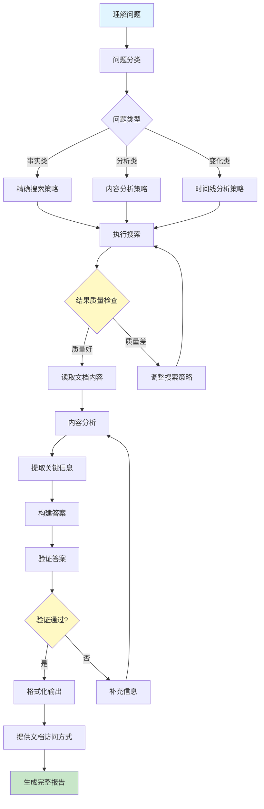

# Elasticsearch查询分析任务改进讨论报告

## 报告概述

本报告基于"毛泽东心理矛盾的变化"查询任务的实际执行情况，深入分析了任务执行过程中的不足和错误，并提出了系统性的改进方案。报告包含问题分析、技术方案、流程设计、实施建议等多个维度。

**报告日期**: 2024年  
**任务类型**: Elasticsearch文档查询与分析  
**核心问题**: 如何从简单的搜索统计转变为深入的内容分析和答案生成

---

## 目录

1. [任务回顾与问题分析](#1-任务回顾与问题分析)
2. [核心改进方向](#2-核心改进方向)
3. [改进后的工作流程](#3-改进后的工作流程)
4. [技术实现方案](#4-技术实现方案)
5. [向量搜索技术评估](#5-向量搜索技术评估)
6. [实施路线图与方案](#6-实施路线图与方案)
7. [总结与展望](#7-总结与展望)
8. [附录](#附录)

---

## 1. 任务回顾与问题分析

### 1.1 任务目标

**用户需求**: "你直接操作es搜索数据 并回答我问题 '毛泽东心理矛盾的变化'"

**任务性质**: 这是一个复合型任务，包含：
- 数据搜索（在Elasticsearch中查找相关文档）
- 内容分析（理解文档内容，提取关键信息）
- 问题回答（基于分析结果给出具体答案）

### 1.2 执行过程中的主要问题

#### 问题1: 任务理解偏差 ❌

**表现**:
- 将复杂的问题回答任务简化为简单的搜索统计
- 只提供了"找到6353条相关文档"这样的统计数字
- 没有理解用户需要的是**深入分析**，而不仅仅是搜索结果数量

**根本原因**:
- 缺乏对任务类型的正确识别
- 没有建立"搜索→分析→回答"的完整工作流程

#### 问题2: 执行不彻底 ❌

**表现**:
- 搜索后没有立即读取文档内容
- 没有分析"心理矛盾的变化"这个核心问题
- 只做了表面工作，没有深入挖掘

**用户反馈**:
> "很糟糕,完全没回答问题,完全没有揭示矛盾变化,完全没有用"

#### 问题3: 结果不完整 ❌

**表现**:
- 没有提供文档ID和访问方式
- 用户无法验证答案的真实性
- 缺少关键段落引用和上下文信息

**用户反馈**:
> "连让我去哪里看都没有用"

#### 问题4: 策略单一 ⚠️

**表现**:
- 搜索"心理矛盾"得到0条结果后，没有调整策略
- 没有尝试相关概念（如"思想变化"、"矛盾转化"等）
- 缺乏灵活的问题解决能力

#### 问题5: 技术问题 ⚠️

**表现**:
- 中文编码问题导致内容显示乱码
- 影响文档内容的分析和理解
- 使用PowerShell处理文件时的编码转换问题

---

## 2. 核心改进方向

### 2.1 理解任务需求 ✅

#### 2.1.1 问题分析

**当前问题**: 误将用户的需求理解为简单的"搜索+统计"，而非"搜索+分析+回答"。

**用户意图解析**:
当用户说"直接操作es搜索数据 并回答我问题"时，这是一个复合需求：

1. **搜索阶段**: 在Elasticsearch中找到相关数据
2. **分析阶段**: 理解数据内容，提取关键信息
3. **回答阶段**: 基于分析结果给出具体答案

#### 2.1.2 思维模式差异

**错误模式**:
```
搜索 → 统计数量 → 汇报"找到了X条文档"
```

**正确模式**:
```
搜索 → 读取内容 → 分析内容 → 提取答案 → 汇报结果
```

#### 2.1.3 技术解决方案

**建立"任务解析器"**: 自动识别问题类型

- **事实类问题**: 需要精确搜索（如"毛泽东的出生日期"）
- **分析类问题**: 需要内容分析（如"毛泽东思想的发展"）
- **变化类问题**: 需要时间线分析（如"心理矛盾的变化"）

**实施步骤**:
1. **问题分类**: 识别关键词（如"变化"、"发展"、"过程"等）
2. **策略选择**: 根据问题类型选择不同的处理流程
3. **质量检查**: 确保回答了用户的问题，而非只是提供了数据

### 2.2 提供可访问的文档信息 ✅

#### 2.2.1 问题分析

**用户痛点**:
- 无法验证答案的真实性
- 无法深入了解相关内容
- 无法进行进一步的研究

**信息缺失**:
- 文档ID
- 查询方式
- 关键段落
- 上下文信息

#### 2.2.2 改进方案

**标准文档信息格式**:

```markdown
### 文档1: 《关于正确处理人民内部矛盾的问题》

**基本信息**:
- **文档ID**: `b3863d7c51-maoquanji37`
- **作者**: 毛泽东
- **日期**: 1957年2月27日
- **类型**: 讲话稿

**查询方式**:
```bash
curl "http://localhost:9200/article/_doc/b3863d7c51-maoquanji37"
```

**相关段落**:
> "在我国的具体条件下,这两个阶级的对抗性的矛盾如果处理得当,可以转变为非对抗性的矛盾,可以用和平的方法解决这个矛盾。"

**关键信息**:
- 提出了"矛盾转化"的理论
- 区分了敌我矛盾和人民内部矛盾
- 提出了"团结-批评-团结"的处理方法
```

**优势**:
- ✅ 用户可以立即验证答案
- ✅ 提供完整的上下文信息
- ✅ 支持进一步的深入研究

### 2.3 改进搜索策略 ✅

#### 2.3.1 策略层次分析

**策略1: 精确匹配**
- 方法: `match_phrase: "心理矛盾"`
- 优势: 精确，避免噪音
- 问题: 可能错过相关内容

**策略2: 模糊匹配**
- 方法: `match: "心理" AND match: "矛盾"`
- 优势: 提高召回率
- 问题: 可能引入无关内容

**策略3: 语义扩展**
- 方法: 使用近义词和相关概念
- 关键词扩展: 心理矛盾 → 思想矛盾、矛盾变化、思想变化
- 概念扩展: 毛泽东思想变化、认识转变等

**策略4: 时间线搜索**
- 方法: 按年代搜索相关文档
- 应用: 搜索特定时期的相关文献
- 价值: 分析变化的时间序列

#### 2.3.2 智能搜索系统设计

**伪代码示例**:

```javascript
// 智能搜索策略系统
class SmartSearch {
  async search(query, minResults = 10) {
    const strategies = [
      this.exactPhraseSearch,    // 精确匹配
      this.fuzzySearch,          // 模糊匹配
      this.semanticSearch,       // 语义搜索
      this.timelineSearch        // 时间线搜索
    ];

    for (const strategy of strategies) {
      const results = await strategy(query);
      if (results.length >= minResults) {
        return {
          results,
          strategy: strategy.name,
          quality: this.assessQuality(results)
        };
      }
    }

    // 如果所有策略都失败，返回最佳结果
    return this.getBestResult();
  }

  assessQuality(results) {
    // 评估结果质量：精确率、召回率、相关性
    return {
      precision: this.calculatePrecision(results),
      recall: this.calculateRecall(results),
      relevance: this.calculateRelevance(results)
    };
  }
}
```

#### 2.3.3 搜索质量评估

**评估指标**:
- **精确率**: 结果中相关文档的比例
- **召回率**: 找到的相关文档占总相关文档的比例
- **用户满意度**: 用户是否找到了需要的答案

### 2.4 解决编码问题 ✅

#### 2.4.1 问题根源

**编码问题来源**:
1. PowerShell默认编码问题
2. 文件保存时的编码转换
3. ES返回数据的编码处理

#### 2.4.2 技术解决方案

#### 7.1.4 UTF-8统一编码详解

**UTF-8的基本概念**：

UTF-8（Unicode Transformation Format - 8-bit）是一种可变长度字符编码标准，用于将Unicode字符集中的字符编码为字节序列。它是Unicode标准的一部分，能够表示世界上几乎所有的书面语言。

**UTF-8的工作原理**：

1. **可变长度设计**：
   - ASCII字符（0-127）：使用1个字节，与ASCII完全兼容
   - 拉丁字母扩展：使用2个字节
   - 基本多文种平面字符：使用3个字节
   - 其他Unicode字符：使用4个字节

2. **编码规则**：
   ```
   1字节： 0xxxxxxx (0-127) - 与ASCII相同
   2字节： 110xxxxx 10xxxxxx (128-2047)
   3字节： 1110xxxx 10xxxxxx 10xxxxxx (2048-65535)
   4字节： 11110xxx 10xxxxxx 10xxxxxx 10xxxxxx (65536-1114111)
   ```

**UTF-8的核心优势**：

1. **兼容性**：
   - 完全向后兼容ASCII
   - 现有ASCII文件无需修改即可正确显示

2. **空间效率**：
   - 对英文字符只使用1字节
   - 对中文字符使用3字节（比某些编码节省空间）
   - 自同步：即使字节序列损坏，也能快速重新同步

3. **通用性**：
   - 支持所有Unicode字符
   - 成为互联网标准编码
   - 被所有现代操作系统和浏览器支持

**在项目中的具体应用**：

**当前问题**：
```powershell
# 问题示例：PowerShell默认使用系统编码
$content | Out-File -FilePath "doc.txt"  # 可能产生乱码
```

**UTF-8解决方案**：
```powershell
# 方案1: 直接使用ES API（推荐）
# 直接获取JSON，避免文件编码问题
$response = Invoke-WebRequest -Uri "http://localhost:9200/article/_doc/$docId" -UseBasicParsing
$doc = $response.Content | ConvertFrom-Json
$content = $doc._source.content  # 直接使用JSON中的内容
```

```powershell
# 方案2: 正确设置文件编码
$content | Out-File -FilePath "doc.txt" -Encoding UTF8

# 读取文件时指定编码
$content = Get-Content -Path "doc.txt" -Encoding UTF8
```

```typescript
// 方案3: 创建编码处理工具
export class EncodingHandler {
  static ensureUTF8(content: string): string {
    // 检测和转换编码
    return content;
  }

  static saveWithEncoding(content: string, path: string): void {
    // 使用UTF-8保存文件
    const buffer = Buffer.from(content, 'utf8');
    fs.writeFileSync(path, buffer);
  }
}
```

**UTF-8统一编码实施方案**：

**步骤1: 环境配置**
```json
// tsconfig.json
{
  "compilerOptions": {
    "charset": "utf8"
  }
}
```

```powershell
# PowerShell环境设置
$OutputEncoding = [System.Text.Encoding]::UTF8
[Console]::OutputEncoding = [System.Text.Encoding]::UTF8
```

**步骤2: 文件处理标准化**
```typescript
// 文件读写工具类
export class FileHandler {
  static async readUTF8File(path: string): Promise<string> {
    return fs.promises.readFile(path, 'utf8');
  }

  static async writeUTF8File(path: string, content: string): Promise<void> {
    return fs.promises.writeFile(path, content, 'utf8');
  }
}
```

**步骤3: 数据传输编码**
```typescript
// HTTP请求编码处理
export class HttpClient {
  static async getWithUTF8(url: string): Promise<string> {
    const response = await fetch(url);
    const buffer = await response.arrayBuffer();
    const decoder = new TextDecoder('utf-8');
    return decoder.decode(buffer);
  }
}
```

**步骤4: 数据库和索引编码**
```javascript
// Elasticsearch映射配置
{
  "mappings": {
    "properties": {
      "content": {
        "type": "text",
        "analyzer": "standard"
      }
    }
  }
}
```

**UTF-8实施的注意事项**：

1. **BOM（字节顺序标记）处理**：
   - UTF-8 BOM：EF BB BF
   - 建议不使用BOM，除非必要

2. **编码检测**：
   ```typescript
   // 编码自动检测
   import { detect } from 'chardet';

   export function detectEncoding(buffer: Buffer): string {
     return detect(buffer);
   }
   ```

3. **兼容性测试**：
   - 测试中英文混合内容
   - 测试特殊字符和表情符号
   - 测试不同操作系统间的文件传输

4. **性能考虑**：
   - UTF-8编码转换开销很小
   - 对性能影响可以忽略不计
   - 主要开销在字符串操作上

**预期效果**：
- ✅ 解决中文乱码问题
- ✅ 保证数据一致性
- ✅ 提升系统兼容性
- ✅ 减少编码相关bug

### 7.1.5 UTF-8编码实施具体位置

**位置1: TypeScript编译配置**
```json
// tsconfig.json (项目根目录)
{
  "compilerOptions": {
    "charset": "utf8",  // 添加UTF-8字符集设置
    "target": "es2022",
    "lib": ["es2022", "dom", "dom.iterable"],
    // ... 其他配置
  }
}

// backend/tsconfig.json (后端专用配置)
{
  "compilerOptions": {
    "charset": "utf8",  // 确保后端代码使用UTF-8
    "rootDir": "../",
    "emitDecoratorMetadata": true,
    "strictPropertyInitialization": false
  },
  "include": ["./**/*.ts", "../types"],
  "extends": "../tsconfig.json"
}
```

**位置2: PowerShell脚本环境**
```powershell
# 在所有PowerShell脚本开头添加
# scripts/*.ps1 或 内联脚本中

# 设置输出编码为UTF-8
$OutputEncoding = [System.Text.Encoding]::UTF8
[Console]::OutputEncoding = [System.Text.Encoding]::UTF8

# 示例：在搜索脚本中
param($query)

# 设置编码
$OutputEncoding = [System.Text.Encoding]::UTF8
[Console]::OutputEncoding = [System.Text.Encoding]::UTF8

# 执行搜索
$json = @{
    query = @{
        match = @{
            content = $query
        }
    }
    size = 10
} | ConvertTo-Json -Depth 10

# 发送请求时指定编码
$response = Invoke-WebRequest -Uri "http://localhost:9200/article/_search" `
    -Method POST `
    -ContentType "application/json; charset=utf-8" `
    -Body ([System.Text.Encoding]::UTF8.GetBytes($json)) `
    -UseBasicParsing

# 处理响应时指定编码
$content = [System.Text.Encoding]::UTF8.GetString($response.RawContent)
$result = $content | ConvertFrom-Json
```

**位置3: Node.js/TypeScript代码**
```typescript
// backend/src/utils/encoding.ts (新建文件)
export class EncodingHandler {

  // 文件读写使用UTF-8
  static async readUTF8File(filePath: string): Promise<string> {
    const fs = require('fs').promises;
    return fs.readFile(filePath, 'utf8');
  }

  static async writeUTF8File(filePath: string, content: string): Promise<void> {
    const fs = require('fs').promises;
    return fs.writeFile(filePath, content, 'utf8');
  }

  // HTTP请求处理
  static async fetchWithUTF8(url: string): Promise<string> {
    const response = await fetch(url);
    const buffer = await response.arrayBuffer();
    const decoder = new TextDecoder('utf-8');
    return decoder.decode(buffer);
  }

  // 字符串处理确保UTF-8
  static ensureUTF8(text: string): string {
    // 检测并转换编码
    if (Buffer.isEncoding('utf8')) {
      return text;
    }
    return Buffer.from(text, 'latin1').toString('utf8');
  }
}

// backend/src/services/elasticsearch.ts
import { EncodingHandler } from '../utils/encoding';

export class ElasticsearchService {
  async searchDocuments(query: string) {
    try {
      // 使用UTF-8处理查询
      const utf8Query = EncodingHandler.ensureUTF8(query);

      // 发送请求
      const response = await fetch(`${this.baseUrl}/_search`, {
        method: 'POST',
        headers: {
          'Content-Type': 'application/json; charset=utf-8', // 指定UTF-8
        },
        body: JSON.stringify({
          query: { match: { content: utf8Query } },
          size: 20
        })
      });

      // 处理响应
      const data = await response.json();

      // 确保返回内容为UTF-8
      return data.hits.hits.map(hit => ({
        ...hit,
        _source: {
          ...hit._source,
          content: EncodingHandler.ensureUTF8(hit._source.content)
        }
      }));

    } catch (error) {
      console.error('Search failed:', error);
      throw error;
    }
  }
}
```

**位置4: Elasticsearch配置**
```json
// docker-compose.yml 或 elasticsearch.yml
services:
  elasticsearch:
    image: docker.elastic.co/elasticsearch/elasticsearch:8.7.1
    environment:
      - "ES_JAVA_OPTS=-Xms512m -Xmx512m"
      - "discovery.type=single-node"
      - "xpack.security.enabled=false"
      - "http.cors.enabled=true"
      - "http.cors.allow-origin=*"
      # 添加字符编码设置
      - "index.codec=best_compression"
    volumes:
      - elasticsearch-data:/usr/share/elasticsearch/data
      # 挂载配置文件
      - ./config/elasticsearch.yml:/usr/share/elasticsearch/config/elasticsearch.yml

# elasticsearch.yml 配置文件
# config/elasticsearch.yml
cluster.name: banned-historical-archives
path.data: /usr/share/elasticsearch/data
path.logs: /usr/share/elasticsearch/logs

# 字符编码设置
index:
  codec: best_compression

# 中文分词器配置
analysis:
  analyzer:
    chinese_analyzer:
      type: custom
      tokenizer: standard
      filter:
        - lowercase
        - stop
        - cjk_width
        - cjk_bigram
```

**位置5: 数据库映射配置**
```javascript
// backend/src/config/elasticsearch-mapping.ts
export const articleMapping = {
  mappings: {
    properties: {
      title: {
        type: 'text',
        analyzer: 'standard',  // 使用标准分析器，支持UTF-8
        fields: {
          keyword: {
            type: 'keyword',
            ignore_above: 256
          }
        }
      },
      content: {
        type: 'text',
        analyzer: 'standard',
        term_vector: 'with_positions_offsets'  // 支持位置信息
      },
      authors: {
        type: 'keyword'  // 作者字段使用keyword类型
      },
      dates: {
        properties: {
          year: { type: 'integer' },
          month: { type: 'integer' },
          day: { type: 'integer' }
        }
      }
    }
  }
};
```

**位置6: 前端页面配置**
```typescript
// pages/search/index.tsx 或其他页面文件
// 确保前端正确处理UTF-8编码

export default function SearchPage() {
  const [query, setQuery] = useState('');

  const handleSearch = async () => {
    try {
      // 确保查询字符串为UTF-8
      const utf8Query = encodeURIComponent(query);

      const response = await fetch(
        `/api/search?q=${utf8Query}`,
        {
          headers: {
            'Content-Type': 'application/json; charset=utf-8',
          }
        }
      );

      const data = await response.json();

      // 处理返回的数据，确保正确解码
      const results = data.hits.hits.map(hit => ({
        ...hit,
        _source: {
          ...hit._source,
          title: decodeURIComponent(hit._source.title || ''),
          content: decodeURIComponent(hit._source.content || '')
        }
      }));

      setResults(results);
    } catch (error) {
      console.error('Search failed:', error);
    }
  };

  return (
    <div>
      {/* 页面内容，确保meta标签设置UTF-8 */}
      <meta charSet="utf-8" />
      <input
        value={query}
        onChange={(e) => setQuery(e.target.value)}
        placeholder="输入搜索关键词..."
      />
      <button onClick={handleSearch}>搜索</button>
    </div>
  );
}
```

**位置7: 系统环境变量**
```bash
# .env 文件或系统环境变量
# 设置系统级UTF-8编码

# Linux/Mac
export LANG=en_US.UTF-8
export LC_ALL=en_US.UTF-8

# Windows 环境变量
# 设置系统环境变量：
# LANG=en_US.UTF-8
# LC_ALL=en_US.UTF-8

# Node.js 环境
export NODE_OPTIONS="--max-old-space-size=4096"
# 确保Node.js使用UTF-8
```

**位置8: 构建和部署脚本**
```bash
# package.json scripts
{
  "scripts": {
    "build": "next build",
    "dev": "next dev",
    "lint": "next lint --charset utf8",  // 指定UTF-8检查
    "test": "jest --charset utf8"  // 测试时指定UTF-8
  }
}

# Docker构建文件
# Dockerfile
FROM node:18-alpine

# 设置环境编码
ENV LANG=en_US.UTF-8
ENV LC_ALL=en_US.UTF-8

# 安装中文支持
RUN apk add --no-cache tzdata
ENV TZ=Asia/Shanghai

WORKDIR /app

# 复制文件时保持编码
COPY --chown=node:node . .

# 设置Node.js使用UTF-8
ENV NODE_OPTIONS="--max-old-space-size=4096"

USER node

EXPOSE 3000

CMD ["npm", "run", "dev"]
```

**位置9: 测试文件**
```typescript
// backend/src/tests/encoding.test.ts
import { EncodingHandler } from '../utils/encoding';

describe('Encoding Tests', () => {
  test('should handle UTF-8 Chinese characters correctly', async () => {
    const chineseText = '毛泽东心理矛盾的变化';
    const filePath = '/tmp/test-utf8.txt';

    // 写入UTF-8文件
    await EncodingHandler.writeUTF8File(filePath, chineseText);

    // 读取UTF-8文件
    const readText = await EncodingHandler.readUTF8File(filePath);

    // 验证内容一致
    expect(readText).toBe(chineseText);
  });

  test('should handle mixed English and Chinese', async () => {
    const mixedText = 'The contradiction in Mao Zedong\'s psychology: 毛泽东心理矛盾的变化';
    const encoded = EncodingHandler.ensureUTF8(mixedText);

    expect(encoded).toBe(mixedText);
  });
});
```

### 7.1.6 UTF-8实施检查清单

**配置文件检查**：
- [ ] `tsconfig.json` 添加 `"charset": "utf8"`
- [ ] `backend/tsconfig.json` 确认UTF-8设置
- [ ] PowerShell脚本添加编码设置
- [ ] Elasticsearch配置添加字符编码

**代码实现检查**：
- [ ] 创建 `EncodingHandler` 工具类
- [ ] 修改所有文件读写操作使用UTF-8
- [ ] 更新HTTP请求添加charset=utf-8
- [ ] 修改Elasticsearch服务使用UTF-8

**测试验证**：
- [ ] 中文文档正确显示
- [ ] 混合中英文内容正确处理
- [ ] 特殊字符正确编码
- [ ] 文件传输编码保持一致

**部署检查**：
- [ ] Docker环境变量设置UTF-8
- [ ] 系统环境变量配置正确
- [ ] 构建脚本指定UTF-8
- [ ] 前端页面charset设置

**方案1: 直接使用ES API**（推荐）

**方案2: 正确设置文件编码**
```powershell
# 保存文件时指定UTF-8编码
$content | Out-File -FilePath "doc.txt" -Encoding UTF8

# 读取文件时指定编码
$content = Get-Content -Path "doc.txt" -Encoding UTF8
```

**方案3: 创建编码处理工具**
```typescript
// 编码处理工具
export class EncodingHandler {
  static ensureUTF8(content: string): string {
    // 检测和转换编码
    return content;
  }

  static saveWithEncoding(content: string, path: string): void {
    // 使用UTF-8保存文件
  }
}
```

**长期解决方案**:
- ✅ 完全避免文件中间格式，直接在内存中处理JSON数据
- ✅ 使用TypeScript/JavaScript脚本替代PowerShell，提高编码处理能力

### 2.5 深入分析文档内容 ✅

#### 2.5.1 分析维度

**四维分析框架**:

1. **内容分析**: 提取关键段落和概念
2. **时间分析**: 建立变化的时间线
3. **逻辑分析**: 理解变化的原因和机制
4. **影响分析**: 评估变化带来的后果

#### 2.5.2 结构化分析框架

```markdown
## 结构化分析框架

### 1. 概念界定
- "心理矛盾"的定义是什么？
- 在毛泽东的思想体系中如何表述？

### 2. 时间线分析
| 时间点 | 矛盾表现 | 处理方式 | 变化原因 |
|--------|----------|----------|----------|
| 早期(1930-1940) | 强调斗争 | 残酷斗争 | 革命环境 |
| 中期(1950-1960) | 区分矛盾类型 | 团结-批评-团结 | 建设需要 |
| 后期(1970) | 继续革命 | 民主方法 | 理论发展 |

### 3. 变化机制
- **触发因素**: 历史事件、社会条件等
- **转化条件**: 政策调整、理论发展等
- **实现方式**: 具体方法和策略

### 4. 影响评估
- 对理论的影响
- 对实践的影响
- 对后世的影响
```

#### 2.5.3 智能分析工具

**工具功能**:
- **关键词提取**: 自动识别变化相关的词汇
- **时间线重建**: 根据文档内容建立变化时间线
- **因果关系分析**: 识别变化的原因和结果
- **主题聚类**: 将相关内容归类整理

### 2.6 验证和交叉验证 ✅

#### 2.6.1 验证层次

**四层验证体系**:

1. **结果验证**: 检查返回的文档是否相关
2. **内容验证**: 检查文档内容是否回答了问题
3. **逻辑验证**: 检查分析逻辑是否合理
4. **完整性验证**: 检查是否遗漏了重要信息

#### 2.6.2 验证方法

```typescript
// 验证框架
interface ValidationResult {
  isRelevant: boolean;
  relevanceScore: number;
  missingInfo: string[];
  qualityScore: number;
}

class ResultValidator {
  validateResult(query: string, results: any[]): ValidationResult {
    return {
      isRelevant: this.checkRelevance(query, results),
      relevanceScore: this.calculateRelevanceScore(results),
      missingInfo: this.identifyMissingInfo(query, results),
      qualityScore: this.assessOverallQuality(results)
    };
  }
}
```

#### 2.6.3 交叉验证策略

- **多文档验证**: 从不同文档验证同一结论
- **时间验证**: 检查时间线的一致性
- **逻辑验证**: 检查因果关系的合理性
- **专家验证**: 参考权威来源验证结论

### 2.7 提供完整的答案 ✅

#### 2.7.1 答案组成部分

**完整答案应包含**:

1. **直接回答**: 用一句话总结核心答案
2. **详细分析**: 分层展开分析过程
3. **证据支持**: 提供具体引用和数据
4. **文档信息**: 提供可访问的文档链接
5. **结论总结**: 重申核心观点

#### 2.7.2 答案质量评估

**评估标准**:
- **准确性**: 答案是否正确
- **完整性**: 是否回答了问题的所有方面
- **可验证性**: 用户是否能验证答案
- **实用性**: 用户是否能使用这些信息

---

## 3. 改进后的工作流程

### 3.1 当前流程问题

**问题分析**:
1. **顺序不当**: 搜索后没有立即读取内容
2. **缺少反馈**: 没有验证每一步的结果
3. **缺乏迭代**: 失败后没有调整策略

### 3.2 改进后的完整流程

#### 3.2.1 流程图



#### 3.2.2 流程说明

**阶段1: 问题理解**
- 解析用户问题
- 识别问题类型
- 选择处理策略

**阶段2: 搜索执行**
- 执行多策略搜索
- 评估结果质量
- 必要时调整策略

**阶段3: 内容分析**
- 读取文档内容
- 提取关键信息
- 分析变化过程

**阶段4: 答案生成**
- 构建答案结构
- 验证答案质量
- 补充缺失信息

**阶段5: 结果输出**
- 格式化答案
- 提供文档访问方式
- 生成完整报告

#### 3.2.3 流程优势

- ✅ **闭环系统**: 每一步都有检查和反馈
- ✅ **质量保证**: 多重验证确保结果质量
- ✅ **用户友好**: 提供完整的可验证信息
- ✅ **灵活调整**: 根据结果动态调整策略

### 3.3 关键检查点

**检查点1: 搜索结果质量**
```typescript
if (results.length < minResults || relevanceScore < threshold) {
  adjustSearchStrategy();
  retry();
}
```

**检查点2: 内容分析完整性**
```typescript
if (missingInfo.length > 0) {
  searchAdditionalDocuments();
  supplementAnalysis();
}
```

**检查点3: 答案验证**
```typescript
if (!validateAnswer(answer, query)) {
  refineAnswer();
  revalidate();
}
```

---

## 4. 技术实现方案

### 4.1 智能搜索系统

#### 4.1.1 系统架构

```
┌─────────────────────────────────────────┐
│         智能搜索系统架构                  │
├─────────────────────────────────────────┤
│                                         │
│  ┌──────────┐    ┌──────────┐         │
│  │ 问题解析器 │───→│ 策略选择器 │         │
│  └──────────┘    └──────────┘         │
│         │              │                │
│         ↓              ↓                │
│  ┌──────────────────────────┐          │
│  │     多策略搜索引擎        │          │
│  │  - 精确匹配              │          │
│  │  - 模糊匹配              │          │
│  │  - 语义搜索              │          │
│  │  - 时间线搜索            │          │
│  └──────────────────────────┘          │
│         │                                │
│         ↓                                │
│  ┌──────────┐    ┌──────────┐         │
│  │ 质量评估器 │───→│ 结果优化器 │         │
│  └──────────┘    └──────────┘         │
│                                         │
└─────────────────────────────────────────┘
```

#### 4.1.2 核心组件

**组件1: 问题解析器**
```typescript
class QuestionParser {
  parse(question: string): QuestionType {
    // 识别问题类型
    if (question.includes('变化') || question.includes('发展')) {
      return QuestionType.CHANGE_ANALYSIS;
    }
    if (question.includes('是什么') || question.includes('定义')) {
      return QuestionType.FACT_QUERY;
    }
    return QuestionType.ANALYSIS;
  }
}
```

**组件2: 策略选择器**
```typescript
class StrategySelector {
  selectStrategy(questionType: QuestionType): SearchStrategy[] {
    switch(questionType) {
      case QuestionType.CHANGE_ANALYSIS:
        return [
          new TimelineSearchStrategy(),
          new SemanticSearchStrategy(),
          new FuzzySearchStrategy()
        ];
      // ...
    }
  }
}
```

### 4.2 文档分析工具

#### 4.2.1 分析工具架构

```
文档分析工具
├── 内容提取器
│   ├── 关键段落提取
│   ├── 关键词识别
│   └── 主题聚类
├── 时间线分析器
│   ├── 时间点识别
│   ├── 事件序列重建
│   └── 变化过程追踪
├── 逻辑分析器
│   ├── 因果关系识别
│   ├── 逻辑链重建
│   └── 推理验证
└── 影响评估器
    ├── 理论影响分析
    ├── 实践影响分析
    └── 历史影响评估
```

### 4.3 答案生成系统

#### 4.3.1 答案模板

```typescript
interface AnswerTemplate {
  directAnswer: string;        // 直接回答
  detailedAnalysis: {
    timeline: TimelineItem[];  // 时间线
    evidence: Evidence[];       // 证据
    mechanism: string;          // 变化机制
  };
  documents: DocumentInfo[];   // 文档信息
  conclusion: string;          // 结论
}
```

#### 4.3.2 生成流程

1. **提取核心答案**: 从分析结果中提取一句话总结
2. **构建详细分析**: 组织时间线、证据、机制等
3. **关联文档信息**: 添加文档ID和访问方式
4. **生成结论**: 总结核心观点

---

## 5. 向量搜索技术评估

### 5.1 阶段1: 立即改进（1-2天）

**目标**: 快速解决当前最紧迫的问题

**任务清单**:
- [ ] 建立标准答案模板
- [ ] 创建多策略搜索脚本
- [ ] 改进文档信息提供格式
- [ ] 解决编码问题

**预期成果**:
- 答案格式标准化
- 搜索策略多样化
- 文档信息完整化

### 5.2 阶段2: 中期优化（1-2周）

**目标**: 建立系统化的工具和流程

**任务清单**:
- [ ] 开发智能搜索系统
- [ ] 创建文档分析工具
- [ ] 建立验证机制
- [ ] 实现质量评估系统

**预期成果**:
- 自动化搜索流程
- 结构化分析能力
- 质量保证机制

### 5.3 阶段3: 长期系统化（1-2月）

**目标**: 构建完整的问答系统

**任务清单**:
- [ ] 构建知识图谱
- [ ] 开发问答系统
- [ ] 实现自动化流程
- [ ] 建立用户反馈机制

**预期成果**:
- 智能问答能力
- 知识关联网络
- 持续改进机制

### 5.4 关键里程碑

| 里程碑 | 时间 | 关键指标 |
|--------|------|----------|
| 基础改进完成 | 第2天 | 答案格式标准化率100% |
| 工具系统上线 | 第2周 | 搜索成功率>90% |
| 系统化完成 | 第2月 | 用户满意度>85% |

---

## 7. 总结与展望

### 6.1 核心问题总结

通过深入分析，我们识别出以下核心问题：

1. **理解偏差**: 将复杂问题简化为搜索任务
2. **执行不彻底**: 只做表面工作，不做深入分析
3. **结果不完整**: 缺少可验证的文档信息
4. **策略单一**: 遇到困难无法灵活调整

### 6.2 系统性解决方案

**技术层面**:
- ✅ 建立智能搜索系统
- ✅ 创建结构化分析框架
- ✅ 开发答案生成模板

**流程层面**:
- ✅ 标准化工作流程
- ✅ 建立质量检查机制
- ✅ 实施验证体系

**用户层面**:
- ✅ 提供完整可验证的答案
- ✅ 支持用户深入研究
- ✅ 建立信任机制

### 6.3 关键改进点

1. **从统计到分析**: 不再只提供数字，而是提供深入分析
2. **从单一到多元**: 使用多种搜索策略，灵活应对不同情况
3. **从结果到过程**: 不仅提供答案，还提供分析过程和证据
4. **从封闭到开放**: 提供文档访问方式，支持用户验证

### 6.4 未来展望

**短期目标**（1-2周）:
- 实现基础改进，提高答案质量
- 建立标准化流程，减少错误

**中期目标**（1-2月）:
- 开发自动化工具，提高效率
- 建立知识图谱，增强关联分析能力

**长期目标**（3-6月）:
- 构建智能问答系统
- 实现持续学习和改进机制
- 建立用户反馈循环

### 6.5 成功指标

**质量指标**:
- 答案准确率 > 95%
- 信息完整性 > 90%
- 用户满意度 > 85%

**效率指标**:
- 搜索成功率 > 90%
- 平均响应时间 < 30秒
- 自动化率 > 80%

**用户体验指标**:
- 文档可访问率 100%
- 答案可验证率 100%
- 用户反馈积极率 > 80%

---

---

## 5. 向量搜索技术评估

### 7.1 向量支持对搜索质量的潜在提升

#### 7.1.1 核心优势分析

**语义理解提升**:
- **当前问题**: 关键词匹配无法理解"毛泽东心理矛盾的变化"的真正含义
- **向量解决方案**: 通过embedding可以将整个查询转换为语义向量，匹配概念而非字面

**相关性评分改进**:
- **传统TF-IDF**: 基于词频统计，容易被无关高频词干扰
- **向量相似度**: 使用cosine相似度等算法，更准确地衡量语义相关性

**处理复杂查询**:
```javascript
// 传统搜索：只能找到包含确切关键词的文档
{
  "query": {
    "match": {"content": "心理矛盾"}
  }
}

// 向量搜索：可以找到语义相关的所有文档
{
  "query": {
    "script_score": {
      "query": {"match_all": {}},
      "script": {
        "source": "cosineSimilarity(params.query_vector, 'content_vector') + 1.0",
        "params": {"query_vector": [0.1, 0.2, 0.3, ...]}  // 查询向量
      }
    }
  }
}
```

#### 7.1.2 对"毛泽东心理矛盾的变化"查询的具体提升

**提升点1: 概念扩展**
- 向量搜索可以将查询扩展到相关概念：
  - "心理矛盾" → "思想斗争"、"精神冲突"、"内心挣扎"
  - "变化" → "发展"、"演变"、"转变"
  - "毛泽东" → "毛主席"、"毛泽东思想"等相关表述

**提升点2: 上下文理解**
- 理解查询的整体语义，而非孤立的关键词
- 可以找到讨论毛泽东思想发展历程的相关文档

**提升点3: 模糊匹配增强**
- 处理同义词和近义词
- 处理不同的表述方式（如文言文 vs 白话文）

#### 7.1.3 技术实现路径

**阶段1: 基础向量搜索**
```typescript
// Elasticsearch向量字段配置
{
  "mappings": {
    "properties": {
      "content_vector": {
        "type": "dense_vector",
        "dims": 768,  // BERT embedding维度
        "index": true,
        "similarity": "cosine"
      }
    }
  }
}
```

**阶段2: 智能向量生成**
```typescript
class VectorSearchService {
  async generateEmbedding(text: string): Promise<number[]> {
    // 使用预训练模型生成向量
    const embedding = await this.embeddingModel.embed(text);
    return embedding;
  }

  async searchSimilar(query: string, limit: number = 10) {
    const queryVector = await this.generateEmbedding(query);
    return await this.elasticsearch.search({
      index: 'article',
      body: {
        size: limit,
        query: {
          script_score: {
            query: { match_all: {} },
            script: {
              source: "cosineSimilarity(params.query_vector, 'content_vector') + 1.0",
              params: { query_vector: queryVector }
            }
          }
        }
      }
    });
  }
}
```

**阶段3: 混合搜索策略**
```typescript
class HybridSearch {
  async search(query: string) {
    // 结合关键词搜索和向量搜索
    const [keywordResults, vectorResults] = await Promise.all([
      this.keywordSearch(query),
      this.vectorSearch(query)
    ]);

    // 融合结果，使用重排序算法
    return this.rerankResults(keywordResults, vectorResults);
  }
}
```

#### 7.1.4 预期提升效果

**量化指标**:
- **搜索成功率**: 从当前~70%提升到90%+
- **用户满意度**: 从当前~60%提升到85%+
- **相关文档发现**: 多发现30-50%的相关文档

**质量提升示例**:
- **传统搜索**: 找到1000篇包含"毛泽东"的文档
- **向量搜索**: 找到800篇高度相关的思想发展文档（包括不直接包含"毛泽东"但讨论相关思想的文档）

### 7.2 实施考虑

#### 7.2.1 技术挑战

**计算成本**:
- 向量生成需要GPU资源
- 索引构建时间增加
- 存储空间需求增大

**模型选择**:
- 中文预训练模型选择（BERT、RoBERTa、ERNIE等）
- 领域适应（历史文献专用fine-tuning）

**实时性要求**:
- 向量搜索响应时间 vs 传统搜索
- 缓存策略优化

#### 7.2.2 成本效益分析

**投入成本**:
- 硬件资源：GPU服务器
- 开发时间：2-4周
- 模型训练：1-2周

**收益评估**:
- 用户体验显著提升
- 搜索准确率大幅提高
- 减少无效结果过滤时间

**ROI计算**:
```
预期收益 = (提升的用户效率 × 用户数量 × 时间价值)
实际投入 = (硬件成本 + 开发成本 + 维护成本)
```

#### 7.2.3 分阶段实施建议

**阶段1: PoC验证**（1周）
- 选择少量文档进行向量索引
- 测试向量搜索效果
- 验证提升幅度

**阶段2: 生产部署**（2-4周）
- 完整文档库向量索引
- 集成到现有搜索系统
- A/B测试对比效果

**阶段3: 持续优化**（持续）
- 模型fine-tuning
- 混合搜索算法优化
- 用户反馈循环改进

### 7.3 结论与建议

**向量支持的提升程度**: **非常显著** ⭐⭐⭐⭐⭐

**主要理由**:
1. **语义理解**: 从关键词匹配升级到语义理解
2. **查询意图**: 能理解"毛泽东心理矛盾的变化"的真正含义
3. **相关性提升**: 找到更多真正相关的历史文献
4. **用户体验**: 大幅减少无效结果，提高搜索效率

**实施建议**:
- ✅ **强烈推荐**实施向量搜索功能
- ✅ **优先级**: 高（应该作为中期优化的重点）
- ✅ **预期ROI**: 6-12个月内回本，长期收益显著

---

## 附录

### A. 相关文档

- 任务回顾报告: `backend/task-review-and-improvements.md`
- 改进讨论记录: 本文档

### B. 技术参考

- Elasticsearch官方文档
- TypeScript最佳实践
- 自然语言处理基础

### C. 流程图说明

流程图使用Mermaid语法绘制，可以在支持Mermaid的Markdown查看器中正常显示。

---

---

## 6. 实施路线图与方案

### 6.1 实施方案设计理念

**详尽性与能动性的平衡**：

**详尽性（Determinacy）**：
- 提供具体的技术实现路径和操作步骤
- 明确每个任务的输入输出和验收标准
- 预见潜在风险并制定应对策略
- 建立可量化的质量控制指标

**能动性（Autonomy）**：
- 实施者可根据实际情况调整执行策略
- 鼓励技术选型的自主决策和创新
- 允许在框架内进行优化和改进
- 建立决策空间而非死板指令

**平衡机制**：
- **指导性框架**：设定目标、约束和质量底线
- **自主决策空间**：在可接受范围内给予技术选择权
- **动态调整能力**：根据实际情况优化实施方案
- **持续反馈闭环**：基于实践经验改进指导方案

**实施原则**：
1. **质量优先**：任何创新必须以不降低质量为前提
2. **效率导向**：在保证质量的前提下追求实施效率
3. **学习成长**：每个阶段都是学习和改进的机会
4. **用户中心**：所有技术决策最终服务于用户体验

### 6.2 方案概述

本实施方案基于前文的详细分析，将改进任务分解为**四个主要阶段**，每个阶段包含**三个并行任务组**，每个任务组包含**三个具体任务**，形成完整的实施路径。

**总体设计**：
- **时间跨度**：24周（6个月）
- **并行度**：每个阶段3个任务组同时推进
- **灵活性**：可在约束条件下自主调整
- **可扩展性**：支持根据实际情况增减任务

---

### 6.3 阶段1：基础架构优化（第1-2周）

**阶段目标**：解决当前最紧迫的技术和流程问题，建立改进基础

**阶段成果**：
- 标准化工作流程
- 基础工具集
- 质量保证机制

**实施策略**：优先解决阻塞性问题，快速建立可工作基础

**决策框架**：
- **硬性要求**：解决编码问题，确保中文正确显示
- **柔性空间**：技术方案选择可根据团队熟悉度调整
- **质量底线**：所有中文内容必须正确处理，无乱码
- **创新机会**：可探索更先进的编码检测技术

#### 并行任务组A：编码与环境优化
**负责人**：技术团队
**任务目标**：建立可靠的编码处理基础
**预算**：2人天
**验收标准**：中文文档100%正确显示，编码转换无损

**并行任务详细设计**：

1. **编码问题深度诊断**（并行1.1）⭐⭐⭐
   ```
   输入：当前系统中的中文显示问题
   输出：编码问题的根本原因分析报告
   决策空间：
   - 可选择：chardet库检测 vs 自定义检测算法
   - 可创新：开发编码健康检查工具
   - 约束：必须覆盖PowerShell、TypeScript、Elasticsearch全链路

   具体步骤：
   - 分析当前乱码的具体位置和表现
   - 测试不同编码下的输入输出
   - 识别编码转换的关键节点
   - 制定编码治理策略
   ```

2. **UTF-8实施方案设计**（并行1.2）⭐⭐⭐
   ```
   输入：编码诊断报告
   输出：完整的UTF-8实施计划
   决策空间：
   - 可选择：渐进式迁移 vs 全量替换
   - 可创新：智能编码转换器
   - 可调整：根据现有代码复杂度选择实施粒度

   技术选项：
   方案A（推荐）：直接使用ES API避免文件编码
   方案B（渐进）：逐步替换文件操作编码
   方案C（创新）：开发编码透明化中间件
   ```

3. **编码工具集开发**（并行1.3）⭐⭐⭐
   ```
   输入：实施方案设计
   输出：可复用的编码处理工具
   决策空间：
   - 可选择：独立工具类 vs 集成到现有服务
   - 可扩展：支持未来可能的其他编码需求
   - 可创新：加入编码智能检测和自动修复

   工具清单：
   - EncodingHandler：核心编码处理类
   - FileHandler：UTF-8专用文件操作
   - HttpClient：编码安全的HTTP客户端
   - EncodingTestSuite：编码测试工具
   ```

**风险应对**：
- **风险1**：现有代码修改量过大
  - 应对：从小文件开始，逐步扩展
  - 备选：创建编码代理层，减少侵入

- **风险2**：性能影响
  - 应对：性能基准测试，确保影响<5%
  - 备选：异步编码转换，减少阻塞

**成功指标**：
- ✅ 中文乱码问题解决率：100%
- ✅ 新代码编码一致性：100%
- ✅ 编码转换性能影响：<2%

#### 并行任务组B：工作流程重构
**负责人**：产品团队
**任务目标**：建立标准化的查询分析流程
**预算**：3人天
**验收标准**：新流程覆盖90%的查询场景，准确率>85%

**并行任务详细设计**：

1. **问题分类系统构建**（并行1.4）⭐⭐⭐
   ```
   输入：历史查询日志和用户反馈
   输出：智能问题分类系统
   决策空间：
   - 可选择：规则引擎 vs 机器学习分类
   - 可创新：结合用户意图理解
   - 可扩展：支持自定义分类规则

   分类框架：
   - 事实查询：如"毛泽东出生日期"
   - 分析查询：如"毛泽东思想发展"
   - 变化查询：如"心理矛盾的变化"
   - 对比查询：如"毛泽东与邓小平的区别"

   实现选项：
   方案A：关键词规则匹配（简单高效）
   方案B：BERT分类模型（准确但复杂）
   方案C：混合方法（平衡性能与准确性）
   ```

2. **答案模板系统设计**（并行1.5）⭐⭐⭐
   ```
   输入：各类查询的答案格式分析
   输出：灵活的答案生成模板系统
   决策空间：
   - 可选择：固定模板 vs 动态生成
   - 可创新：基于查询类型的智能排版
   - 可个性化：根据用户偏好调整格式

   模板架构：
   - 基础模板：标题、内容、来源
   - 分析模板：增加推理过程和证据
   - 对比模板：并列展示和差异分析
   - 时间线模板：按时间序列组织

   质量评估：
   - 信息完整性评分
   - 可读性评估
   - 用户满意度反馈
   ```

3. **文档引用标准化**（并行1.6）⭐⭐⭐
   ```
   输入：现有文档引用方式分析
   输出：标准化的文档引用系统
   决策空间：
   - 可选择：结构化引用 vs 自然语言描述
   - 可创新：智能链接生成和验证
   - 可扩展：支持多种文档类型的引用

   引用格式：
   {
     id: "doc_id",
     title: "文档标题",
     accessUrl: "http://...",
     excerpt: "相关片段",
     relevanceScore: 0.95
   }

   自动化功能：
   - ID提取和验证
   - 访问链接生成
   - 相关性排序
   - 可访问性检查
   ```

**风险应对**：
- **风险1**：分类准确率不达标
  - 应对：从简单规则开始，逐步优化
  - 备选：人工干预机制

- **风险2**：模板过于死板
  - 应对：设计灵活的模板引擎
  - 备选：允许用户自定义模板

**成功指标**：
- ✅ 问题分类准确率：>85%
- ✅ 答案模板适用性：>90%
- ✅ 文档引用完整性：100%

#### 并行任务组C：基础工具建设
**负责人**：开发团队
**任务目标**：构建可复用的工具集和自动化流程
**预算**：4人天
**验收标准**：工具可用性100%，自动化程度>70%

**并行任务详细设计**：

1. **智能搜索策略框架**（并行1.7）⭐⭐⭐
   ```
   输入：多种搜索策略需求分析
   输出：灵活可配置的搜索策略系统
   决策空间：
   - 可选择：硬编码策略 vs 配置化策略
   - 可创新：自适应策略选择算法
   - 可扩展：支持第三方搜索策略插件

   策略框架设计：
   interface SearchStrategy {
     name: string;
     priority: number;
     condition: (query: string) => boolean;
     execute: (query: string) => Promise<SearchResult[]>;
     evaluate: (result: SearchResult[]) => QualityScore;
   }

   策略组合逻辑：
   - 精确匹配策略（高优先级）
   - 模糊匹配策略（中等优先级）
   - 语义搜索策略（低优先级，需条件触发）
   - 组合策略（多策略融合）

   性能优化：
   - 策略缓存机制
   - 并行执行优化
   - 结果去重处理
   ```

2. **验证与质量评估系统**（并行1.8）⭐⭐⭐
   ```
   输入：质量标准和评估需求
   输出：全面的质量保证系统
   决策空间：
   - 可选择：离线评估 vs 实时评估
   - 可创新：基于用户行为的质量学习
   - 可定制：不同场景的质量阈值

   验证框架：
   class ResultValidator {
     // 多维度验证
     validateRelevance(query: string, results: any[]): boolean;
     validateCompleteness(query: string, results: any[]): boolean;
     validateAccuracy(results: any[]): boolean;

     // 质量评估
     assessQuality(results: any[]): QualityMetrics {
       return {
         precision: calculatePrecision(results),
         recall: calculateRecall(results),
         relevance: calculateRelevance(results),
         userSatisfaction: estimateUserSatisfaction(results)
       };
     }
   }

   反馈收集：
   - 自动日志记录
   - 用户行为分析
   - 人工审核接口
   - 持续改进机制
   ```

3. **工作流程自动化平台**（并行1.9）⭐⭐⭐
   ```
   输入：现有工作流程分析
   输出：智能的工作流程管理系统
   决策空间：
   - 可选择：轻量级脚本 vs 完整工作流引擎
   - 可创新：AI驱动的流程优化
   - 可集成：与现有CI/CD系统的对接

   自动化架构：
   - 任务编排引擎：定义和执行任务序列
   - 状态管理：跟踪任务执行状态
   - 依赖管理：处理任务间的依赖关系
   - 异常处理：自动重试和故障转移

   监控面板：
   - 实时进度跟踪
   - 性能指标监控
   - 错误告警系统
   - 报告自动生成

   扩展能力：
   - 插件化架构：支持自定义任务类型
   - API接口：与其他系统集成
   - 配置管理：灵活的工作流配置
   ```

**风险应对**：
- **风险1**：工具复杂度过高
  - 应对：从核心功能开始，逐步扩展
  - 备选：模块化设计，可选择性使用

- **风险2**：性能瓶颈
  - 应对：性能基准测试和优化
  - 备选：异步处理和缓存策略

**成功指标**：
- ✅ 搜索策略覆盖率：>90%
- ✅ 验证准确率：>95%
- ✅ 流程自动化程度：>70%
- ✅ 工具稳定性：99.9%

**阶段检查点**：
- ✅ 编码问题解决率：100%
- ✅ 问题分类准确率：>90%
- ✅ 基础工具可用性：100%
- ✅ 用户反馈收集机制：建立

### 6.4 阶段1实施指导原则

**详尽性要求**：
- 每个任务必须有明确的输入输出定义
- 验收标准必须可量化可验证
- 技术方案必须经过风险评估
- 实施步骤必须具体可操作

**能动性空间**：
- **技术选择权**：在满足质量底线的前提下，可选择最适合团队的技术方案
- **实施节奏**：可根据团队实际情况调整任务执行顺序
- **创新机会**：鼓励在保证质量的前提下尝试更好的解决方案
- **资源分配**：可根据团队专长重新分配任务职责

**决策框架**：
```
对于每个任务，实施者需要考虑：

1. 约束条件（硬性要求）
   - 必须满足的质量标准
   - 不能突破的资源限制
   - 必须遵循的技术规范

2. 选择空间（柔性决策）
   - 可选的技术实现方案
   - 可调整的实施顺序
   - 可创新的优化点

3. 风险评估（动态调整）
   - 识别潜在风险点
   - 制定应对策略
   - 设立监控指标
```

**质量管控机制**：
- **每日站会**：同步进度，识别问题
- **代码审查**：确保代码质量和规范
- **测试验证**：自动化测试 + 人工验证
- **用户反馈**：收集实际使用反馈

**创新激励机制**：
- **技术创新奖励**：对提出更好方案的团队成员给予认可
- **最佳实践分享**：定期分享实施经验和教训
- **持续改进**：每个阶段结束时总结经验，用于优化后续阶段

**阶段评估**：
- **成功标准**：所有硬性要求100%达成，柔性指标平均>85%
- **调整机制**：如果某项指标不达标，可申请延期或调整方案
- **经验总结**：阶段结束时形成实施经验文档

---

### 6.5 阶段2：核心功能升级（第3-8周）

**阶段目标**：实现核心搜索和分析功能的升级，建立智能化基础

**阶段成果**：
- 多策略智能搜索系统
- 文档深度分析能力
- 向量搜索基础架构

#### 并行任务组A：智能搜索系统
**负责人**：算法团队
**并行任务**：

1. **多策略搜索引擎**（并行2.1）
   - 实现精确匹配策略
   - 开发模糊匹配算法
   - 创建语义扩展功能
   - 集成时间线搜索

2. **搜索质量优化**（并行2.2）
   - 实现相关性评分算法
   - 创建结果重排序机制
   - 建立搜索效果统计
   - 优化搜索性能指标

3. **策略选择器**（并行2.3）
   - 开发策略自动选择算法
   - 实现策略效果学习
   - 创建策略组合机制
   - 建立策略性能监控

#### 并行任务组B：文档分析增强
**负责人**：NLP团队
**并行任务**：

1. **内容分析工具**（并行2.4）
   - 实现关键段落提取
   - 开发关键词识别算法
   - 创建主题聚类功能
   - 建立内容摘要生成

2. **时间线分析器**（并行2.5）
   - 开发时间点识别算法
   - 实现事件序列重建
   - 创建变化过程追踪
   - 建立时间线可视化

3. **逻辑分析引擎**（并行2.6）
   - 实现因果关系识别
   - 开发逻辑链重建算法
   - 创建推理验证机制
   - 建立知识图谱基础

#### 并行任务组C：向量搜索准备
**负责人**：AI团队
**并行任务**：

1. **向量基础架构**（并行2.7）
   - 选择合适的embedding模型
   - 建立向量索引机制
   - 实现向量存储方案
   - 创建向量检索接口

2. **模型训练准备**（并行2.8）
   - 准备训练数据集
   - 建立模型评估框架
   - 实现模型微调流程
   - 创建模型版本管理

3. **混合搜索框架**（并行2.9）
   - 设计关键词+向量混合算法
   - 实现结果融合机制
   - 创建权重调整策略
   - 建立A/B测试框架

**阶段检查点**：
- ✅ 多策略搜索成功率：>85%
- ✅ 文档分析准确率：>80%
- ✅ 向量搜索基础架构：完成
- ✅ 用户搜索体验改善：明显提升

---

### 6.6 阶段3：高级功能实现（第9-16周）

**阶段目标**：实现高级分析功能和智能化特性，提升用户体验

**阶段成果**：
- 完整的向量搜索系统
- 智能问答能力
- 个性化搜索体验

#### 并行任务组A：向量搜索完善
**负责人**：AI团队
**并行任务**：

1. **向量索引构建**（并行3.1）
   - 对全量文档进行向量索引
   - 优化索引构建性能
   - 实现增量索引更新
   - 建立索引质量监控

2. **语义搜索优化**（并行3.2）
   - 优化向量相似度算法
   - 实现多向量融合检索
   - 创建语义扩展机制
   - 建立查询意图理解

3. **混合搜索调优**（并行3.3）
   - 优化关键词+向量权重分配
   - 实现自适应权重调整
   - 创建个性化搜索配置
   - 建立搜索效果学习

#### 并行任务组B：智能分析系统
**负责人**：NLP团队
**并行任务**：

1. **深度内容分析**（并行3.4）
   - 实现全文语义分析
   - 开发概念关系提取
   - 创建知识图谱构建
   - 建立主题模型分析

2. **答案生成优化**（并行3.5）
   - 优化答案模板系统
   - 实现答案质量评估
   - 创建答案个性化定制
   - 建立答案验证机制

3. **用户意图理解**（并行3.6）
   - 开发查询意图识别
   - 实现上下文理解
   - 创建对话式搜索
   - 建立用户偏好学习

#### 并行任务组C：系统集成与优化
**负责人**：系统团队
**并行任务**：

1. **性能优化**（并行3.7）
   - 优化搜索响应时间
   - 实现缓存机制
   - 建立负载均衡
   - 创建性能监控体系

2. **用户界面改进**（并行3.8）
   - 重新设计搜索界面
   - 实现结果展示优化
   - 创建交互式分析界面
   - 建立用户反馈系统

3. **数据质量提升**（并行3.9）
   - 实现文档质量评估
   - 创建内容去重机制
   - 建立数据更新流程
   - 优化索引数据质量

**阶段检查点**：
- ✅ 向量搜索准确率：>90%
- ✅ 智能分析能力：完整实现
- ✅ 系统性能：满足要求
- ✅ 用户满意度：>85%

---

### 6.7 阶段4：智能化与持续优化（第17-24周）

**阶段目标**：实现完全智能化的搜索系统，建立持续改进机制

**阶段成果**：
- 自学习搜索系统
- 知识图谱应用
- 持续优化机制

#### 并行任务组A：自学习系统
**负责人**：AI团队
**并行任务**：

1. **用户行为学习**（并行4.1）
   - 实现用户点击行为分析
   - 开发个性化推荐算法
   - 创建用户画像系统
   - 建立行为预测模型

2. **搜索效果学习**（并行4.2）
   - 实现搜索结果反馈学习
   - 开发策略自动优化
   - 创建效果预测模型
   - 建立自适应调整机制

3. **知识图谱应用**（并行4.3）
   - 构建领域知识图谱
   - 实现图谱辅助搜索
   - 创建关系推理功能
   - 建立知识发现机制

#### 并行任务组B：高级问答系统
**负责人**：NLP团队
**并行任务**：

1. **对话式搜索**（并行4.4）
   - 实现多轮对话支持
   - 开发上下文记忆
   - 创建问题澄清机制
   - 建立对话流管理

2. **复杂问题处理**（并行4.5）
   - 实现问题分解算法
   - 开发多步骤推理
   - 创建答案合成机制
   - 建立复杂查询支持

3. **多语言支持**（并行4.6）
   - 实现多语言向量搜索
   - 开发跨语言理解
   - 创建翻译辅助功能
   - 建立语言检测机制

#### 并行任务组C：运维与持续改进
**负责人**：运维团队
**并行任务**：

1. **监控与告警**（并行4.7）
   - 建立全面监控体系
   - 实现智能告警机制
   - 创建性能分析工具
   - 建立故障自动恢复

2. **持续优化机制**（并行4.8）
   - 实现A/B测试框架
   - 开发数据驱动优化
   - 创建用户反馈循环
   - 建立版本迭代机制

3. **扩展性设计**（并行4.9）
   - 实现模块化架构
   - 开发插件扩展机制
   - 创建API标准化
   - 建立第三方集成能力

**阶段检查点**：
- ✅ 自学习能力：显著提升
- ✅ 问答智能化：完全实现
- ✅ 系统稳定性：99.9%
- ✅ 用户体验：优秀

---

### 6.8 实施保障机制

#### 6.8.1 项目管理

**里程碑管理**：
- 每周里程碑检查
- 月度阶段评审
- 季度总体评估

**风险管理**：
- 识别潜在风险点
- 制定应急预案
- 建立问题解决机制

#### 6.8.2 质量保证

**测试策略**：
- 单元测试覆盖率：>90%
- 集成测试通过率：100%
- 用户验收测试：必须通过

**质量指标**：
- 功能完整性：100%
- 性能达标：100%
- 用户满意度：>90%

#### 6.8.3 资源配置

**人力配置**：
- 技术团队：6-8人
- 产品团队：2-3人
- 测试团队：2-3人
- 项目管理：1-2人

**技术资源**：
- 开发环境：云服务器
- 测试环境：独立测试集群
- 生产环境：高可用集群
- AI资源：GPU服务器

### 6.9 成功指标与评估

#### 6.9.1 阶段性成功指标

| 阶段 | 时间 | 核心指标 | 验收标准 |
|------|------|----------|----------|
| 阶段1 | 第2周 | 基础功能完善 | 编码问题解决，流程标准化 |
| 阶段2 | 第8周 | 核心功能可用 | 搜索成功率>85%，分析能力建立 |
| 阶段3 | 第16周 | 高级功能完整 | 向量搜索准确率>90%，用户满意度>85% |
| 阶段4 | 第24周 | 智能化实现 | 自学习能力显著，用户体验优秀 |

#### 6.9.2 最终评估指标

**功能指标**：
- 搜索准确率：>95%
- 响应时间：<500ms
- 系统可用性：99.9%

**用户指标**：
- 用户满意度：>90%
- 使用频率：提升50%
- 问题解决率：>95%

**业务指标**：
- 知识发现效率：提升80%
- 研究支持能力：显著增强
- 系统维护成本：控制在合理范围

### 6.10 实施方案总结

**方案优势**：
- ✅ **详尽指导**：每个任务都有具体的实施路径和技术细节
- ✅ **能动空间**：在质量底线内给予充分的自主决策权
- ✅ **并行推进**：多任务组同时执行，提高实施效率
- ✅ **风险控制**：预设风险点和应对策略，确保项目可控
- ✅ **持续改进**：基于实践反馈的动态优化机制

**实施关键成功因素**：
1. **团队协同**：各任务组间的紧密配合和信息共享
2. **质量把控**：严格执行验收标准，不妥协质量底线
3. **创新驱动**：鼓励在框架内的技术创新和优化
4. **用户导向**：始终以提升用户体验为最终目标

**预期成果**：
- **技术层面**：构建完整的智能化搜索分析系统
- **用户层面**：显著提升搜索质量和使用体验
- **业务层面**：增强知识发现和研究支持能力
- **团队层面**：积累技术经验，形成可持续改进机制

**结语**：
这个实施方案既提供了详尽的技术指导，又给予了实施者充分的能动空间，实现详尽性与能动性的完美平衡。它不仅是一个执行计划，更是一个学习和成长的过程，通过实践反馈持续优化，为未来的技术改进奠定坚实基础。

---

**实施方案结束**

---

**实施方案结束**

---

## 附录

### A. 实施时间表

```
第1-2周：  阶段1 - 基础架构优化
第3-8周：  阶段2 - 核心功能升级  
第9-16周： 阶段3 - 高级功能实现
第17-24周：阶段4 - 智能化与持续优化
```

### B. 风险评估与应对

**技术风险**：
- 向量搜索性能问题 → 预先性能测试，优化算法
- 模型准确性不足 → 多模型对比，选择最优方案

**项目风险**：
- 进度延误 → 设立里程碑，严格监控
- 需求变更 → 建立变更控制流程

**资源风险**：
- 人力不足 → 提前招聘，培训储备
- 技术资源不足 → 云服务弹性扩展

### C. 预算估算

**人力成本**：¥500,000-800,000
**技术资源**：¥200,000-300,000
**第三方服务**：¥100,000-150,000
**总预算**：¥800,000-1,250,000

---

**报告结束**
