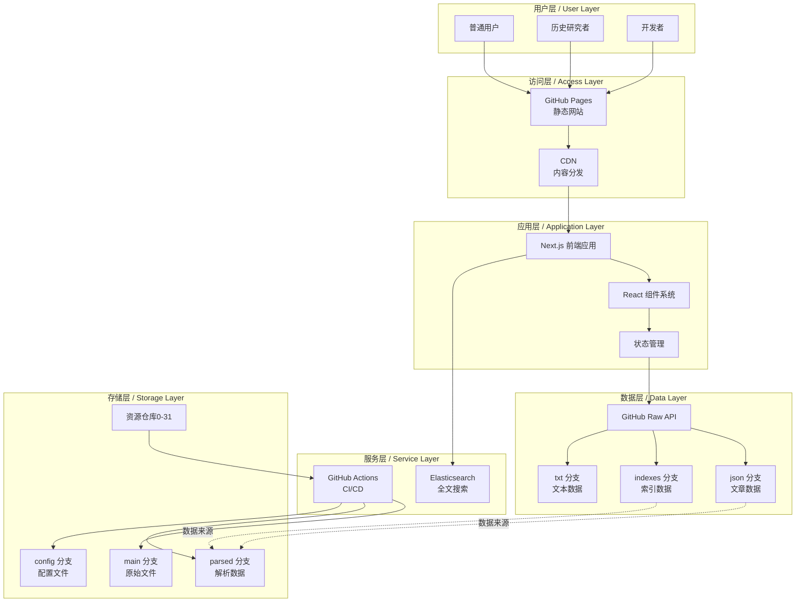
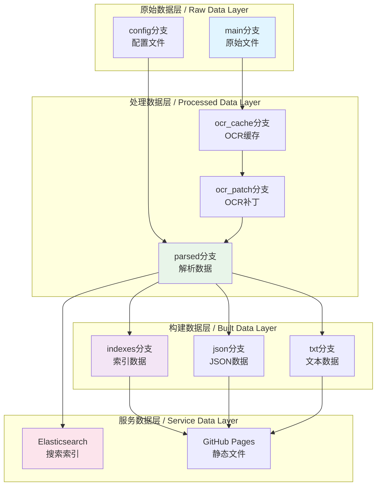
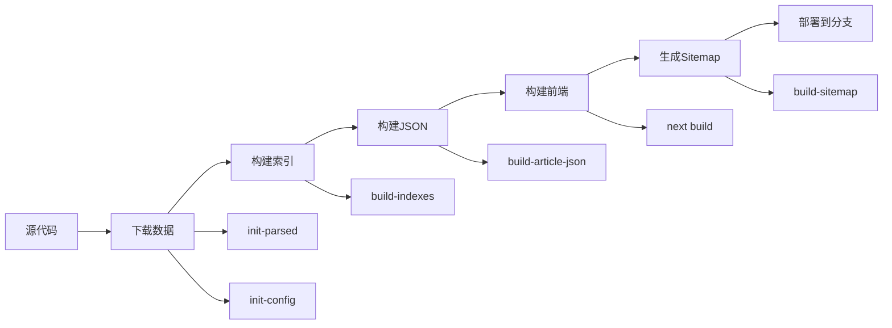
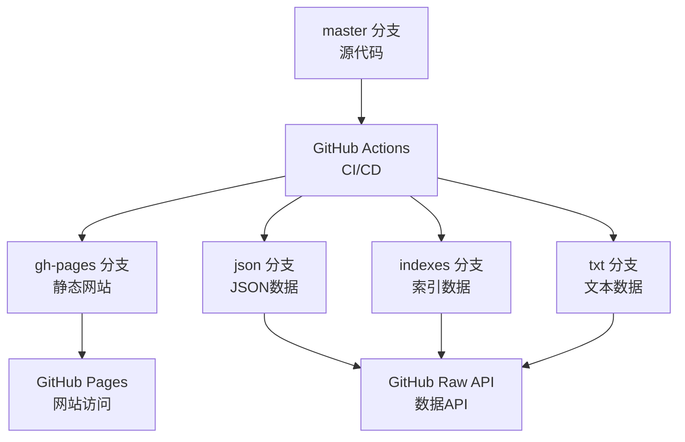

# 系统架构设计文档 / System Architecture Design Document

本文档详细描述和谐历史档案馆项目的系统架构设计，包括整体架构、技术选型、模块设计和扩展性规划。

## 📋 目录 / Table of Contents

- [架构概述 / Architecture Overview](#架构概述--architecture-overview)
- [技术架构 / Technical Architecture](#技术架构--technical-architecture)
- [数据架构 / Data Architecture](#数据架构--data-architecture)
- [前端架构 / Frontend Architecture](#前端架构--frontend-architecture)
- [构建架构 / Build Architecture](#构建架构--build-architecture)
- [部署架构 / Deployment Architecture](#部署架构--deployment-architecture)
- [扩展性设计 / Scalability Design](#扩展性设计--scalability-design)

## 架构概述 / Architecture Overview

### 设计原则 / Design Principles

1. **静态优先**: 优先使用静态网站生成，减少服务器成本
2. **分布式存储**: 使用 Git 仓库分布式存储，提高可用性
3. **无服务器架构**: 基于 GitHub Pages 和 GitHub Raw API，无需后端服务器
4. **可扩展性**: 支持水平扩展，通过增加资源仓库扩展容量
5. **离线可用**: 支持完全离线部署和使用

### 整体架构图 / Overall Architecture Diagram



## 技术架构 / Technical Architecture

### 技术栈选择 / Technology Stack Selection

#### 前端技术栈

| 技术 | 版本 | 用途 | 选择理由 |
|------|------|------|---------|
| Next.js | 15.x | 前端框架 | 静态导出、SSR支持、优秀的开发体验 |
| React | 18.x | UI库 | 组件化、生态丰富、性能优秀 |
| TypeScript | 4.9+ | 类型系统 | 类型安全、代码提示、减少错误 |
| Material-UI | 6.x | UI组件库 | 组件丰富、主题系统、响应式设计 |
| diff-match-patch | 1.x | 文本对比 | 高效的文本差异算法 |

#### 后端/构建技术栈

| 技术 | 版本 | 用途 | 选择理由 |
|------|------|------|---------|
| Node.js | 18.x LTS | 运行时 | 异步IO、生态丰富、跨平台 |
| TypeScript | 4.9+ | 构建脚本 | 类型安全、与前端统一 |
| fs-extra | 10.x | 文件操作 | Promise支持、功能丰富 |
| JSON5 | 2.x | JSON解析 | 支持注释、更灵活 |

#### 数据处理技术栈

| 技术 | 版本 | 用途 | 选择理由 |
|------|------|------|---------|
| PaddleOCR | latest | OCR识别 | 中文识别准确、开源免费 |
| Git LFS | latest | 大文件存储 | 版本控制大文件 |
| Elasticsearch | 8.x | 全文搜索 | 强大的搜索能力、开源 |

### 架构模式 / Architecture Patterns

#### 1. 静态网站生成 (SSG)

- **模式**: Static Site Generation
- **实现**: Next.js `output: 'export'`
- **优势**: 
  - 无需服务器，部署到 GitHub Pages
  - 加载速度快，CDN友好
  - 安全性高，无服务器攻击面

#### 2. 客户端数据获取 (CSR)

- **模式**: Client-Side Rendering
- **实现**: React `useEffect` + `fetch`
- **优势**:
  - 动态数据加载
  - 减少服务器负担
  - 支持离线缓存

#### 3. 分布式数据存储

- **模式**: Distributed Storage
- **实现**: 32个资源仓库 + Git分支
- **优势**:
  - 水平扩展能力强
  - 数据冗余备份
  - 版本控制内置

## 数据架构 / Data Architecture

### 数据存储结构 / Data Storage Structure

```
资源仓库架构:
banned-historical-archives{0-31}/
├── main/              # 原始文件分支
│   └── {id}/         # 资源ID目录
│       ├── file.pdf  # 原始PDF文件
│       └── images/    # 图片文件
├── config/           # 配置分支
│   └── {id}.ts       # TypeScript配置文件
├── parsed/           # 解析数据分支
│   └── {prefix}/     # ID前3位
│       └── {id}/     # 资源ID
│           ├── {id}.json      # 解析结果
│           ├── {id}.tags      # 标签数据
│           └── {id}.metadata  # 元数据
├── ocr_cache/        # OCR缓存分支
│   └── {id}.json     # OCR识别结果
└── ocr_patch/        # OCR补丁分支
    └── {id}.json     # 人工修正补丁
```

### 数据格式设计 / Data Format Design

#### 文章数据结构

```typescript
interface ArticleResponse {
  books: BookData[];
}

interface BookData {
  id: string;              // 书籍ID
  name: string;            // 书籍名称
  type: 'pdf' | 'img';    // 资源类型
  internal: boolean;       // 是否内部文件
  official: boolean;       // 是否官方文件
  author: string;          // 作者信息
  files: string[];         // 文件列表
  tags: Tag[];             // 标签列表
  article: ParserResult;  // 文章内容
}

interface ParserResult {
  title: string;           // 标题
  authors: string[];       // 作者列表
  dates: DateObject[];     // 日期列表
  is_range_date: boolean;  // 是否日期范围
  tags: Tag[];             // 标签
  types: string[];         // 文章类型
  origin?: string;         // 来源
  alias?: string;          // 别名
  parts: ContentPart[];    // 内容段落
  comments: string[];       // 注释列表
  comment_pivots: Pivot[]; // 注释位置
}
```

#### 索引数据结构

```typescript
interface ArticleListIndex {
  articles: ArticleSummary[];  // 文章摘要列表
  books: string[];             // 书籍名称列表
  tags: Tag[];                 // 标签列表
}

interface ArticleSummary {
  id: string;                  // 文章ID
  title: string;               // 标题
  authors: string[];           // 作者
  dates: DateObject[];         // 日期
  is_range_date: boolean;      // 日期范围标识
  tag_ids: number[];          // 标签ID列表
  book_ids: number[];         // 书籍ID列表
}
```

### 数据访问模式 / Data Access Patterns

#### 1. 直接访问模式

```typescript
// 通过 GitHub Raw API 直接访问
const url = `https://raw.githubusercontent.com/.../json/json/${prefix}/${id}.json`;
const data = await fetch(url).then(r => r.json());
```

#### 2. 索引访问模式

```typescript
// 先加载索引，再按需加载详情
const index = await fetch('/indexes/article_list_0.json').then(r => r.json());
const article = await fetch(`/json/json/${id.slice(0,3)}/${id}.json`).then(r => r.json());
```

#### 3. 搜索访问模式

```typescript
// 通过 Elasticsearch 搜索，获取ID后再加载详情
const results = await searchElasticsearch(query);
const articles = await Promise.all(
  results.hits.map(hit => fetchArticle(hit._id))
);
```

### 数据存储层详细设计 / Detailed Data Storage Layer Design

#### 存储分层架构 / Storage Layer Architecture



#### 数据分片策略 / Data Sharding Strategy

```typescript
// 按文章ID前缀分片存储
function getShardPath(articleId: string): string {
  // 使用ID前3位作为分片键
  const prefix = articleId.slice(0, 3);
  return `json/${prefix}/${articleId}.json`;
}

// 按资源仓库ID分片
function getArchiveId(articleId: string): number {
  // 使用哈希算法分配到32个仓库
  const hash = md5(articleId);
  return parseInt(hash.slice(0, 2), 16) % 32;
}

// 索引文件分片
function getIndexShard(articleCount: number, index: number): string {
  const chunkSize = 10000;
  const shardIndex = Math.floor(index / chunkSize);
  return `indexes/article_list_${shardIndex}.json`;
}
```

#### 数据分区策略 / Data Partitioning Strategy

```typescript
// 按日期分区
interface DatePartition {
  year: number;
  month?: number;
  day?: number;
}

function getPartitionByDate(date: DateObject): string {
  if (date.year) {
    const year = date.year;
    const decade = Math.floor((year - 1900) / 10) * 10 + 1900;
    return `decade_${decade}`;
  }
  return 'unknown';
}

// 按标签分区
function getPartitionByTag(tag: Tag): string {
  return `${tag.type}_${tag.name}`;
}

// 按作者分区
function getPartitionByAuthor(author: string): string {
  // 使用拼音首字母
  const pinyin = getPinyinInitial(author);
  return `author_${pinyin}`;
}
```

### 数据访问模式最佳实践 / Data Access Pattern Best Practices

#### 1. 批量加载优化

```typescript
// 批量加载文章数据
async function loadArticlesBatch(articleIds: string[]): Promise<Article[]> {
  // 按分片分组
  const shards = new Map<string, string[]>();
  for (const id of articleIds) {
    const shard = id.slice(0, 3);
    if (!shards.has(shard)) {
      shards.set(shard, []);
    }
    shards.get(shard)!.push(id);
  }
  
  // 并行加载各分片
  const promises = Array.from(shards.entries()).map(async ([shard, ids]) => {
    return Promise.all(ids.map(id => loadArticle(id)));
  });
  
  const results = await Promise.all(promises);
  return results.flat();
}
```

#### 2. 缓存策略

```typescript
// 多级缓存策略
class DataCache {
  private memoryCache = new Map<string, { data: any; timestamp: number }>();
  private readonly MEMORY_TTL = 5 * 60 * 1000; // 5分钟
  
  async get<T>(key: string): Promise<T | null> {
    // 1. 检查内存缓存
    const cached = this.memoryCache.get(key);
    if (cached && Date.now() - cached.timestamp < this.MEMORY_TTL) {
      return cached.data as T;
    }
    
    // 2. 检查浏览器缓存
    const browserCache = await this.getBrowserCache(key);
    if (browserCache) {
      this.memoryCache.set(key, { data: browserCache, timestamp: Date.now() });
      return browserCache as T;
    }
    
    return null;
  }
  
  async set<T>(key: string, data: T): Promise<void> {
    // 更新内存缓存
    this.memoryCache.set(key, { data, timestamp: Date.now() });
    
    // 更新浏览器缓存
    await this.setBrowserCache(key, data);
  }
}
```

#### 3. 预加载策略

```typescript
// 预加载常用数据
class DataPreloader {
  private preloadQueue: string[] = [];
  
  // 预加载文章列表
  async preloadArticleList(): Promise<void> {
    const fileCount = await fetch('/indexes/file_count.json').then(r => r.json());
    const count = fileCount.article_list;
    
    // 预加载前3个分片
    const promises = [];
    for (let i = 0; i < Math.min(3, count); i++) {
      promises.push(
        fetch(`/indexes/article_list_${i}.json`).then(r => r.json())
      );
    }
    
    await Promise.all(promises);
  }
  
  // 预加载热门文章
  async preloadPopularArticles(): Promise<void> {
    const popularIds = await this.getPopularArticleIds();
    await this.loadArticlesBatch(popularIds);
  }
}
```

### 数据备份和恢复策略 / Data Backup and Recovery Strategy

#### 备份策略 / Backup Strategy

```typescript
// 数据备份配置
interface BackupConfig {
  frequency: 'daily' | 'weekly' | 'monthly';
  retention: number; // 保留天数
  locations: string[]; // 备份位置
}

// 执行备份
async function performBackup(config: BackupConfig): Promise<void> {
  const timestamp = new Date().toISOString();
  const backupDir = `backups/${timestamp}`;
  
  // 1. 备份原始数据
  await backupDirectory('parsed', `${backupDir}/parsed`);
  await backupDirectory('config', `${backupDir}/config`);
  
  // 2. 备份构建数据
  await backupDirectory('indexes', `${backupDir}/indexes`);
  await backupDirectory('json', `${backupDir}/json`);
  
  // 3. 生成校验和
  await generateChecksums(backupDir);
  
  // 4. 压缩备份
  await compressBackup(backupDir);
  
  // 5. 上传到远程存储
  for (const location of config.locations) {
    await uploadBackup(backupDir, location);
  }
  
  // 6. 清理旧备份
  await cleanupOldBackups(config.retention);
}
```

#### 恢复策略 / Recovery Strategy

```typescript
// 数据恢复
async function restoreFromBackup(backupId: string): Promise<void> {
  const backupDir = `backups/${backupId}`;
  
  // 1. 验证备份完整性
  const isValid = await validateBackup(backupDir);
  if (!isValid) {
    throw new Error('备份文件损坏');
  }
  
  // 2. 备份当前数据
  await backupCurrentData();
  
  // 3. 恢复数据
  await restoreDirectory(`${backupDir}/parsed`, 'parsed');
  await restoreDirectory(`${backupDir}/config`, 'config');
  await restoreDirectory(`${backupDir}/indexes`, 'indexes');
  await restoreDirectory(`${backupDir}/json`, 'json');
  
  // 4. 重新构建
  await rebuildIndexes();
  await rebuildJSON();
  
  // 5. 验证恢复结果
  await validateRestoredData();
}
```

#### 灾难恢复计划 / Disaster Recovery Plan

```typescript
// 灾难恢复流程
interface DisasterRecoveryPlan {
  rto: number; // Recovery Time Objective (恢复时间目标，分钟)
  rpo: number; // Recovery Point Objective (恢复点目标，分钟)
  procedures: RecoveryProcedure[];
}

// 恢复程序
async function executeDisasterRecovery(plan: DisasterRecoveryPlan): Promise<void> {
  // 1. 评估损失
  const damage = await assessDamage();
  
  // 2. 选择恢复点
  const recoveryPoint = await selectRecoveryPoint(plan.rpo);
  
  // 3. 执行恢复
  await restoreFromBackup(recoveryPoint.backupId);
  
  // 4. 验证恢复
  await validateRecovery();
  
  // 5. 切换到恢复环境
  await switchToRecoveryEnvironment();
  
  // 6. 通知相关人员
  await notifyStakeholders();
}
```

## 前端架构 / Frontend Architecture

### 组件架构 / Component Architecture

```
components/
├── Layout/              # 布局组件
│   ├── Layout.tsx      # 主布局
│   └── Header.tsx      # 页头
├── Article/            # 文章相关组件
│   ├── ArticleCard.tsx # 文章卡片
│   ├── ArticleViewer.tsx # 文章查看器
│   └── VersionCompare.tsx # 版本对比
├── Filter/             # 筛选组件
│   ├── FilterPanel.tsx # 筛选面板
│   └── TagFilter.tsx   # 标签筛选
└── Common/             # 通用组件
    ├── Loading.tsx     # 加载中
    └── ErrorBoundary.tsx # 错误边界
```

### 状态管理 / State Management

#### React Hooks 状态管理

```typescript
// 使用 Context + Hooks 管理全局状态
const AppContext = createContext<AppState>({
  articles: [],
  filters: {},
  loading: false,
});

// 自定义 Hooks
function useArticles() {
  const [articles, setArticles] = useState<Article[]>([]);
  const [loading, setLoading] = useState(false);
  
  const loadArticles = useCallback(async () => {
    setLoading(true);
    try {
      const data = await fetchArticles();
      setArticles(data);
    } finally {
      setLoading(false);
    }
  }, []);
  
  return { articles, loading, loadArticles };
}
```

### 路由架构 / Routing Architecture

```
pages/
├── index.tsx           # 首页
├── articles/           # 文章列表
│   └── index.tsx
├── article/            # 文章详情
│   └── index.tsx
├── search/            # 搜索
│   └── index.tsx
├── music/              # 音乐
│   └── index.tsx
└── gallery/            # 图库
    └── index.tsx
```

## 构建架构 / Build Architecture

### 构建流程 / Build Process



### 构建脚本架构 / Build Scripts Architecture

```
backend/
├── build-indexes.ts       # 构建索引
├── build-article-json.ts  # 构建文章JSON
├── build-sitemap.ts       # 构建网站地图
├── build-txt.ts           # 构建文本导出
├── init-sub-repository.ts # 初始化子仓库
└── init-es.ts             # 初始化Elasticsearch
```

## 部署架构 / Deployment Architecture

### 多分支部署策略 / Multi-Branch Deployment Strategy



### 部署流程 / Deployment Flow

1. **代码提交**: 推送到 `master` 分支
2. **触发构建**: GitHub Actions 自动触发
3. **数据准备**: 下载最新数据
4. **构建处理**: 构建索引、JSON、前端
5. **分支部署**: 推送到对应分支
6. **自动发布**: GitHub Pages 自动更新

## 扩展性设计 / Scalability Design

### 水平扩展 / Horizontal Scaling

#### 资源仓库扩展

- **当前**: 32个资源仓库 (archives0-31)
- **扩展方式**: 增加新的资源仓库 (archives32+)
- **影响**: 前端代码无需修改，自动支持新仓库

#### 数据分片策略

```typescript
// 按ID前缀分片存储
function getArchiveId(articleId: string): number {
  const hash = md5(articleId);
  return parseInt(hash.slice(0, 2), 16) % 32;
}

// 按日期分片索引
function getIndexShard(date: DateObject): number {
  const year = date.year || 1900;
  return Math.floor((year - 1900) / 10); // 每10年一个分片
}
```

### 性能优化扩展 / Performance Optimization Scaling

#### CDN 加速

- **静态资源**: 通过 GitHub Pages CDN 自动加速
- **数据文件**: 通过 GitHub Raw API CDN 加速
- **自定义CDN**: 可配置自定义CDN域名

#### 缓存策略

```typescript
// 多级缓存策略
1. 浏览器缓存 (Cache-Control)
2. CDN缓存 (GitHub CDN)
3. Service Worker缓存 (PWA)
4. 内存缓存 (React State)
```

### 功能扩展 / Feature Scaling

#### 插件化架构

```typescript
// 支持插件扩展
interface Plugin {
  name: string;
  version: string;
  init: (app: App) => void;
  hooks: {
    beforeRender?: (data: any) => any;
    afterRender?: (element: HTMLElement) => void;
  };
}

// 插件注册
function registerPlugin(plugin: Plugin) {
  plugins.push(plugin);
  plugin.init(app);
}
```

#### API 扩展

```typescript
// 支持自定义API端点
interface ApiExtension {
  path: string;
  handler: (req: Request) => Response;
}

// API扩展注册
function registerApi(extension: ApiExtension) {
  apiRoutes.set(extension.path, extension.handler);
}
```

## 安全架构 / Security Architecture

### 安全措施 / Security Measures

1. **静态网站**: 无服务器攻击面
2. **HTTPS**: GitHub Pages 自动提供 HTTPS
3. **内容安全策略**: CSP 头部保护
4. **数据验证**: 客户端和服务端数据验证
5. **访问控制**: 基于 Git 权限的访问控制

### 数据安全 / Data Security

- **版本控制**: Git 提供完整的历史记录
- **数据完整性**: 通过校验和验证数据完整性
- **备份策略**: 分布式存储提供天然备份

## 监控和运维 / Monitoring and Operations

### 监控指标 / Monitoring Metrics

1. **性能指标**: 页面加载时间、API响应时间
2. **错误指标**: 错误率、错误类型分布
3. **使用指标**: 访问量、页面浏览量、搜索量
4. **数据指标**: 数据量、索引大小、构建时间

### 运维工具 / Operations Tools

- **GitHub Actions**: CI/CD 自动化
- **GitHub Insights**: 代码和仓库分析
- **Elasticsearch Monitoring**: 搜索性能监控
- **Browser DevTools**: 前端性能分析

---

**最后更新 / Last Updated**: 2025-01-XX
**维护者 / Maintainers**: 项目维护团队

