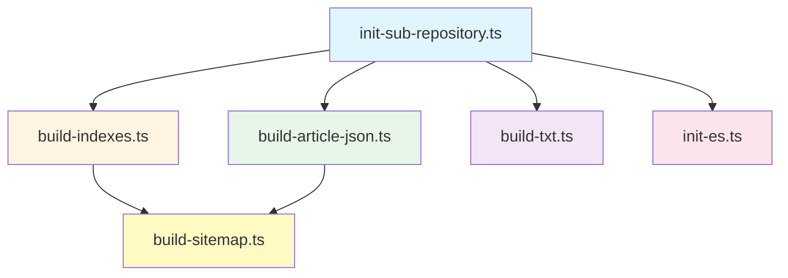

# 构建脚本文档 / Build Scripts Documentation

本文档详细说明和谐历史档案馆项目的所有构建脚本，包括功能说明、使用方法、参数配置和调试技巧。

## 📋 目录 / Table of Contents

- [构建脚本概览 / Build Scripts Overview](#构建脚本概览--build-scripts-overview)
- [脚本详细说明 / Script Details](#脚本详细说明--script-details)
- [脚本使用指南 / Usage Guide](#脚本使用指南--usage-guide)
- [脚本开发规范 / Development Standards](#脚本开发规范--development-standards)
- [调试技巧 / Debugging Tips](#调试技巧--debugging-tips)

## 构建脚本概览 / Build Scripts Overview

### 脚本列表 / Script List

| 脚本文件 | 功能 | 输入 | 输出 | 执行命令 |
|---------|------|------|------|---------|
| `build-indexes.ts` | 构建索引文件 | parsed/, config/ | indexes/ | `npm run build-indexes` |
| `build-article-json.ts` | 构建文章JSON | parsed/, indexes/ | json/ | `npm run build-article-json` |
| `build-sitemap.ts` | 构建网站地图 | indexes/ | out/ | `npm run build` (postbuild) |
| `build-txt.ts` | 构建文本导出 | parsed/ | txt/ | `npm run build-txt` |
| `init-sub-repository.ts` | 初始化子仓库 | GitHub | parsed/, config/ | `npm run init-parsed` |
| `init-es.ts` | 初始化搜索索引 | parsed/ | Elasticsearch | `npm run init-es` |

### 脚本依赖关系 / Script Dependencies



## 脚本详细说明 / Script Details

### build-indexes.ts

#### 功能描述 / Function Description

构建用于前端快速查询的索引文件。索引文件存储在 `indexes/` 目录下，分片存储以提高加载性能。

#### 输入数据 / Input Data

- **parsed/archives{0-31}/**: 解析后的数据目录
  - `{prefix}/{resource_id}/{article_id}.json` - 文章数据
  - `{prefix}/{resource_id}/{article_id}.tags` - 标签数据
  - `{prefix}/{resource_id}/{resource_id}.metadata` - 资源元数据
- **config/archives{0-31}/**: 配置文件目录
  - `{resource_id}.ts` - TypeScript配置文件

#### 输出数据 / Output Data

- **indexes/file_count.json**: 文件统计信息

  ```json
  {
    "article_list": 5  // 文章列表分片数量
  }
  ```

- **indexes/article_list_{n}.json**: 文章列表分片（每片10000条）

  ```json
  {
    "articles": [
      {
        "id": "883eeb87ad",
        "title": "文章标题",
        "authors": ["作者"],
        "dates": [{"year": 1966}],
        "is_range_date": false,
        "tag_ids": [0, 1],
        "book_ids": [0]
      }
    ],
    "books": ["书籍名称"],
    "tags": [{"name": "标签名", "type": "标签类型"}]
  }
  ```

- **indexes/article_list_with_book_info_{n}.json**: 文章与书籍关联信息

  ```json
  [
    [
      "883eeb87ad",
      [
        ["book_id", "书籍名称", 0]
      ]
    ]
  ]
  ```

- **indexes/music.json**: 音乐资源索引
- **indexes/gallery.json**: 图库资源索引

#### 处理流程 / Processing Flow

1. 遍历所有资源仓库 (0-31)
2. 读取每个资源的元数据和配置
3. 根据资源类型（book/music/video/picture）构建对应的索引
4. 合并文章数据，构建文章映射
5. 生成分片存储的索引文件（每片10000条）

#### 代码示例 / Code Example

```typescript
// 主要处理逻辑
for (let i = 0; i <= 31; ++i) {
  const archivePath = join(__dirname, '../parsed/archives' + i);
  
  // 遍历资源目录
  for (const prefix of await fs.readdir(archivePath)) {
    for (const resource of await fs.readdir(join(archivePath, prefix))) {
      // 读取元数据和配置
      const metadata = await readMetadata(resourcePath);
      const config = await readConfig(configPath);
      
      // 根据资源类型处理
      if (config.resource_type === 'book') {
        // 处理书籍资源
        processBookResource(metadata, config);
      } else if (config.resource_type === 'music') {
        // 处理音乐资源
        processMusicResource(metadata);
      }
      // ...
    }
  }
}
```

#### 性能优化 / Performance Optimization

- 使用内存映射存储文章数据，避免重复读取
- 分片存储索引文件，减少单文件大小
- 使用Map数据结构提高查找效率

### build-article-json.ts

#### 功能描述 / Function Description

将解析后的文章数据按照出版物分组，生成前端可直接使用的JSON数据文件。

#### 输入数据 / Input Data

- **parsed/archives{0-31}/**: 解析后的数据目录
- **indexes/**: 文章索引（通过 `get_article_indexes()` 获取）

#### 输出数据 / Output Data

- **json/{prefix}/{article_id}.json**: 文章JSON文件

  ```json
  {
    "books": [
      {
        "id": "book_id",
        "name": "书籍名称",
        "type": "pdf",
        "internal": false,
        "official": true,
        "author": "作者",
        "files": ["file1.pdf"],
        "tags": [{"name": "标签", "type": "类型"}],
        "article": {
          "title": "文章标题",
          "authors": ["作者"],
          "dates": [{"year": 1966}],
          "parts": [...]
        }
      }
    ]
  }
  ```

#### 处理流程 / Processing Flow

1. 读取文章索引，获取所有文章的基本信息
2. 为每篇文章收集其在不同出版物中的版本
3. 合并元数据、文章内容和标签信息
4. 生成按文章ID组织的JSON文件（按ID前3位分组）

#### 代码示例 / Code Example

```typescript
// 主要处理逻辑
for (const article_id of Object.keys(article_indexes)) {
  const book_arr = article_indexes[article_id];
  const books = [];
  
  // 为每篇文章收集其在不同出版物中的版本
  for (const bookInfo of book_arr) {
    const [book_id, book_name, archives_id] = bookInfo;
    
    // 读取书籍元数据
    const bookMetadata = await readBookMetadata(book_path);
    
    // 读取文章内容
    bookMetadata.article = await readArticle(articlePath);
    
    // 读取文章标签
    bookMetadata.tags = await readTags(tagsPath);
    
    books.push(bookMetadata);
  }
  
  // 写入JSON文件
  await writeJSON(outputPath, { books });
}
```

### build-sitemap.ts

#### 功能描述 / Function Description

构建网站地图（sitemap.xml）和robots.txt文件，用于搜索引擎优化。

#### 输入数据 / Input Data

- **indexes/**: 文章索引（通过 `get_article_indexes()` 获取）

#### 输出数据 / Output Data

- **out/sitemap-{n}.xml**: 网站地图分片（每片4000条URL）
- **out/sitemap-index.xml**: 网站地图索引
- **out/robot.txt**: 机器人协议文件

#### 处理流程 / Processing Flow

1. 读取所有文章ID
2. 按分片大小（4000条）分组
3. 生成XML格式的网站地图
4. 生成网站地图索引
5. 生成robots.txt文件

#### 代码示例 / Code Example

```typescript
// 生成网站地图
const chunk_size = 4000;
const ids = Object.keys(article_indexes);
const n = Math.ceil(ids.length / chunk_size);

for (let i = 0; i < n; i++) {
  const chunk = ids.slice(i * chunk_size, (i + 1) * chunk_size);
  const sitemap = generateSitemapXML(chunk, host);
  await writeFile(`out/sitemap-${i}.xml`, sitemap);
}

// 生成网站地图索引
const index = generateSitemapIndex(n, host);
await writeFile('out/sitemap-index.xml', index);
```

### build-txt.ts

#### 功能描述 / Function Description

将文章数据导出为纯文本格式，便于文本搜索和导出。

#### 输入数据 / Input Data

- **parsed/archives{0-31}/**: 解析后的数据目录
- **indexes/**: 文章索引

#### 输出数据 / Output Data

- **txt/{book_id}/{prefix}/{article_id}.txt**: 文本文件

#### 处理流程 / Processing Flow

1. 读取文章数据
2. 格式化文本内容（标题、作者、日期、正文等）
3. 生成纯文本文件

#### 代码示例 / Code Example

```typescript
// 格式化文本内容
const content = `id: ${article_id}
标题：${article.title}
日期：${formatDates(article.dates)}
是否是时间段：${article.is_range_date}
作者：${article.authors.join(',')}
来源：${article.origin || ''}
标签：${tags.map(t => t.name).join(',')}
书籍：${book_metadata.name}
书籍作者：${book_metadata.author}

正文：
${formatParts(article.parts)}

描述：
${article.description || ''}
`;
```

### init-sub-repository.ts

#### 功能描述 / Function Description

从GitHub下载项目所需的资源仓库数据，包括解析后的数据、配置文件等。

#### 支持的分支 / Supported Branches

- **parsed**: 解析后的标准化数据
- **config**: 配置文件和元数据
- **raw**: 原始文件数据（GitHub上使用main分支）
- **ocr_cache**: OCR识别缓存
- **ocr_patch**: OCR结果补丁

#### 处理流程 / Processing Flow

1. 获取命令行参数中的分支名称
2. 遍历所有资源仓库 (0-31)
3. 使用Git浅克隆下载指定分支
4. 如果目录已存在，尝试更新到最新版本

#### 代码示例 / Code Example

```typescript
// 下载资源仓库
for (let i = 0; i <= 31; ++i) {
  const command = `git clone --depth 1 --branch ${branch} ${prefix}/banned-historical-archives${i}.git ${dir}/archives${i}`;
  
  try {
    execSync(command, { cwd: join(__dirname, '..') });
    
    // 如果目录已存在，尝试更新
    const repoPath = join(__dirname, '../', dir, 'archives' + i);
    execSync('git pull', { cwd: repoPath });
  } catch (error) {
    console.log(`仓库 archives${i} 处理失败:`, error);
  }
}
```

#### 使用方法 / Usage

```bash
# 下载解析数据
npm run init-parsed

# 下载配置文件
npm run init-config

# 下载原始文件
npm run init-raw

# 下载OCR缓存
npm run init-ocr_cache

# 下载OCR补丁
npm run init-ocr_patch
```

### init-es.ts

#### 功能描述 / Function Description

将解析后的文章数据导入到Elasticsearch中，用于提供全文搜索功能。

#### 支持的模式 / Supported Modes

- **正常模式**: 检查索引是否为空，只在空索引时导入
- **重置模式**: 清空现有索引并重新导入所有数据

#### 处理流程 / Processing Flow

1. 检查运行模式（正常/重置）
2. 如果是重置模式，清空现有索引
3. 如果是正常模式，检查索引是否为空
4. 读取所有文章数据
5. 索引到Elasticsearch

#### 代码示例 / Code Example

```typescript
// 检查模式
if (process.argv[process.argv.length - 1] === 'reset') {
  // 清空索引
  await esClient.deleteByQuery({
    index: 'article',
    body: { query: { match_all: {} } },
  });
} else {
  // 检查索引是否为空
  const countResult = await esClient.count({ index: 'article' });
  if (countResult.count != 0) {
    console.log('article not empty');
    return;
  }
}

// 索引文章
for (const article_id of Object.keys(article_indexes)) {
  for (const book of article_indexes[article_id]) {
    const article = await readArticle(article_id, book);
    
    await esClient.index({
      index: 'article',
      id: `${article_id}-${book[0]}`,
      document: {
        article_id,
        publication_id: book[0],
        publication_name: book[1],
        title: article.title,
        authors: article.authors,
        content: formatContent(article),
      },
    });
  }
}
```

#### 使用方法 / Usage

```bash
# 初始化索引（只在空索引时导入）
npm run init-es

# 重置并重新初始化索引
npm run reset-es
```

## 脚本使用指南 / Usage Guide

### 完整构建流程 / Complete Build Process

```bash
# 1. 下载数据
npm run init-parsed
npm run init-config

# 2. 构建索引
npm run build-indexes

# 3. 构建JSON数据
npm run build-article-json

# 4. 构建文本导出
npm run build-txt

# 5. 初始化搜索索引
npm run init-es

# 6. 构建前端和网站地图
npm run build
```

### 增量构建 / Incremental Build

```bash
# 只更新变更的数据
npm run init-parsed  # 只下载更新的数据
npm run build-indexes  # 只构建变更的索引
npm run build-article-json  # 只构建变更的JSON
```

### 环境变量配置 / Environment Variables

```bash
# 配置GitHub仓库前缀
export REPO_PREFIX=https://github.com/banned-historical-archives

# 配置Elasticsearch连接
export ES_HOST=localhost
export ES_PORT=9200
```

## 脚本开发规范 / Development Standards

### 代码风格 / Code Style

1. **使用TypeScript**: 所有脚本使用TypeScript编写
2. **类型安全**: 使用类型定义，避免使用`any`
3. **错误处理**: 使用try-catch处理错误，提供有意义的错误信息
4. **日志输出**: 使用console.log输出进度和状态信息

### 文件组织 / File Organization

```
backend/
├── build-indexes.ts          # 索引构建
├── build-article-json.ts     # JSON构建
├── build-sitemap.ts           # 网站地图构建
├── build-txt.ts              # 文本导出构建
├── init-sub-repository.ts    # 子仓库初始化
├── init-es.ts                # 搜索索引初始化
├── get_article_indexes.ts    # 获取文章索引（工具函数）
└── connect-es.ts             # Elasticsearch连接（工具函数）
```

### 命名规范 / Naming Conventions

- **文件名**: 使用kebab-case，如 `build-indexes.ts`
- **函数名**: 使用camelCase，如 `buildIndexes()`
- **类型名**: 使用PascalCase，如 `ArticleIndex`
- **常量名**: 使用UPPER_SNAKE_CASE，如 `MAX_CHUNK_SIZE`

### 文档注释 / Documentation Comments

```typescript
/**
 * @fileoverview 索引构建脚本
 *
 * 此脚本扫描所有解析后的数据，构建用于前端快速查询的索引文件。
 *
 * @example
 * ```bash
 * npm run build-indexes
 * ```
 */

/**
 * 构建文章索引
 *
 * @param articles - 文章列表
 * @returns 索引数据
 */
function buildArticleIndex(articles: Article[]): IndexData {
  // ...
}
```

## 调试技巧 / Debugging Tips

### 日志调试 / Log Debugging

```typescript
// 添加详细日志
console.log(`开始处理仓库: ${archivePath}`);
console.log(`处理资源: ${resource} (仓库 ${i})`);
console.log(`已处理 ${processedCount}/${totalArticles} 篇文章`);
```

### 断点调试 / Breakpoint Debugging

```bash
# 使用Node.js调试器
node --inspect-brk node_modules/.bin/ts-node backend/build-indexes.ts

# 或使用VS Code调试配置
{
  "type": "node",
  "request": "launch",
  "name": "Debug Build Scripts",
  "runtimeExecutable": "npm",
  "runtimeArgs": ["run", "build-indexes"],
  "skipFiles": ["<node_internals>/**"]
}
```

### 性能分析 / Performance Profiling

```typescript
// 添加性能计时
const startTime = Date.now();
await processData();
const duration = Date.now() - startTime;
console.log(`处理耗时: ${duration}ms`);
```

### 错误处理 / Error Handling

```typescript
// 捕获并记录错误
try {
  await processArticle(article);
} catch (error) {
  console.error(`处理文章 ${article.id} 时出错:`, error);
  // 记录到错误日志
  await logError(article.id, error);
  // 继续处理其他文章
  continue;
}
```

### 数据验证 / Data Validation

```typescript
// 验证数据完整性
function validateData(data: any): boolean {
  if (!data.id) {
    console.warn('数据缺少ID');
    return false;
  }
  if (!data.title) {
    console.warn('数据缺少标题');
    return false;
  }
  return true;
}
```

---

**最后更新 / Last Updated**: 2025-01-XX
**维护者 / Maintainers**: 项目维护团队
