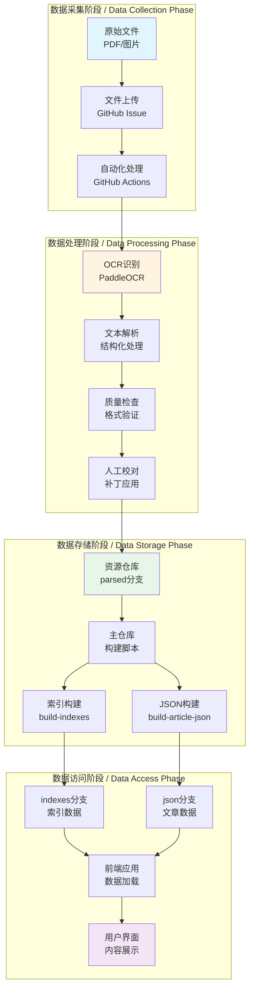
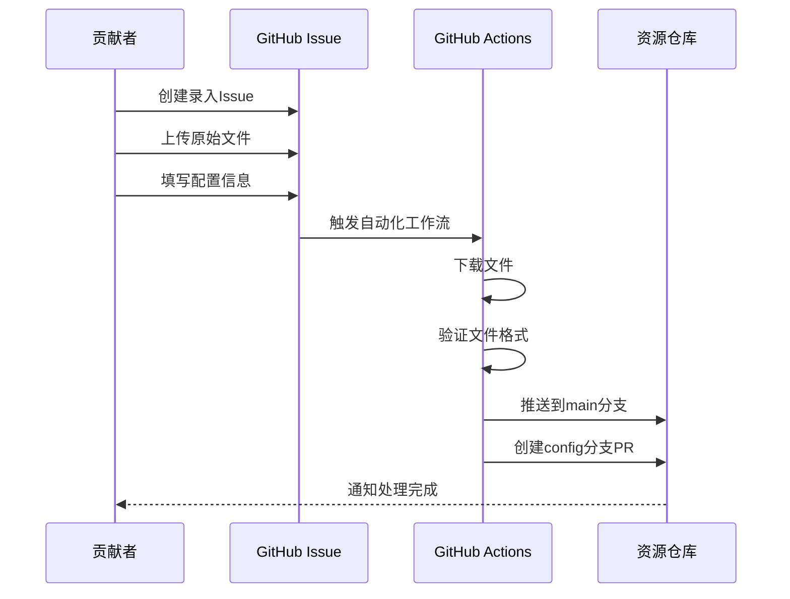
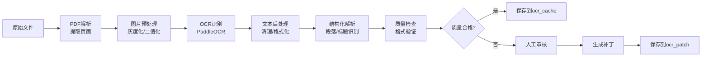
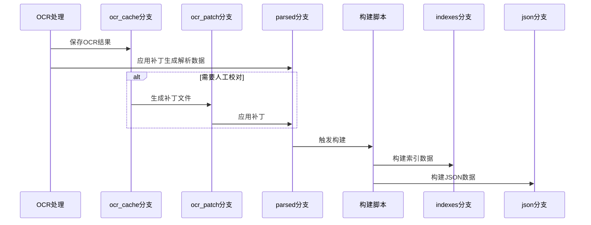
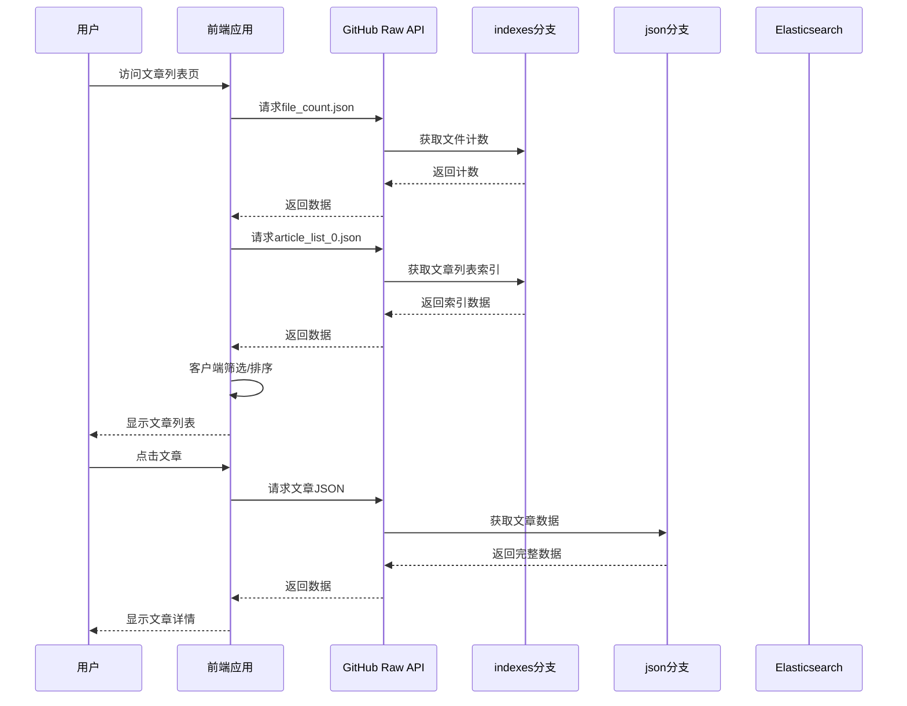
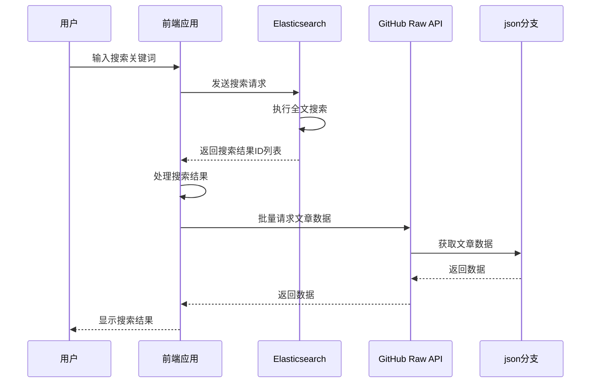
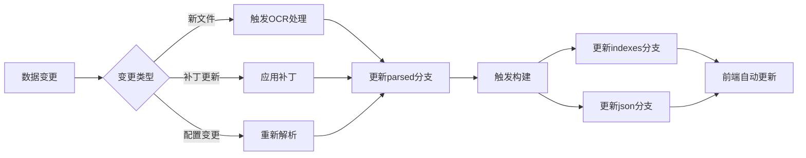
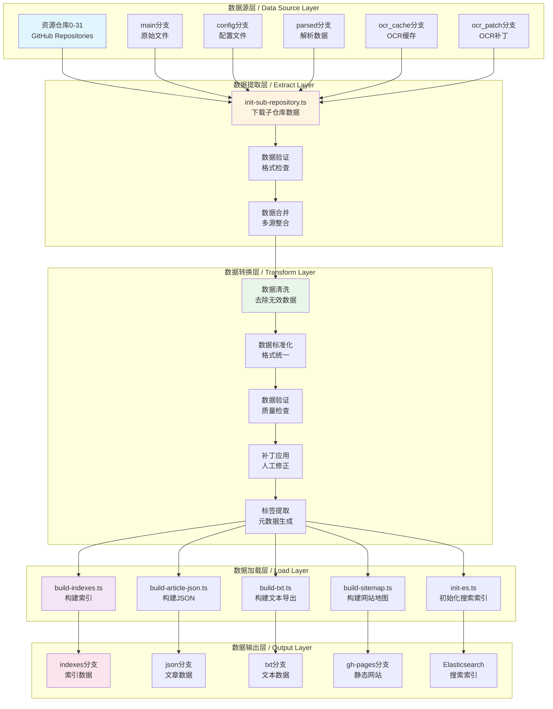
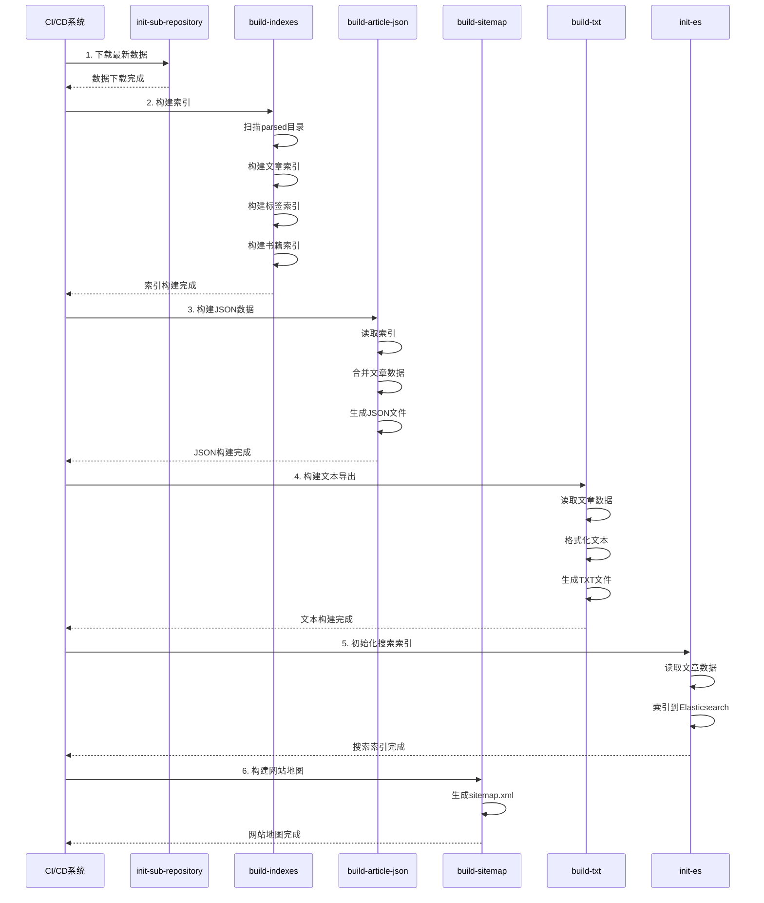
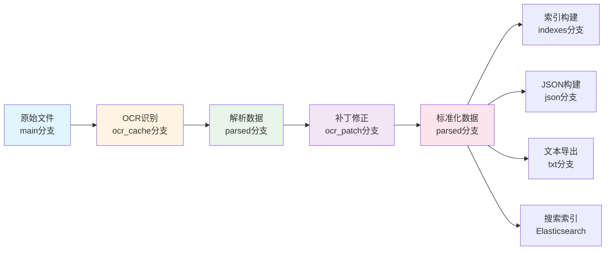

# 数据流和处理流程文档 / Data Flow and Processing Pipeline Document

本文档详细描述和谐历史档案馆项目中数据从原始文件到最终展示的完整处理流程，包括数据采集、处理、存储和访问的各个环节。

## 📋 目录 / Table of Contents

- [数据流概述 / Data Flow Overview](#数据流概述--data-flow-overview)
- [数据采集流程 / Data Collection Process](#数据采集流程--data-collection-process)
- [数据处理流程 / Data Processing Pipeline](#数据处理流程--data-processing-pipeline)
- [数据存储流程 / Data Storage Process](#数据存储流程--data-storage-process)
- [数据访问流程 / Data Access Process](#数据访问流程--data-access-process)
- [数据更新流程 / Data Update Process](#数据更新流程--data-update-process)
- [数据管道架构 / Data Pipeline Architecture](#数据管道架构--data-pipeline-architecture)
- [错误处理和重试机制 / Error Handling and Retry Mechanism](#错误处理和重试机制--error-handling-and-retry-mechanism)
- [数据版本管理 / Data Version Management](#数据版本管理--data-version-management)
- [数据血缘关系追踪 / Data Lineage Tracking](#数据血缘关系追踪--data-lineage-tracking)

## 数据流概述 / Data Flow Overview

### 完整数据流图 / Complete Data Flow Diagram



### 数据流关键节点 / Key Data Flow Nodes

| 阶段 | 输入 | 处理 | 输出 |
|------|------|------|------|
| 采集 | 原始PDF/图片 | 文件上传 | 资源仓库main分支 |
| OCR | PDF/图片 | PaddleOCR识别 | ocr_cache分支 |
| 解析 | OCR结果 | 结构化解析 | parsed分支 |
| 校对 | parsed数据 | 人工修正 | ocr_patch分支 |
| 构建 | parsed数据 | 索引/JSON构建 | indexes/json分支 |
| 访问 | indexes/json | 前端加载 | 用户界面 |

## 数据采集流程 / Data Collection Process

### 文件上传流程 / File Upload Process



### 文件格式要求 / File Format Requirements

#### 支持的格式

| 格式 | 扩展名 | 用途 | 处理方式 |
|------|--------|------|---------|
| PDF | `.pdf` | 文档文件 | PDF解析 + OCR |
| 图片 | `.png`, `.jpg`, `.jpeg` | 扫描图片 | 直接OCR |
| EPUB | `.epub` | 电子书 | EPUB解析 |

#### 文件质量要求

1. **分辨率**: 至少 200 DPI，推荐 300+ DPI
2. **格式**: 清晰的扫描版，避免二次排版
3. **完整性**: 文件完整，无缺失页面
4. **来源**: 注明文件来源，确保可追溯

### 配置信息结构 / Configuration Structure

```typescript
interface UploadConfig {
  source_name: string;        // 来源名称
  archive_id: number;        // 资源仓库ID
  internal: boolean;          // 是否内部文件
  official: boolean;          // 是否官方文件
  author: string;             // 作者信息
  articles: ArticleConfig[]; // 文章配置列表
  ocr?: OCRConfig;            // OCR配置（可选）
}

interface ArticleConfig {
  title: string;             // 文章标题
  authors: string[];         // 作者列表
  dates: DateObject[];      // 日期列表
  is_range_date: boolean;    // 是否日期范围
  page_start: number;        // 起始页码
  page_end: number;          // 结束页码
  alias?: string;            // 别名
}
```

## 数据处理流程 / Data Processing Pipeline

### OCR处理流程 / OCR Processing Pipeline



### OCR处理详细步骤 / Detailed OCR Processing Steps

#### 1. 文件预处理

```typescript
// 文件类型检测和预处理
async function preprocessFile(filePath: string): Promise<ProcessedFile> {
  const fileType = await detectFileType(filePath);
  
  switch (fileType) {
    case 'pdf':
      return await extractPagesFromPDF(filePath);
    case 'image':
      return await loadImage(filePath);
    case 'epub':
      return await extractTextFromEPUB(filePath);
    default:
      throw new Error(`不支持的文件类型: ${fileType}`);
  }
}
```

#### 2. OCR识别

```typescript
// PaddleOCR识别配置
interface OCRConfig {
  rec_model: string;              // 识别模型
  det_model: string;              // 检测模型
  content_thresholds: number[];    // 内容阈值
  use_angle_cls: boolean;          // 使用角度分类
}

// OCR识别流程
async function performOCR(image: Image, config: OCRConfig): Promise<OCRResult> {
  // 1. 文本检测
  const textBoxes = await detectText(image, config.det_model);
  
  // 2. 文本识别
  const texts = await Promise.all(
    textBoxes.map(box => recognizeText(box, config.rec_model))
  );
  
  // 3. 结果合并
  return mergeOCRResults(textBoxes, texts);
}
```

#### 3. 文本结构化解析

```typescript
// 解析OCR结果，识别段落、标题等结构
function parseOCRResult(ocrResult: OCRResult): ParserResult {
  const parts: ContentPart[] = [];
  let currentParagraph = '';
  
  for (const line of ocrResult.lines) {
    // 识别标题（通常字体较大、居中）
    if (isTitle(line)) {
      if (currentParagraph) {
        parts.push({ type: 'paragraph', text: currentParagraph });
        currentParagraph = '';
      }
      parts.push({ type: 'title', text: line.text });
    }
    // 识别作者行
    else if (isAuthorLine(line)) {
      if (currentParagraph) {
        parts.push({ type: 'paragraph', text: currentParagraph });
        currentParagraph = '';
      }
      parts.push({ type: 'authors', text: line.text });
    }
    // 普通段落
    else {
      currentParagraph += line.text + '\n';
    }
  }
  
  // 添加最后一个段落
  if (currentParagraph) {
    parts.push({ type: 'paragraph', text: currentParagraph });
  }
  
  return {
    title: extractTitle(parts),
    authors: extractAuthors(parts),
    dates: extractDates(parts),
    parts: parts,
    // ... 其他字段
  };
}
```

### 质量检查和验证 / Quality Check and Validation

#### 数据格式验证

```typescript
// 验证解析结果格式
function validateParserResult(result: ParserResult): ValidationResult {
  const errors: string[] = [];
  
  // 检查必需字段
  if (!result.title) {
    errors.push('缺少标题');
  }
  
  if (!result.authors || result.authors.length === 0) {
    errors.push('缺少作者信息');
  }
  
  if (!result.dates || result.dates.length === 0) {
    errors.push('缺少日期信息');
  }
  
  // 检查内容段落
  if (!result.parts || result.parts.length === 0) {
    errors.push('缺少内容段落');
  }
  
  // 检查段落类型
  const validTypes = ['title', 'paragraph', 'authors', 'subtitle'];
  for (const part of result.parts) {
    if (!validTypes.includes(part.type)) {
      errors.push(`无效的段落类型: ${part.type}`);
    }
  }
  
  return {
    isValid: errors.length === 0,
    errors,
  };
}
```

#### 质量评分

```typescript
// 计算数据质量分数
function calculateQualityScore(result: ParserResult): number {
  let score = 100;
  
  // 标题质量 (-10 if missing)
  if (!result.title) score -= 10;
  
  // 作者信息 (-5 if missing)
  if (!result.authors || result.authors.length === 0) score -= 5;
  
  // 日期信息 (-5 if missing)
  if (!result.dates || result.dates.length === 0) score -= 5;
  
  // 内容完整性 (-20 if too short)
  const totalLength = result.parts.reduce((sum, p) => sum + p.text.length, 0);
  if (totalLength < 100) score -= 20;
  
  // 格式规范性 (-10 if invalid format)
  if (!validateFormat(result)) score -= 10;
  
  return Math.max(0, score);
}
```

## 数据存储流程 / Data Storage Process

### 存储结构 / Storage Structure

```
资源仓库存储结构:
archives{id}/
├── main/                    # 原始文件分支
│   └── {resource_id}/
│       ├── file.pdf         # PDF文件
│       └── images/          # 图片文件
│           ├── 001.png
│           └── 002.png
│
├── config/                  # 配置分支
│   └── {resource_id}.ts    # TypeScript配置
│
├── ocr_cache/               # OCR缓存分支
│   └── {resource_id}/
│       └── {article_id}.json
│
├── ocr_patch/               # OCR补丁分支
│   └── {resource_id}/
│       └── {article_id}.json
│
└── parsed/                  # 解析数据分支
    └── {prefix}/            # ID前3位
        └── {article_id}/
            ├── {article_id}.json      # 解析结果
            ├── {article_id}.tags      # 标签数据
            └── {article_id}.metadata  # 元数据
```

### 数据存储流程 / Data Storage Flow



## 数据访问流程 / Data Access Process

### 前端数据加载流程 / Frontend Data Loading Flow



### 搜索数据流程 / Search Data Flow



### 数据缓存策略 / Data Caching Strategy

#### 浏览器缓存

```typescript
// 使用Cache API缓存数据
async function getCachedData<T>(key: string): Promise<T | null> {
  const cache = await caches.open('data-cache-v1');
  const cached = await cache.match(key);
  
  if (cached) {
    const data = await cached.json();
    // 检查缓存是否过期（5分钟）
    const age = Date.now() - data.timestamp;
    if (age < 5 * 60 * 1000) {
      return data.value;
    }
  }
  
  return null;
}

async function setCachedData<T>(key: string, value: T): Promise<void> {
  const cache = await caches.open('data-cache-v1');
  const response = new Response(JSON.stringify({
    value,
    timestamp: Date.now(),
  }));
  await cache.put(key, response);
}
```

#### 内存缓存

```typescript
// 使用Map实现内存缓存
class MemoryCache {
  private cache = new Map<string, { data: any; timestamp: number }>();
  private readonly TTL = 5 * 60 * 1000; // 5分钟

  get<T>(key: string): T | null {
    const cached = this.cache.get(key);
    if (cached && Date.now() - cached.timestamp < this.TTL) {
      return cached.data as T;
    }
    return null;
  }

  set<T>(key: string, data: T): void {
    this.cache.set(key, { data, timestamp: Date.now() });
  }

  clear(): void {
    this.cache.clear();
  }
}
```

## 数据更新流程 / Data Update Process

### 数据更新触发 / Data Update Trigger



### 增量更新机制 / Incremental Update Mechanism

```typescript
// 检测数据变更
async function detectChanges(): Promise<string[]> {
  const lastBuildTime = await getLastBuildTime();
  const changedFiles: string[] = [];
  
  // 扫描parsed目录
  const files = await scanParsedDirectory();
  for (const file of files) {
    const stats = await fs.stat(file);
    if (stats.mtimeMs > lastBuildTime) {
      changedFiles.push(file);
    }
  }
  
  return changedFiles;
}

// 增量构建
async function incrementalBuild() {
  const changedFiles = await detectChanges();
  
  if (changedFiles.length === 0) {
    console.log('没有变更，跳过构建');
    return;
  }
  
  // 只构建变更的文件
  for (const file of changedFiles) {
    await buildArticle(file);
  }
  
  // 更新索引
  await updateIndexes(changedFiles);
}
```

### 版本控制 / Version Control

#### Git版本管理

- **数据版本**: 通过Git提交历史追踪数据变更
- **补丁版本**: ocr_patch分支记录每次修正
- **构建版本**: 每次构建生成新的版本标签

#### 数据溯源

```typescript
// 追踪数据来源
interface DataProvenance {
  source_file: string;        // 原始文件
  ocr_version: string;         // OCR版本
  patch_version?: string;      // 补丁版本
  build_time: string;          // 构建时间
  build_commit: string;        // 构建提交
}

// 生成溯源信息
function generateProvenance(articleId: string): DataProvenance {
  return {
    source_file: getSourceFile(articleId),
    ocr_version: getOCRVersion(articleId),
    patch_version: getPatchVersion(articleId),
    build_time: new Date().toISOString(),
    build_commit: getCurrentCommit(),
  };
}
```

## 数据管道架构 / Data Pipeline Architecture

### 完整数据管道图 / Complete Data Pipeline Diagram



### 数据管道执行顺序 / Pipeline Execution Order



### 数据转换步骤详解 / Detailed Data Transformation Steps

#### 步骤1: 数据提取 (Extract)

```typescript
// 数据提取流程
interface ExtractResult {
  parsed: ParsedData[];      // 解析后的数据
  config: ConfigData[];       // 配置数据
  metadata: Metadata[];       // 元数据
  patches: PatchData[];       // 补丁数据
}

async function extractData(): Promise<ExtractResult> {
  const result: ExtractResult = {
    parsed: [],
    config: [],
    metadata: [],
    patches: [],
  };
  
  // 遍历所有资源仓库 (0-31)
  for (let i = 0; i <= 31; i++) {
    const archivePath = `parsed/archives${i}`;
    
    // 检查仓库是否存在
    if (!await fs.pathExists(archivePath)) {
      continue;
    }
    
    // 读取parsed数据
    const parsedData = await readParsedData(archivePath);
    result.parsed.push(...parsedData);
    
    // 读取config数据
    const configData = await readConfigData(`config/archives${i}`);
    result.config.push(...configData);
    
    // 读取补丁数据
    const patchData = await readPatchData(`ocr_patch/archives${i}`);
    result.patches.push(...patchData);
  }
  
  return result;
}
```

#### 步骤2: 数据转换 (Transform)

```typescript
// 数据转换流程
interface TransformResult {
  articles: Article[];        // 标准化文章
  indexes: IndexData;         // 索引数据
  errors: ValidationError[];  // 验证错误
}

async function transformData(extracted: ExtractResult): Promise<TransformResult> {
  const articles: Article[] = [];
  const errors: ValidationError[] = [];
  
  // 应用补丁
  for (const patch of extracted.patches) {
    const article = findArticle(extracted.parsed, patch.articleId);
    if (article) {
      applyPatch(article, patch);
    }
  }
  
  // 数据标准化
  for (const parsed of extracted.parsed) {
    try {
      // 验证数据格式
      const validation = validateParserResult(parsed);
      if (!validation.isValid) {
        errors.push(...validation.errors);
        continue;
      }
      
      // 标准化处理
      const article = standardizeArticle(parsed, extracted.config);
      articles.push(article);
    } catch (error) {
      errors.push({
        articleId: parsed.id,
        error: error.message,
      });
    }
  }
  
  // 构建索引
  const indexes = buildIndexes(articles);
  
  return {
    articles,
    indexes,
    errors,
  };
}
```

#### 步骤3: 数据加载 (Load)

```typescript
// 数据加载流程
async function loadData(transformed: TransformResult): Promise<void> {
  // 1. 构建索引文件
  await buildIndexFiles(transformed.indexes);
  
  // 2. 构建JSON文件
  await buildJSONFiles(transformed.articles);
  
  // 3. 构建文本文件
  await buildTextFiles(transformed.articles);
  
  // 4. 更新搜索索引
  await updateSearchIndex(transformed.articles);
  
  // 5. 构建网站地图
  await buildSitemap(transformed.articles);
  
  // 6. 报告错误
  if (transformed.errors.length > 0) {
    await reportErrors(transformed.errors);
  }
}
```

## 错误处理和重试机制 / Error Handling and Retry Mechanism

### 错误分类 / Error Classification

```typescript
enum ErrorType {
  NETWORK_ERROR = 'NETWORK_ERROR',           // 网络错误
  FILE_NOT_FOUND = 'FILE_NOT_FOUND',         // 文件不存在
  PARSE_ERROR = 'PARSE_ERROR',               // 解析错误
  VALIDATION_ERROR = 'VALIDATION_ERROR',     // 验证错误
  BUILD_ERROR = 'BUILD_ERROR',               // 构建错误
  UNKNOWN_ERROR = 'UNKNOWN_ERROR',           // 未知错误
}

interface ErrorInfo {
  type: ErrorType;
  message: string;
  articleId?: string;
  filePath?: string;
  timestamp: Date;
  retryCount: number;
  maxRetries: number;
}
```

### 重试策略 / Retry Strategy

```typescript
// 指数退避重试策略
async function retryWithBackoff<T>(
  fn: () => Promise<T>,
  maxRetries: number = 3,
  baseDelay: number = 1000
): Promise<T> {
  let lastError: Error;
  
  for (let attempt = 0; attempt < maxRetries; attempt++) {
    try {
      return await fn();
    } catch (error) {
      lastError = error;
      
      // 如果是最后一次尝试，直接抛出错误
      if (attempt === maxRetries - 1) {
        throw error;
      }
      
      // 计算延迟时间（指数退避）
      const delay = baseDelay * Math.pow(2, attempt);
      console.warn(`重试 ${attempt + 1}/${maxRetries}，${delay}ms后重试...`);
      
      await sleep(delay);
    }
  }
  
  throw lastError!;
}

// 使用示例
async function downloadWithRetry(url: string): Promise<Buffer> {
  return retryWithBackoff(async () => {
    const response = await fetch(url);
    if (!response.ok) {
      throw new Error(`HTTP ${response.status}: ${response.statusText}`);
    }
    return Buffer.from(await response.arrayBuffer());
  }, 3, 1000);
}
```

### 错误恢复机制 / Error Recovery Mechanism

```typescript
// 错误恢复策略
class ErrorRecovery {
  private errorQueue: ErrorInfo[] = [];
  
  // 记录错误
  recordError(error: ErrorInfo): void {
    this.errorQueue.push(error);
    
    // 根据错误类型选择恢复策略
    switch (error.type) {
      case ErrorType.NETWORK_ERROR:
        this.scheduleRetry(error);
        break;
      case ErrorType.FILE_NOT_FOUND:
        this.reportMissingFile(error);
        break;
      case ErrorType.PARSE_ERROR:
        this.markForManualReview(error);
        break;
      case ErrorType.VALIDATION_ERROR:
        this.logValidationError(error);
        break;
      default:
        this.reportUnknownError(error);
    }
  }
  
  // 计划重试
  private scheduleRetry(error: ErrorInfo): void {
    if (error.retryCount < error.maxRetries) {
      setTimeout(() => {
        this.retryOperation(error);
      }, 1000 * Math.pow(2, error.retryCount));
    }
  }
  
  // 标记需要人工审核
  private markForManualReview(error: ErrorInfo): void {
    // 创建Issue或通知管理员
    console.warn(`需要人工审核: ${error.articleId}`);
  }
  
  // 报告缺失文件
  private reportMissingFile(error: ErrorInfo): void {
    console.error(`文件不存在: ${error.filePath}`);
    // 可以尝试从备份恢复或跳过
  }
}
```

### 错误监控和告警 / Error Monitoring and Alerting

```typescript
// 错误监控
class ErrorMonitor {
  private errorCounts = new Map<ErrorType, number>();
  private errorThresholds = new Map<ErrorType, number>([
    [ErrorType.NETWORK_ERROR, 10],
    [ErrorType.PARSE_ERROR, 5],
    [ErrorType.VALIDATION_ERROR, 20],
  ]);
  
  // 检查错误阈值
  checkThresholds(): void {
    for (const [type, threshold] of this.errorThresholds) {
      const count = this.errorCounts.get(type) || 0;
      if (count >= threshold) {
        this.sendAlert(type, count);
      }
    }
  }
  
  // 发送告警
  private sendAlert(type: ErrorType, count: number): void {
    console.error(`告警: ${type} 错误数量达到 ${count}`);
    // 发送邮件、Slack通知等
  }
}
```

## 数据版本管理 / Data Version Management

### 版本控制策略 / Version Control Strategy

```typescript
interface DataVersion {
  version: string;              // 版本号 (semver格式)
  commitHash: string;           // Git提交哈希
  buildTime: string;            // 构建时间
  dataHash: string;             // 数据内容哈希
  changes: ChangeLog[];         // 变更日志
}

interface ChangeLog {
  articleId: string;
  changeType: 'ADD' | 'UPDATE' | 'DELETE';
  description: string;
  timestamp: Date;
}
```

### 版本追踪 / Version Tracking

```typescript
// 生成数据版本信息
function generateDataVersion(): DataVersion {
  const commitHash = execSync('git rev-parse HEAD').toString().trim();
  const dataHash = calculateDataHash();
  const changes = detectChanges();
  
  return {
    version: calculateVersion(changes),
    commitHash,
    buildTime: new Date().toISOString(),
    dataHash,
    changes,
  };
}

// 检测数据变更
function detectChanges(): ChangeLog[] {
  const changes: ChangeLog[] = [];
  const lastVersion = loadLastVersion();
  
  // 比较当前数据和上一版本
  const currentArticles = getAllArticles();
  const previousArticles = loadPreviousArticles(lastVersion);
  
  // 检测新增
  for (const article of currentArticles) {
    if (!previousArticles.has(article.id)) {
      changes.push({
        articleId: article.id,
        changeType: 'ADD',
        description: `新增文章: ${article.title}`,
        timestamp: new Date(),
      });
    }
  }
  
  // 检测更新
  for (const article of currentArticles) {
    const previous = previousArticles.get(article.id);
    if (previous && hasChanged(article, previous)) {
      changes.push({
        articleId: article.id,
        changeType: 'UPDATE',
        description: `更新文章: ${article.title}`,
        timestamp: new Date(),
      });
    }
  }
  
  // 检测删除
  for (const article of previousArticles.values()) {
    if (!currentArticles.has(article.id)) {
      changes.push({
        articleId: article.id,
        changeType: 'DELETE',
        description: `删除文章: ${article.title}`,
        timestamp: new Date(),
      });
    }
  }
  
  return changes;
}
```

### 版本回滚 / Version Rollback

```typescript
// 版本回滚
async function rollbackToVersion(version: string): Promise<void> {
  const targetVersion = loadVersion(version);
  
  if (!targetVersion) {
    throw new Error(`版本 ${version} 不存在`);
  }
  
  // 备份当前版本
  await backupCurrentVersion();
  
  // 恢复目标版本的数据
  await restoreData(targetVersion.dataHash);
  
  // 恢复索引
  await restoreIndexes(targetVersion.commitHash);
  
  console.log(`已回滚到版本 ${version}`);
}
```

## 数据血缘关系追踪 / Data Lineage Tracking

### 数据血缘图 / Data Lineage Graph



### 数据溯源 / Data Provenance

```typescript
interface DataProvenance {
  articleId: string;
  source: {
    repository: string;         // 资源仓库
    branch: string;             // 分支名
    filePath: string;           // 文件路径
    commitHash: string;         // 提交哈希
  };
  transformations: {
    step: string;               // 转换步骤
    timestamp: Date;            // 执行时间
    config: any;                // 配置信息
  }[];
  dependencies: {
    articleId: string;          // 依赖的文章ID
    relationship: string;       // 关系类型
  }[];
}

// 生成数据溯源信息
function generateProvenance(articleId: string): DataProvenance {
  const article = getArticle(articleId);
  
  return {
    articleId,
    source: {
      repository: article.sourceRepository,
      branch: article.sourceBranch,
      filePath: article.sourceFilePath,
      commitHash: article.sourceCommitHash,
    },
    transformations: article.transformHistory,
    dependencies: findDependencies(articleId),
  };
}

// 查找数据依赖
function findDependencies(articleId: string): Dependency[] {
  const dependencies: Dependency[] = [];
  const article = getArticle(articleId);
  
  // 查找引用的其他文章
  for (const part of article.parts) {
    const references = extractReferences(part.text);
    for (const ref of references) {
      dependencies.push({
        articleId: ref.articleId,
        relationship: 'REFERENCES',
      });
    }
  }
  
  // 查找相同来源的文章
  const sameSource = findArticlesBySource(article.source);
  for (const related of sameSource) {
    if (related.id !== articleId) {
      dependencies.push({
        articleId: related.id,
        relationship: 'SAME_SOURCE',
      });
    }
  }
  
  return dependencies;
}
```

### 影响分析 / Impact Analysis

```typescript
// 分析数据变更的影响范围
function analyzeImpact(articleId: string): ImpactAnalysis {
  const article = getArticle(articleId);
  const impact: ImpactAnalysis = {
    affectedArticles: [],
    affectedIndexes: [],
    affectedSearches: [],
  };
  
  // 查找依赖此文章的其他文章
  const dependents = findDependents(articleId);
  impact.affectedArticles.push(...dependents);
  
  // 查找受影响的索引
  const indexes = findAffectedIndexes(articleId);
  impact.affectedIndexes.push(...indexes);
  
  // 查找受影响的搜索
  const searches = findAffectedSearches(articleId);
  impact.affectedSearches.push(...searches);
  
  return impact;
}
```

---

**最后更新 / Last Updated**: 2025-01-XX
**维护者 / Maintainers**: 项目维护团队
