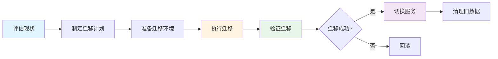

# 数据迁移文档 / Data Migration Document

本文档描述数据迁移策略、版本兼容性处理、迁移脚本使用和回滚策略。

## 📋 目录 / Table of Contents

- [数据迁移策略 / Data Migration Strategy](#数据迁移策略--data-migration-strategy)
- [版本兼容性处理 / Version Compatibility](#版本兼容性处理--version-compatibility)
- [迁移脚本使用 / Migration Script Usage](#迁移脚本使用--migration-script-usage)
- [回滚策略 / Rollback Strategy](#回滚策略--rollback-strategy)
- [迁移验证 / Migration Validation](#迁移验证--migration-validation)

## 数据迁移策略 / Data Migration Strategy

### 迁移类型 / Migration Types

#### 数据结构迁移 / Data Structure Migration

当数据结构发生变化时，需要迁移现有数据到新结构。

#### 数据格式迁移 / Data Format Migration

当数据格式发生变化时，需要转换数据格式。

#### 数据位置迁移 / Data Location Migration

当数据存储位置发生变化时，需要迁移数据到新位置。

### 迁移计划 / Migration Plan



## 版本兼容性处理 / Version Compatibility

### 版本管理 / Version Management

```typescript
interface DataVersion {
  version: string;              // 版本号 (semver格式)
  schema: string;              // 数据模式版本
  migrationScript: string;     // 迁移脚本路径
  rollbackScript: string;      // 回滚脚本路径
}
```

### 兼容性检查 / Compatibility Check

```typescript
function checkCompatibility(currentVersion: string, targetVersion: string): CompatibilityResult {
  const current = parseVersion(currentVersion);
  const target = parseVersion(targetVersion);
  
  // 主版本号不同，不兼容
  if (current.major !== target.major) {
    return {
      compatible: false,
      requiresMigration: true,
      migrationPath: findMigrationPath(currentVersion, targetVersion),
    };
  }
  
  // 次版本号不同，可能需要迁移
  if (current.minor !== target.minor) {
    return {
      compatible: true,
      requiresMigration: checkMigrationRequired(currentVersion, targetVersion),
      migrationPath: findMigrationPath(currentVersion, targetVersion),
    };
  }
  
  // 补丁版本不同，通常兼容
  return {
    compatible: true,
    requiresMigration: false,
  };
}
```

## 迁移脚本使用 / Migration Script Usage

### 迁移脚本示例 / Migration Script Example

```typescript
// 从v1迁移到v2
async function migrateV1ToV2(data: V1Data): Promise<V2Data> {
  return {
    // 转换字段
    id: data.id,
    title: data.title,
    
    // 新结构
    dates: [data.date],  // 单个日期转换为数组
    is_range_date: false,
    
    // 保持其他字段
    authors: data.authors,
    parts: data.parts,
  };
}
```

### 批量迁移 / Batch Migration

```typescript
async function batchMigrate(sourceDir: string, targetDir: string): Promise<void> {
  const files = await fs.readdir(sourceDir);
  
  for (const file of files) {
    const sourcePath = join(sourceDir, file);
    const targetPath = join(targetDir, file);
    
    // 读取旧数据
    const oldData = await fs.readJSON(sourcePath);
    
    // 执行迁移
    const newData = await migrateV1ToV2(oldData);
    
    // 写入新数据
    await fs.writeJSON(targetPath, newData);
  }
}
```

## 回滚策略 / Rollback Strategy

### 回滚流程 / Rollback Process


### 回滚脚本 / Rollback Script

```typescript
async function rollback(version: string): Promise<void> {
  // 1. 停止服务
  await stopServices();
  
  // 2. 恢复备份
  const backupPath = `backups/${version}`;
  await restoreBackup(backupPath);
  
  // 3. 验证数据
  await validateData();
  
  // 4. 重启服务
  await startServices();
}
```

## 迁移验证 / Migration Validation

### 验证检查项 / Validation Checks

- 数据完整性
- 数据格式正确性
- 数据一致性
- 性能指标

### 验证脚本 / Validation Script

```typescript
async function validateMigration(sourceDir: string, targetDir: string): Promise<ValidationResult> {
  const sourceFiles = await fs.readdir(sourceDir);
  const targetFiles = await fs.readdir(targetDir);
  
  // 检查文件数量
  if (sourceFiles.length !== targetFiles.length) {
    return {
      valid: false,
      errors: ['文件数量不匹配'],
    };
  }
  
  // 检查数据完整性
  for (const file of sourceFiles) {
    const sourceData = await fs.readJSON(join(sourceDir, file));
    const targetData = await fs.readJSON(join(targetDir, file));
    
    if (!validateDataIntegrity(sourceData, targetData)) {
      return {
        valid: false,
        errors: [`文件 ${file} 数据不完整`],
      };
    }
  }
  
  return {
    valid: true,
    errors: [],
  };
}
```

---

**最后更新 / Last Updated**: 2025-01-XX
**维护者 / Maintainers**: 项目维护团队

