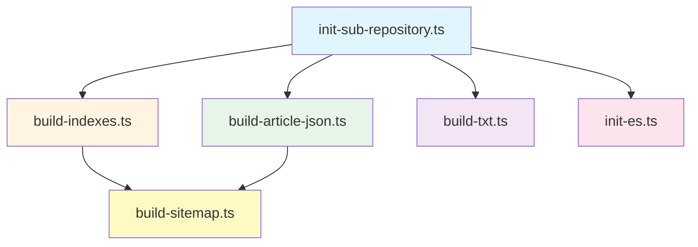
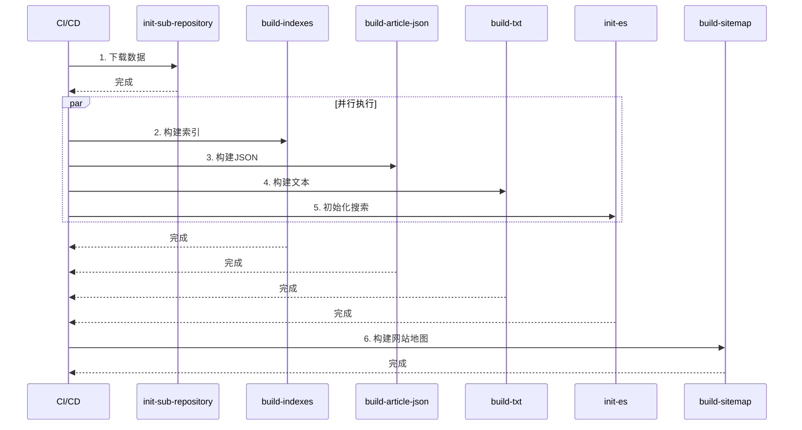

# 数据管道文档 / Data Pipeline Document

本文档详细描述和谐历史档案馆项目的数据管道架构，包括ETL流程、数据管道组件、监控和优化策略。

## 📋 目录 / Table of Contents

- [数据管道概述 / Data Pipeline Overview](#数据管道概述--data-pipeline-overview)
- [ETL流程详解 / ETL Process Details](#etl流程详解--etl-process-details)
- [数据管道组件 / Data Pipeline Components](#数据管道组件--data-pipeline-components)
- [数据管道监控 / Data Pipeline Monitoring](#数据管道监控--data-pipeline-monitoring)
- [数据管道优化 / Data Pipeline Optimization](#数据管道优化--data-pipeline-optimization)

## 数据管道概述 / Data Pipeline Overview

### 数据管道架构 / Data Pipeline Architecture

数据管道是数据从原始状态到最终可用状态的处理流程，主要包括三个阶段：

1. **Extract (提取)**: 从资源仓库提取数据
2. **Transform (转换)**: 数据清洗、标准化、验证
3. **Load (加载)**: 构建索引、生成JSON、更新搜索索引


### 数据管道特点 / Pipeline Characteristics

- **可扩展性**: 支持水平扩展，通过增加资源仓库扩展容量
- **可靠性**: 具备错误处理和重试机制
- **可监控性**: 提供详细的日志和性能指标
- **可维护性**: 模块化设计，易于维护和更新

## ETL流程详解 / ETL Process Details

### Extract (提取) / Extract Phase

#### 数据源 / Data Sources

数据管道从以下数据源提取数据：

1. **资源仓库 (archives0-31)**
   - `main` 分支: 原始文件
   - `config` 分支: 配置文件
   - `parsed` 分支: 解析数据
   - `ocr_cache` 分支: OCR缓存
   - `ocr_patch` 分支: OCR补丁

#### 提取流程 / Extraction Process

```typescript
// 数据提取流程
async function extractData(): Promise<ExtractedData> {
  const extracted: ExtractedData = {
    parsed: [],
    config: [],
    metadata: [],
    patches: [],
  };
  
  // 遍历所有资源仓库
  for (let i = 0; i <= 31; i++) {
    const archivePath = `parsed/archives${i}`;
    
    if (!await fs.pathExists(archivePath)) {
      continue;
    }
    
    // 提取parsed数据
    const parsedData = await extractParsedData(archivePath);
    extracted.parsed.push(...parsedData);
    
    // 提取config数据
    const configData = await extractConfigData(`config/archives${i}`);
    extracted.config.push(...configData);
    
    // 提取补丁数据
    const patchData = await extractPatchData(`ocr_patch/archives${i}`);
    extracted.patches.push(...patchData);
  }
  
  return extracted;
}
```

#### 提取脚本 / Extraction Scripts

- **init-sub-repository.ts**: 从GitHub下载资源仓库数据
  - 支持多个分支: parsed, config, raw, ocr_cache, ocr_patch
  - 使用Git浅克隆提高速度
  - 支持增量更新

```bash
# 下载解析数据
npm run init-parsed

# 下载配置文件
npm run init-config
```

### Transform (转换) / Transform Phase

#### 数据清洗 / Data Cleaning

```typescript
// 数据清洗流程
function cleanData(rawData: RawData): CleanedData {
  return {
    // 去除空白字符
    text: rawData.text.trim(),
    
    // 标准化编码
    encoding: normalizeEncoding(rawData.encoding),
    
    // 移除无效字符
    content: removeInvalidChars(rawData.content),
    
    // 统一换行符
    lineEndings: normalizeLineEndings(rawData.lineEndings),
  };
}
```

#### 数据标准化 / Data Standardization

```typescript
// 数据标准化流程
function standardizeData(cleanedData: CleanedData): StandardizedData {
  return {
    // 标准化日期格式
    dates: cleanedData.dates.map(d => standardizeDate(d)),
    
    // 标准化作者名称
    authors: cleanedData.authors.map(a => standardizeAuthor(a)),
    
    // 标准化标签
    tags: cleanedData.tags.map(t => standardizeTag(t)),
    
    // 标准化内容结构
    parts: standardizeContentParts(cleanedData.parts),
  };
}
```

#### 数据验证 / Data Validation

```typescript
// 数据验证流程
function validateData(standardizedData: StandardizedData): ValidationResult {
  const errors: ValidationError[] = [];
  
  // 验证必填字段
  if (!standardizedData.title) {
    errors.push({ field: 'title', message: '标题不能为空' });
  }
  
  // 验证数据格式
  if (!isValidDate(standardizedData.dates[0])) {
    errors.push({ field: 'dates', message: '日期格式无效' });
  }
  
  // 验证数据完整性
  if (standardizedData.parts.length === 0) {
    errors.push({ field: 'parts', message: '内容不能为空' });
  }
  
  return {
    isValid: errors.length === 0,
    errors,
  };
}
```

#### 补丁应用 / Patch Application

```typescript
// 应用补丁
function applyPatches(data: StandardizedData, patches: Patch[]): StandardizedData {
  let result = { ...data };
  
  for (const patch of patches) {
    if (patch.articleId === data.id) {
      result = applyPatch(result, patch);
    }
  }
  
  return result;
}
```

### Load (加载) / Load Phase

#### 索引构建 / Index Building

```typescript
// 构建索引
async function buildIndexes(articles: Article[]): Promise<void> {
  // 1. 构建文章索引
  const articleIndex = buildArticleIndex(articles);
  await writeIndex('indexes/article_list_0.json', articleIndex);
  
  // 2. 构建标签索引
  const tagIndex = buildTagIndex(articles);
  await writeIndex('indexes/tags.json', tagIndex);
  
  // 3. 构建书籍索引
  const bookIndex = buildBookIndex(articles);
  await writeIndex('indexes/books.json', bookIndex);
  
  // 4. 更新文件计数
  await updateFileCount(articles.length);
}
```

#### JSON构建 / JSON Building

```typescript
// 构建JSON数据
async function buildJSON(articles: Article[]): Promise<void> {
  for (const article of articles) {
    const prefix = article.id.slice(0, 3);
    const dir = `json/${prefix}`;
    
    await fs.ensureDir(dir);
    
    const filePath = `${dir}/${article.id}.json`;
    await fs.writeJSON(filePath, {
      books: article.books,
    });
  }
}
```

#### 搜索索引更新 / Search Index Update

```typescript
// 更新Elasticsearch索引
async function updateSearchIndex(articles: Article[]): Promise<void> {
  for (const article of articles) {
    await esClient.index({
      index: 'article',
      id: article.id,
      document: {
        article_id: article.id,
        title: article.title,
        authors: article.authors,
        content: article.content,
      },
    });
  }
}
```

## 数据管道组件 / Data Pipeline Components

### 构建脚本说明 / Build Scripts

#### build-indexes.ts

**功能**: 构建文章索引文件

**输入**: 
- `parsed/archives{0-31}/` - 解析后的数据
- `config/archives{0-31}/` - 配置文件

**输出**:
- `indexes/file_count.json` - 文件统计
- `indexes/article_list_{n}.json` - 文章列表分片
- `indexes/article_list_with_book_info_{n}.json` - 文章与书籍关联
- `indexes/music.json` - 音乐索引
- `indexes/gallery.json` - 图库索引

**处理流程**:
1. 遍历所有资源仓库 (0-31)
2. 读取每个资源的元数据和配置
3. 根据资源类型构建对应的索引
4. 生成分片存储的索引文件

#### build-article-json.ts

**功能**: 构建文章JSON数据文件

**输入**:
- `parsed/archives{0-31}/` - 解析后的数据
- 文章索引信息

**输出**:
- `json/{prefix}/{article_id}.json` - 文章JSON文件

**处理流程**:
1. 读取文章索引，获取所有文章的基本信息
2. 为每篇文章收集其在不同出版物中的版本
3. 合并元数据、文章内容和标签信息
4. 生成按文章ID组织的JSON文件

#### build-sitemap.ts

**功能**: 构建网站地图

**输入**:
- 文章索引

**输出**:
- `out/sitemap-{n}.xml` - 网站地图分片
- `out/sitemap-index.xml` - 网站地图索引
- `out/robot.txt` - 机器人协议文件

**处理流程**:
1. 读取所有文章ID
2. 按分片大小分组
3. 生成XML格式的网站地图
4. 生成网站地图索引

#### build-txt.ts

**功能**: 构建文本导出文件

**输入**:
- `parsed/archives{0-31}/` - 解析后的数据

**输出**:
- `txt/{book_id}/{prefix}/{article_id}.txt` - 文本文件

**处理流程**:
1. 读取文章数据
2. 格式化文本内容
3. 生成纯文本文件

#### init-sub-repository.ts

**功能**: 初始化子仓库数据

**输入**:
- GitHub资源仓库URL

**输出**:
- `{branch}/archives{0-31}/` - 下载的数据目录

**处理流程**:
1. 遍历所有资源仓库 (0-31)
2. 使用Git浅克隆下载指定分支
3. 如果目录已存在，尝试更新到最新版本

#### init-es.ts

**功能**: 初始化Elasticsearch索引

**输入**:
- `parsed/archives{0-31}/` - 解析后的数据

**输出**:
- Elasticsearch索引

**处理流程**:
1. 检查索引是否为空
2. 读取所有文章数据
3. 索引到Elasticsearch
4. 支持重置模式

### 依赖关系图 / Dependency Graph



### 执行顺序 / Execution Order



## 数据管道监控 / Data Pipeline Monitoring

### 构建日志分析 / Build Log Analysis

#### 日志格式 / Log Format

```typescript
interface BuildLog {
  timestamp: string;
  level: 'INFO' | 'WARN' | 'ERROR';
  script: string;
  message: string;
  duration?: number;
  articleId?: string;
  error?: string;
}
```

#### 日志收集 / Log Collection

```typescript
// 日志收集器
class BuildLogger {
  private logs: BuildLog[] = [];
  
  info(script: string, message: string, metadata?: any): void {
    this.logs.push({
      timestamp: new Date().toISOString(),
      level: 'INFO',
      script,
      message,
      ...metadata,
    });
  }
  
  error(script: string, message: string, error: Error): void {
    this.logs.push({
      timestamp: new Date().toISOString(),
      level: 'ERROR',
      script,
      message,
      error: error.message,
    });
  }
  
  getLogs(): BuildLog[] {
    return this.logs;
  }
}
```

### 性能指标 / Performance Metrics

#### 关键指标 / Key Metrics

```typescript
interface PerformanceMetrics {
  // 构建时间
  buildTime: {
    total: number;              // 总构建时间（秒）
    extract: number;           // 提取时间
    transform: number;         // 转换时间
    load: number;              // 加载时间
  };
  
  // 数据处理量
  dataVolume: {
    articlesProcessed: number;  // 处理文章数
    filesProcessed: number;     // 处理文件数
    dataSize: number;          // 数据大小（MB）
  };
  
  // 错误统计
  errors: {
    total: number;              // 总错误数
    byType: Map<string, number>; // 按类型分类
  };
  
  // 缓存命中率
  cacheHitRate: number;         // 缓存命中率
}
```

#### 性能监控 / Performance Monitoring

```typescript
// 性能监控器
class PerformanceMonitor {
  private metrics: PerformanceMetrics = {
    buildTime: { total: 0, extract: 0, transform: 0, load: 0 },
    dataVolume: { articlesProcessed: 0, filesProcessed: 0, dataSize: 0 },
    errors: { total: 0, byType: new Map() },
    cacheHitRate: 0,
  };
  
  startTimer(phase: string): () => number {
    const start = Date.now();
    return () => {
      const duration = (Date.now() - start) / 1000;
      this.metrics.buildTime[phase] = duration;
      return duration;
    };
  }
  
  recordError(type: string): void {
    this.metrics.errors.total++;
    const count = this.metrics.errors.byType.get(type) || 0;
    this.metrics.errors.byType.set(type, count + 1);
  }
  
  getMetrics(): PerformanceMetrics {
    return { ...this.metrics };
  }
}
```

### 错误告警 / Error Alerting

#### 告警规则 / Alert Rules

```typescript
interface AlertRule {
  name: string;
  condition: (metrics: PerformanceMetrics) => boolean;
  severity: 'LOW' | 'MEDIUM' | 'HIGH' | 'CRITICAL';
  message: string;
}

const alertRules: AlertRule[] = [
  {
    name: '构建时间过长',
    condition: (m) => m.buildTime.total > 3600, // 超过1小时
    severity: 'HIGH',
    message: '构建时间超过1小时，可能存在性能问题',
  },
  {
    name: '错误率过高',
    condition: (m) => m.errors.total > 100,
    severity: 'CRITICAL',
    message: '构建过程中出现大量错误',
  },
  {
    name: '缓存命中率过低',
    condition: (m) => m.cacheHitRate < 0.5,
    severity: 'MEDIUM',
    message: '缓存命中率低于50%，可能需要优化',
  },
];
```

#### 告警通知 / Alert Notification

```typescript
// 告警通知器
class AlertNotifier {
  async checkAlerts(metrics: PerformanceMetrics): Promise<void> {
    for (const rule of alertRules) {
      if (rule.condition(metrics)) {
        await this.sendAlert(rule, metrics);
      }
    }
  }
  
  private async sendAlert(rule: AlertRule, metrics: PerformanceMetrics): Promise<void> {
    console.error(`[${rule.severity}] ${rule.name}: ${rule.message}`);
    // 发送邮件、Slack通知等
  }
}
```

## 数据管道优化 / Data Pipeline Optimization

### 增量构建策略 / Incremental Build Strategy

#### 变更检测 / Change Detection

```typescript
// 检测数据变更
async function detectChanges(): Promise<string[]> {
  const lastBuildTime = await getLastBuildTime();
  const changedFiles: string[] = [];
  
  // 扫描parsed目录
  const files = await scanDirectory('parsed');
  for (const file of files) {
    const stats = await fs.stat(file);
    if (stats.mtimeMs > lastBuildTime) {
      changedFiles.push(file);
    }
  }
  
  return changedFiles;
}
```

#### 增量构建 / Incremental Build

```typescript
// 增量构建
async function incrementalBuild(): Promise<void> {
  const changedFiles = await detectChanges();
  
  if (changedFiles.length === 0) {
    console.log('没有变更，跳过构建');
    return;
  }
  
  // 只处理变更的文件
  const changedArticles = await getChangedArticles(changedFiles);
  
  // 增量更新索引
  await updateIndexesIncremental(changedArticles);
  
  // 增量更新JSON
  await updateJSONIncremental(changedArticles);
  
  // 增量更新搜索索引
  await updateSearchIndexIncremental(changedArticles);
}
```

### 并行处理优化 / Parallel Processing Optimization

#### 并行执行 / Parallel Execution

```typescript
// 并行处理文章
async function processArticlesParallel(articles: Article[]): Promise<void> {
  const batchSize = 100;
  const batches = chunkArray(articles, batchSize);
  
  // 并行处理批次
  await Promise.all(
    batches.map(batch => processBatch(batch))
  );
}

// 并行处理批次
async function processBatch(batch: Article[]): Promise<void> {
  await Promise.all(
    batch.map(article => processArticle(article))
  );
}
```

#### 资源限制 / Resource Limits

```typescript
// 限制并发数
class ConcurrencyLimiter {
  private running = 0;
  private queue: (() => Promise<void>)[] = [];
  
  constructor(private maxConcurrency: number) {}
  
  async execute<T>(fn: () => Promise<T>): Promise<T> {
    return new Promise((resolve, reject) => {
      this.queue.push(async () => {
        try {
          const result = await fn();
          resolve(result);
        } catch (error) {
          reject(error);
        } finally {
          this.running--;
          this.processQueue();
        }
      });
      
      this.processQueue();
    });
  }
  
  private processQueue(): void {
    while (this.running < this.maxConcurrency && this.queue.length > 0) {
      this.running++;
      const task = this.queue.shift()!;
      task();
    }
  }
}
```

### 缓存策略 / Caching Strategy

#### 多级缓存 / Multi-Level Cache

```typescript
// 多级缓存
class MultiLevelCache {
  private l1Cache = new Map<string, any>(); // 内存缓存
  private l2Cache: Cache; // 文件系统缓存
  
  async get<T>(key: string): Promise<T | null> {
    // 1. 检查L1缓存
    if (this.l1Cache.has(key)) {
      return this.l1Cache.get(key) as T;
    }
    
    // 2. 检查L2缓存
    const l2Value = await this.l2Cache.get(key);
    if (l2Value) {
      this.l1Cache.set(key, l2Value);
      return l2Value as T;
    }
    
    return null;
  }
  
  async set<T>(key: string, value: T): Promise<void> {
    // 更新L1缓存
    this.l1Cache.set(key, value);
    
    // 更新L2缓存
    await this.l2Cache.set(key, value);
  }
}
```

#### 缓存失效 / Cache Invalidation

```typescript
// 缓存失效策略
class CacheInvalidator {
  invalidate(key: string): void {
    // 使缓存失效
    cache.delete(key);
  }
  
  invalidatePattern(pattern: string): void {
    // 使匹配模式的所有缓存失效
    for (const key of cache.keys()) {
      if (key.match(pattern)) {
        cache.delete(key);
      }
    }
  }
  
  invalidateAll(): void {
    // 使所有缓存失效
    cache.clear();
  }
}
```

---

**最后更新 / Last Updated**: 2025-01-XX
**维护者 / Maintainers**: 项目维护团队

