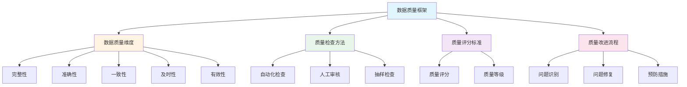
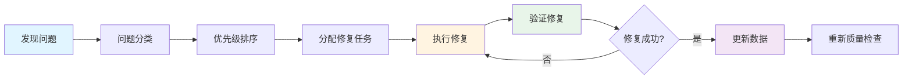

# 数据质量文档 / Data Quality Document

本文档定义和谐历史档案馆的数据质量框架，包括质量维度、检查方法、评分标准和改进流程。

## 📋 目录 / Table of Contents

- [数据质量框架 / Data Quality Framework](#数据质量框架--data-quality-framework)
- [数据质量维度 / Data Quality Dimensions](#数据质量维度--data-quality-dimensions)
- [数据质量检查 / Data Quality Checks](#数据质量检查--data-quality-checks)
- [数据质量改进 / Data Quality Improvement](#数据质量改进--data-quality-improvement)

## 数据质量框架 / Data Quality Framework

### 质量定义 / Quality Definition

数据质量是指数据满足用户需求的程度，包括数据的准确性、完整性、一致性、及时性和有效性。

### 质量目标 / Quality Goals

- **准确性**: 数据准确反映原始文档内容，OCR识别准确率 >95%
- **完整性**: 无缺失内容，无重复内容，所有必填字段完整
- **一致性**: 数据格式统一，命名规范一致
- **及时性**: 数据及时更新，构建时间合理
- **有效性**: 数据符合业务规则，通过所有验证检查

### 质量框架图 / Quality Framework Diagram



## 数据质量维度 / Data Quality Dimensions

### 完整性 (Completeness)

#### 定义 / Definition

数据完整性是指数据没有缺失，所有必需的数据都存在。

#### 检查项 / Check Items

```typescript
interface CompletenessChecks {
  // 必填字段检查
  requiredFields: {
    title: boolean;        // 标题是否存在
    authors: boolean;      // 作者是否存在
    dates: boolean;        // 日期是否存在
    parts: boolean;        // 内容段落是否存在
  };
  
  // 内容完整性检查
  contentCompleteness: {
    hasTitle: boolean;           // 是否有标题段落
    hasAuthors: boolean;          // 是否有作者段落
    hasContent: boolean;          // 是否有正文内容
    noEmptyParts: boolean;        // 是否有空段落
  };
  
  // 关联数据完整性
  relatedData: {
    tagsExist: boolean;          // 标签数据是否存在
    metadataExists: boolean;      // 元数据是否存在
    configExists: boolean;       // 配置文件是否存在
  };
}
```

#### 检查方法 / Check Methods

```typescript
function checkCompleteness(article: Article): CompletenessChecks {
  return {
    requiredFields: {
      title: !!article.title && article.title.trim().length > 0,
      authors: !!article.authors && article.authors.length > 0,
      dates: !!article.dates && article.dates.length > 0,
      parts: !!article.parts && article.parts.length > 0,
    },
    contentCompleteness: {
      hasTitle: article.parts.some(p => p.type === 'title'),
      hasAuthors: article.parts.some(p => p.type === 'authors'),
      hasContent: article.parts.some(p => p.type === 'paragraph'),
      noEmptyParts: !article.parts.some(p => !p.text || p.text.trim().length === 0),
    },
    relatedData: {
      tagsExist: await checkTagsExist(article.id),
      metadataExists: await checkMetadataExists(article.id),
      configExists: await checkConfigExists(article.id),
    },
  };
}
```

### 准确性 (Accuracy)

#### 定义 / Definition

数据准确性是指数据准确反映原始文档内容，OCR识别错误率低。

#### 检查项 / Check Items

```typescript
interface AccuracyChecks {
  // OCR识别准确性
  ocrAccuracy: {
    characterAccuracy: number;    // 字符识别准确率
    wordAccuracy: number;          // 词语识别准确率
    commonErrors: string[];        // 常见错误列表
  };
  
  // 内容准确性
  contentAccuracy: {
    titleMatches: boolean;         // 标题是否匹配
    authorsMatch: boolean;         // 作者是否匹配
    datesMatch: boolean;           // 日期是否匹配
    noObviousErrors: boolean;      // 无明显错误
  };
  
  // 格式准确性
  formatAccuracy: {
    dateFormat: boolean;          // 日期格式正确
    authorFormat: boolean;        // 作者格式正确
    tagFormat: boolean;           // 标签格式正确
  };
}
```

#### 检查方法 / Check Methods

```typescript
function checkAccuracy(article: Article, original: OriginalDocument): AccuracyChecks {
  // 计算OCR识别准确率
  const ocrResult = compareWithOriginal(article, original);
  
  return {
    ocrAccuracy: {
      characterAccuracy: calculateCharacterAccuracy(ocrResult),
      wordAccuracy: calculateWordAccuracy(ocrResult),
      commonErrors: identifyCommonErrors(ocrResult),
    },
    contentAccuracy: {
      titleMatches: article.title === original.title,
      authorsMatch: arraysEqual(article.authors, original.authors),
      datesMatch: datesEqual(article.dates, original.dates),
      noObviousErrors: !hasObviousErrors(article),
    },
    formatAccuracy: {
      dateFormat: validateDateFormat(article.dates),
      authorFormat: validateAuthorFormat(article.authors),
      tagFormat: validateTagFormat(article.tags),
    },
  };
}
```

### 一致性 (Consistency)

#### 定义 / Definition

数据一致性是指数据格式统一，命名规范一致，相同类型的数据使用相同的格式。

#### 检查项 / Check Items

```typescript
interface ConsistencyChecks {
  // 格式一致性
  formatConsistency: {
    dateFormatConsistent: boolean;      // 日期格式一致
    authorFormatConsistent: boolean;    // 作者格式一致
    tagFormatConsistent: boolean;       // 标签格式一致
  };
  
  // 命名一致性
  namingConsistency: {
    articleIdFormat: boolean;          // 文章ID格式一致
    bookIdFormat: boolean;             // 书籍ID格式一致
    tagNameFormat: boolean;            // 标签名称格式一致
  };
  
  // 结构一致性
  structureConsistency: {
    partsOrderConsistent: boolean;     // 段落顺序一致
    metadataStructureConsistent: boolean; // 元数据结构一致
  };
}
```

#### 检查方法 / Check Methods

```typescript
function checkConsistency(articles: Article[]): ConsistencyChecks {
  // 检查格式一致性
  const dateFormats = articles.map(a => getDateFormat(a.dates));
  const authorFormats = articles.map(a => getAuthorFormat(a.authors));
  
  return {
    formatConsistency: {
      dateFormatConsistent: allEqual(dateFormats),
      authorFormatConsistent: allEqual(authorFormats),
      tagFormatConsistent: checkTagFormatConsistency(articles),
    },
    namingConsistency: {
      articleIdFormat: articles.every(a => isValidArticleId(a.id)),
      bookIdFormat: articles.every(a => isValidBookId(a.bookId)),
      tagNameFormat: checkTagNameConsistency(articles),
    },
    structureConsistency: {
      partsOrderConsistent: checkPartsOrderConsistency(articles),
      metadataStructureConsistent: checkMetadataStructureConsistency(articles),
    },
  };
}
```

### 及时性 (Timeliness)

#### 定义 / Definition

数据及时性是指数据及时更新，构建时间合理，数据新鲜度高。

#### 检查项 / Check Items

```typescript
interface TimelinessChecks {
  // 更新及时性
  updateTimeliness: {
    lastUpdateTime: Date;              // 最后更新时间
    updateFrequency: number;           // 更新频率（天）
    dataAge: number;                  // 数据年龄（天）
  };
  
  // 构建及时性
  buildTimeliness: {
    buildTime: number;                // 构建时间（秒）
    buildFrequency: number;           // 构建频率（天）
    lastBuildTime: Date;              // 最后构建时间
  };
}
```

#### 检查方法 / Check Methods

```typescript
function checkTimeliness(article: Article): TimelinessChecks {
  const now = new Date();
  const lastUpdate = new Date(article.lastUpdateTime);
  const dataAge = (now.getTime() - lastUpdate.getTime()) / (1000 * 60 * 60 * 24);
  
  return {
    updateTimeliness: {
      lastUpdateTime: lastUpdate,
      updateFrequency: calculateUpdateFrequency(article),
      dataAge,
    },
    buildTimeliness: {
      buildTime: article.buildTime,
      buildFrequency: calculateBuildFrequency(),
      lastBuildTime: getLastBuildTime(),
    },
  };
}
```

### 有效性 (Validity)

#### 定义 / Definition

数据有效性是指数据符合业务规则，通过所有验证检查。

#### 检查项 / Check Items

```typescript
interface ValidityChecks {
  // 业务规则有效性
  businessRules: {
    dateRangeValid: boolean;          // 日期范围有效
    authorValid: boolean;             // 作者有效
    tagValid: boolean;                // 标签有效
  };
  
  // 数据格式有效性
  formatValidity: {
    jsonValid: boolean;               // JSON格式有效
    dateValid: boolean;               // 日期格式有效
    idValid: boolean;                 // ID格式有效
  };
  
  // 约束有效性
  constraintValidity: {
    requiredFieldsPresent: boolean;    // 必填字段存在
    fieldTypesCorrect: boolean;      // 字段类型正确
    valueRangesValid: boolean;       // 值范围有效
  };
}
```

#### 检查方法 / Check Methods

```typescript
function checkValidity(article: Article): ValidityChecks {
  return {
    businessRules: {
      dateRangeValid: validateDateRange(article.dates),
      authorValid: validateAuthors(article.authors),
      tagValid: validateTags(article.tags),
    },
    formatValidity: {
      jsonValid: isValidJSON(article),
      dateValid: validateDates(article.dates),
      idValid: validateId(article.id),
    },
    constraintValidity: {
      requiredFieldsPresent: checkRequiredFields(article),
      fieldTypesCorrect: checkFieldTypes(article),
      valueRangesValid: checkValueRanges(article),
    },
  };
}
```

## 数据质量检查 / Data Quality Checks

### 自动化检查脚本 / Automated Check Scripts

#### 质量检查脚本 / Quality Check Script

```typescript
// 执行完整质量检查
async function performQualityCheck(articleId: string): Promise<QualityReport> {
  const article = await loadArticle(articleId);
  const original = await loadOriginal(articleId);
  
  // 执行各项检查
  const completeness = checkCompleteness(article);
  const accuracy = checkAccuracy(article, original);
  const consistency = await checkConsistency(article);
  const timeliness = checkTimeliness(article);
  const validity = checkValidity(article);
  
  // 计算质量分数
  const score = calculateQualityScore({
    completeness,
    accuracy,
    consistency,
    timeliness,
    validity,
  });
  
  // 生成质量报告
  return {
    articleId,
    score,
    checks: {
      completeness,
      accuracy,
      consistency,
      timeliness,
      validity,
    },
    issues: identifyIssues({
      completeness,
      accuracy,
      consistency,
      timeliness,
      validity,
    }),
    recommendations: generateRecommendations({
      completeness,
      accuracy,
      consistency,
      timeliness,
      validity,
    }),
  };
}
```

#### 批量质量检查 / Batch Quality Check

```typescript
// 批量执行质量检查
async function performBatchQualityCheck(articleIds: string[]): Promise<QualityReport[]> {
  const reports: QualityReport[] = [];
  
  for (const articleId of articleIds) {
    try {
      const report = await performQualityCheck(articleId);
      reports.push(report);
    } catch (error) {
      console.error(`检查文章 ${articleId} 时出错:`, error);
    }
  }
  
  return reports;
}
```

### 质量评分标准 / Quality Scoring Standard

#### 评分维度 / Scoring Dimensions

| 维度 | 权重 | 评分标准 |
|------|------|----------|
| 完整性 | 30% | 所有必填字段存在: 100分<br/>缺少1个必填字段: -20分<br/>缺少2个必填字段: -50分<br/>缺少3个以上: 0分 |
| 准确性 | 40% | OCR识别准确率 >98%: 100分<br/>95-98%: 80分<br/>90-95%: 60分<br/><90%: 40分 |
| 一致性 | 15% | 格式完全一致: 100分<br/>1-2处不一致: 80分<br/>3-5处不一致: 60分<br/>>5处不一致: 40分 |
| 及时性 | 10% | 数据年龄 <7天: 100分<br/>7-30天: 80分<br/>30-90天: 60分<br/>>90天: 40分 |
| 有效性 | 5% | 通过所有验证: 100分<br/>1个验证失败: 80分<br/>2个验证失败: 60分<br/>3个以上: 40分 |

#### 质量等级 / Quality Levels

- **A级 (90-100分)**: 优秀，可直接发布
- **B级 (80-89分)**: 良好，需要小幅修改
- **C级 (70-79分)**: 合格，需要人工审核
- **D级 (60-69分)**: 基本合格，需要大幅修改
- **F级 (<60分)**: 不合格，需要重新处理

#### 评分计算 / Score Calculation

```typescript
function calculateQualityScore(checks: QualityChecks): number {
  const weights = {
    completeness: 0.3,
    accuracy: 0.4,
    consistency: 0.15,
    timeliness: 0.1,
    validity: 0.05,
  };
  
  const completenessScore = calculateCompletenessScore(checks.completeness);
  const accuracyScore = calculateAccuracyScore(checks.accuracy);
  const consistencyScore = calculateConsistencyScore(checks.consistency);
  const timelinessScore = calculateTimelinessScore(checks.timeliness);
  const validityScore = calculateValidityScore(checks.validity);
  
  return Math.round(
    completenessScore * weights.completeness +
    accuracyScore * weights.accuracy +
    consistencyScore * weights.consistency +
    timelinessScore * weights.timeliness +
    validityScore * weights.validity
  );
}
```

### 质量报告生成 / Quality Report Generation

#### 报告格式 / Report Format

```typescript
interface QualityReport {
  articleId: string;
  score: number;
  level: 'A' | 'B' | 'C' | 'D' | 'F';
  checks: QualityChecks;
  issues: QualityIssue[];
  recommendations: string[];
  timestamp: Date;
}

interface QualityIssue {
  type: 'completeness' | 'accuracy' | 'consistency' | 'timeliness' | 'validity';
  severity: 'low' | 'medium' | 'high' | 'critical';
  description: string;
  field?: string;
  suggestion?: string;
}
```

#### 报告生成 / Report Generation

```typescript
function generateQualityReport(articleId: string, checks: QualityChecks): QualityReport {
  const score = calculateQualityScore(checks);
  const level = getQualityLevel(score);
  const issues = identifyIssues(checks);
  const recommendations = generateRecommendations(checks);
  
  return {
    articleId,
    score,
    level,
    checks,
    issues,
    recommendations,
    timestamp: new Date(),
  };
}
```

## 数据质量改进 / Data Quality Improvement

### 问题识别和分类 / Issue Identification and Classification

#### 问题分类 / Issue Classification

```typescript
enum IssueCategory {
  COMPLETENESS = 'COMPLETENESS',    // 完整性问题
  ACCURACY = 'ACCURACY',             // 准确性问题
  CONSISTENCY = 'CONSISTENCY',       // 一致性问题
  TIMELINESS = 'TIMELINESS',         // 及时性问题
  VALIDITY = 'VALIDITY',            // 有效性问题
}

enum IssueSeverity {
  LOW = 'LOW',           // 低优先级
  MEDIUM = 'MEDIUM',     // 中优先级
  HIGH = 'HIGH',         // 高优先级
  CRITICAL = 'CRITICAL', // 严重问题
}
```

#### 问题识别 / Issue Identification

```typescript
function identifyIssues(checks: QualityChecks): QualityIssue[] {
  const issues: QualityIssue[] = [];
  
  // 识别完整性问题
  if (!checks.completeness.requiredFields.title) {
    issues.push({
      type: 'completeness',
      severity: 'critical',
      description: '缺少标题字段',
      field: 'title',
      suggestion: '添加文章标题',
    });
  }
  
  // 识别准确性问题
  if (checks.accuracy.ocrAccuracy.characterAccuracy < 0.95) {
    issues.push({
      type: 'accuracy',
      severity: 'high',
      description: `OCR识别准确率较低: ${checks.accuracy.ocrAccuracy.characterAccuracy}`,
      suggestion: '检查原始文件质量或重新进行OCR识别',
    });
  }
  
  // 识别一致性问题
  if (!checks.consistency.formatConsistency.dateFormatConsistent) {
    issues.push({
      type: 'consistency',
      severity: 'medium',
      description: '日期格式不一致',
      suggestion: '统一日期格式',
    });
  }
  
  return issues;
}
```

### 修复流程 / Fix Process

#### 修复流程 / Fix Process Flow



#### 修复步骤 / Fix Steps

1. **问题识别**: 通过质量检查识别问题
2. **问题分类**: 按类型和严重程度分类
3. **优先级排序**: 按严重程度和影响范围排序
4. **分配修复任务**: 分配给相应的修复人员
5. **执行修复**: 修复数据问题
6. **验证修复**: 验证修复结果
7. **更新数据**: 更新到数据仓库
8. **重新质量检查**: 确保问题已解决

### 预防措施 / Preventive Measures

#### 数据录入预防 / Data Entry Prevention

```typescript
// 录入时验证
function validateOnEntry(data: ArticleData): ValidationResult {
  const errors: string[] = [];
  
  // 验证必填字段
  if (!data.title) {
    errors.push('标题不能为空');
  }
  
  // 验证数据格式
  if (!isValidDate(data.dates[0])) {
    errors.push('日期格式无效');
  }
  
  // 验证数据范围
  if (data.dates[0].year < 1900 || data.dates[0].year > 2100) {
    errors.push('年份超出有效范围');
  }
  
  return {
    isValid: errors.length === 0,
    errors,
  };
}
```

#### 构建时预防 / Build-Time Prevention

```typescript
// 构建时验证
async function validateOnBuild(article: Article): Promise<ValidationResult> {
  // 执行完整质量检查
  const qualityReport = await performQualityCheck(article.id);
  
  // 如果质量分数低于阈值，阻止构建
  if (qualityReport.score < 70) {
    return {
      isValid: false,
      errors: [`文章 ${article.id} 质量分数过低: ${qualityReport.score}`],
    };
  }
  
  return {
    isValid: true,
    errors: [],
  };
}
```

#### 监控和告警 / Monitoring and Alerting

```typescript
// 质量监控
class QualityMonitor {
  async monitorQuality(): Promise<void> {
    // 定期执行质量检查
    const reports = await performBatchQualityCheck(getAllArticleIds());
    
    // 统计质量问题
    const stats = calculateQualityStats(reports);
    
    // 如果质量问题超过阈值，发送告警
    if (stats.lowQualityCount > 100) {
      await sendAlert({
        type: 'QUALITY_ALERT',
        message: `发现 ${stats.lowQualityCount} 个低质量文章`,
        severity: 'HIGH',
      });
    }
  }
}
```

---

**最后更新 / Last Updated**: 2025-01-XX
**维护者 / Maintainers**: 项目维护团队

