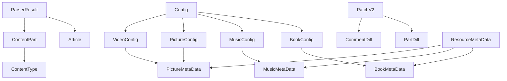

# TypeScript 类型定义文档 / TypeScript Type Definitions Documentation

本文档详细说明和谐历史档案馆项目中所有 TypeScript 类型定义，包括数据结构、接口和枚举类型。

## 📋 目录 / Table of Contents

- [核心类型 / Core Types](#核心类型--core-types)
- [文章相关类型 / Article Related Types](#文章相关类型--article-related-types)
- [多媒体类型 / Multimedia Types](#多媒体类型--multimedia-types)
- [配置类型 / Configuration Types](#配置类型--configuration-types)
- [补丁类型 / Patch Types](#补丁类型--patch-types)
- [索引类型 / Index Types](#索引类型--index-types)
- [OCR类型 / OCR Types](#ocr类型--ocr-types)

## 核心类型 / Core Types

### Tag - 标签类型

用于标识文章、书籍等资源的内容分类和属性。

```typescript
type Tag = {
  id?: string;      // 可选的标签唯一标识符
  name: string;     // 标签名称
  type: string;     // 标签类型，如 '文稿大类'、'地点' 等
};
```

**使用示例**:

```typescript
const tag: Tag = {
  name: '毛泽东',
  type: 'character'
};
```

### Date - 日期类型

表示一个可选的年月日日期结构，支持不完整的日期信息。

```typescript
type Date = {
  year?: number;    // 可选的年份
  month?: number;   // 可选的月份（1-12）
  day?: number;     // 可选的日期（1-31）
};
```

**使用示例**:

```typescript
// 完整日期
const date1: Date = { year: 1966, month: 5, day: 16 };

// 只有年份
const date2: Date = { year: 1966 };

// 日期范围
const dateRange: Date[] = [
  { year: 1966, month: 5, day: 16 },
  { year: 1966, month: 8, day: 1 }
];
```

### ContentType - 内容类型枚举

定义文档内容块的所有可能类型。

```typescript
enum ContentType {
  appellation = 'appellation',        // 称呼
  title = 'title',                    // 标题
  authors = 'authors',                // 作者
  place = 'place',                    // 地点
  subtitle = 'subtitle',              // 副标题
  subtitle2 = 'subtitle2',           // 二级副标题
  subtitle3 = 'subtitle3',           // 三级副标题
  subtitle4 = 'subtitle4',           // 四级副标题
  subtitle5 = 'subtitle5',           // 五级副标题
  subdate = 'subdate',                // 子日期
  paragraph = 'paragraph',            // 段落
  quotation = 'quotation',            // 引用
  signature = 'signature',            // 签名
  image = 'image',                    // 图片
  image_description = 'image_description', // 图片描述
}
```

### ContentPart - 内容段落类型

表示文档中的一个内容单元。

```typescript
type ContentPart = {
  text: string;           // 内容块的文本内容
  type: ContentType;     // 内容块的类型
};
```

**使用示例**:

```typescript
const part: ContentPart = {
  text: '在中央政治局会议上的讲话',
  type: ContentType.title
};
```

### Pivot - 注释定位点类型

用于标识注释在文档内容中的精确位置。

```typescript
type Pivot = {
  part_idx: number;  // 内容部分索引，从 0 开始
  index: number;     // 注释编号
  offset: number;    // 字符偏移量，从 0 开始
};
```

## 文章相关类型 / Article Related Types

### ParserResult - 解析结果类型

表示文档解析后的完整结果，包含所有元数据和内容信息。

```typescript
type ParserResult = {
  title: string;                    // 文档标题
  alias?: string;                   // 可选的标题别名
  dates: Date[];                    // 文档日期列表
  is_range_date: boolean;           // 是否为日期范围
  authors: string[];                // 作者列表
  parts: ContentPart[];              // 文档内容部分列表
  comments: string[];               // 注释内容列表
  comment_pivots: Pivot[];          // 注释定位点列表
  description: string;              // 文档描述
  page_start: number;               // 起始页码
  page_end: number;                 // 结束页码
  origin?: string;                  // 可选的来源信息
  tags?: Tag[];                     // 可选的标签列表
  file_id?: string;                 // 可选的文件标识符
  title_raw?: string;                // 可选的原始标题
  date_raw?: string;                // 可选的原始日期字符串
  parts_raw?: ContentPartRaw[];     // 可选的原始内容部分
};
```

**使用示例**:

```typescript
const parserResult: ParserResult = {
  title: '在中央政治局会议上的讲话',
  dates: [{ year: 1966, month: 5, day: 16 }],
  is_range_date: false,
  authors: ['毛泽东'],
  parts: [
    { text: '在中央政治局会议上的讲话', type: ContentType.title },
    { text: '毛泽东', type: ContentType.authors },
    { text: '目前的形势怎么样？', type: ContentType.paragraph }
  ],
  comments: [],
  comment_pivots: [],
  description: '',
  page_start: 1,
  page_end: 10
};
```

### Article - 文章类型

表示一个历史文献的基本信息结构。

```typescript
type Article = {
  title: string;              // 文章标题
  author: string[];           // 文章作者列表
  dates: Date[];              // 文章日期列表
  is_range_date: boolean;     // 是否为日期范围
  origin?: string;            // 可选的文章来源信息
  alias?: string;             // 可选的文章别名
  tags: Tag[];                // 文章的标签列表
};
```

### ArticleType - 文章类型枚举

定义历史文献的具体类型。

```typescript
enum ArticleType {
  writings = '文章',          // 文章
  mail = '书信',             // 书信
  lecture = '发言',          // 发言
  talk = '对话',             // 对话
  declaration = '宣言',      // 宣言
  instruction = '指示',      // 指示
  comment = '批示',          // 批示
  telegram = '通讯',         // 通讯
}
```

### TagType - 标签类型枚举

定义所有可能的标签分类。

```typescript
enum TagType {
  articleCategory = '文稿大类',    // 文稿大类
  articleType = '文稿类型',        // 文稿类型
  place = '地点',                 // 地点
  character = '人物',             // 人物
  issuer = '出版方/发行方',       // 出版方/发行方
  subject = '主题/事件',          // 主题/事件
  recorder = '记录',              // 记录
  reviewer = '审核',              // 审核
  translator = '翻译',            // 翻译
  reprint = '翻印/传抄',          // 翻印/传抄
}
```

## 多媒体类型 / Multimedia Types

### Music - 音乐类型

表示一个音乐作品的完整信息。

```typescript
type Music = {
  id: string;                // 音乐作品的唯一标识符
  name: string;              // 音乐作品名称
  composers: string[];       // 作曲家列表
  description: string;       // 作品描述
  lyrics: MusicLyric[];      // 歌词列表，可能包含多个版本
};
```

### MusicLyric - 音乐歌词类型

描述一首歌的歌词和对应的音频信息。

```typescript
type MusicLyric = {
  lyricists: string[];       // 作词人列表
  version: string;           // 歌词版本标识
  content: string;           // 歌词文本内容
  audios: {                  // 对应的音频资源列表
    url: string;             // 音频文件URL
    sources: string[];       // 音频来源列表
    art_forms: string[];    // 艺术形式，如 '合唱'、'说书' 等
    artists: {              // 艺术家列表
      name: string;         // 艺术家姓名
      type: string;         // 艺术家类型，如 '伴奏'、'合唱团' 等
    }[];
  }[];
};
```

### PictureMetaData - 图片元数据类型

```typescript
type PictureMetaData = {
  id: string;                        // 图片ID
  name: string;                      // 图片名称
  description: string;                // 描述
  source: string;                    // 来源
  url: string;                        // 图片URL
  year?: number;                      // 年份
  month?: number;                     // 月份
  day?: number;                       // 日期
  tags: { name: string; type: string }[]; // 标签列表
};
```

### VideoMetaData - 视频元数据类型

```typescript
type VideoMetaData = PictureMetaData; // 与图片元数据相同
```

## 配置类型 / Configuration Types

### BookMetaData - 书籍元数据类型

描述书籍资源的基本属性和文件信息。

```typescript
type BookMetaData = {
  id: string;                    // 书籍的唯一标识符
  name: string;                  // 书籍名称
  internal: boolean;              // 是否为内部资料
  official: boolean;              // 是否为官方出版物
  type: 'img' | 'pdf' | 'db' | 'unknown'; // 资源类型
  author: string;                 // 书籍作者
  files: string[];                // 关联的文件列表
};
```

### Config - 配置类型

资源仓库的配置信息，支持书籍、音乐、图片、视频四种类型。

```typescript
type Config = BookConfig | MusicConfig | PictureConfig | VideoConfig;

type BookConfig = {
  resource_type: 'book';
  entity: Partial<BookMetaData>;
  path: string;
  parser_option: ParserOption;
  parser_id: string;
  parser: (path: string, opt: ParserOption) => Promise<ParserResult[]>;
  version?: number;
};

type MusicConfig = {
  resource_type: 'music';
  version?: number;
  entity: MusicMetaData;
};

type PictureConfig = {
  resource_type: 'picture';
  version?: number;
  entity: PictureMetaData;
};

type VideoConfig = {
  resource_type: 'video';
  version?: number;
  entity: VideoMetaData;
};
```

## 补丁类型 / Patch Types

### Patch - V1补丁类型

使用 diff 字符串表示变更的补丁格式。

```typescript
type Patch = {
  parts: { [idx: string]: string };      // 段落diff字符串
  comments: { [idx: string]: string };    // 注释diff字符串
  description: string;                    // 描述diff字符串
};
```

### PatchV2 - V2补丁类型

支持高级补丁操作，包括插入、删除、编辑等。

```typescript
type PatchV2 = {
  version: 2;
  parts: { [idx: string]: PartDiff };     // 段落变更
  comments: { [idx: string]: CommentDiff }; // 注释变更
  newComments?: string[];                  // 新增注释
  description?: StringDiff;                // 描述变更
};

type PartDiff = {
  insertBefore?: ContentPart[];  // 在段落前插入
  insertAfter?: ContentPart[];    // 在段落后插入
  delete?: boolean;               // 是否删除
  diff?: StringDiff;              // diff字符串
  type?: ContentType;             // 段落类型
};

type CommentDiff = {
  insertBefore?: { id?: string; text: StringDiff }[];
  insertAfter?: { id?: string; text: StringDiff }[];
  delete?: boolean;
  diff?: StringDiff;
};
```

## 索引类型 / Index Types

### ArticleListV2 - 文章列表类型

文章列表索引数据格式。

```typescript
type ArticleListV2 = {
  articles: {
    id: string;                  // 文章ID
    title: string;               // 标题
    authors: string[];           // 作者
    dates: any;                  // 日期
    is_range_date: boolean;      // 日期范围标识
    book_ids: number[];          // 书籍ID列表
    tag_ids: number[];           // 标签ID列表
  }[];
  books: string[];               // 书籍名称列表
  tags: { name: string; type: string }[]; // 标签列表
};
```

### MusicIndex - 音乐索引类型

音乐条目的完整索引信息。

```typescript
type MusicIndex = [
  string,                        // 音乐ID
  string,                        // 音乐标题
  number,                        // 起始年份
  number,                        // 结束年份
  string[],                      // 艺术家列表
  string[],                      // 作曲家列表
  string[],                      // 演唱者列表
  { name: string; type: string }[], // 标签列表
  string[],                      // 相关书籍ID列表
  string[],                      // 其他信息
];
```

### GalleryIndexes - 图库索引类型

包含视频和图片元数据的联合数组。

```typescript
type GalleryIndexes = (VideoMetaData | PictureMetaData)[];
```

## OCR类型 / OCR Types

### OCRResult - OCR结果类型

OCR识别后的文本和位置信息。

```typescript
type OCRPosition = [number, number]; // [x, y] 坐标

type OCRResult = {
  // 坐标轴原点在左上角，y轴朝下
  // 左上，右上，右下，左下
  box: [OCRPosition, OCRPosition, OCRPosition, OCRPosition];
  text: string;  // 识别的文本
};
```

### OCRParameter - OCR参数类型

PaddleOCR的完整配置参数。

```typescript
type OCRParameter = {
  image_dir: string;
  use_gpu: boolean;
  use_xpu: boolean;
  use_npu: boolean;
  // ... 更多OCR参数
  rec_model_dir: string;
  det_model_dir: string;
  // ... 检测和识别相关参数
};
```

### OCRParameterAdvanced - 高级OCR参数

OCR处理的高级配置选项。

```typescript
type OCRParameterAdvanced = {
  extract_text_from_pdf: boolean;  // 是否从PDF提取文本
  line_merge_threshold: number;     // 行合并阈值（像素）
  standard_paragraph_merge_strategy_threshold: number; // 标准段落合并策略阈值
  differential_paragraph_merge_strategy_threshold: number; // 差分段落合并策略阈值
  content_thresholds: [number, number, number, number]; // 内容阈值 [上,下,左,右]
  auto_vsplit: boolean;             // 自动垂直分割
  vsplit: number;                   // 垂直分割位置（0-1）
};
```

## 类型使用示例 / Type Usage Examples

### 创建文章数据

```typescript
import { ParserResult, ContentType, Date } from '../types';

const article: ParserResult = {
  title: '在中央政治局会议上的讲话',
  dates: [{ year: 1966, month: 5, day: 16 }],
  is_range_date: false,
  authors: ['毛泽东'],
  parts: [
    {
      text: '在中央政治局会议上的讲话',
      type: ContentType.title
    },
    {
      text: '毛泽东',
      type: ContentType.authors
    },
    {
      text: '目前的形势怎么样？',
      type: ContentType.paragraph
    }
  ],
  comments: [],
  comment_pivots: [],
  description: '',
  page_start: 1,
  page_end: 10
};
```

### 应用补丁

```typescript
import { ParserResult, PatchV2 } from '../types';
import { apply_patch_v2 } from '../utils';

const original: ParserResult = { /* ... */ };
const patch: PatchV2 = {
  version: 2,
  parts: {
    '0': {
      diff: '=12-5+修改后的文本'  // diff字符串
    }
  },
  comments: {},
};

const patched = apply_patch_v2(original, patch);
```

### 类型守卫 / Type Guards

```typescript
// 检查是否为书籍配置
function isBookConfig(config: Config): config is BookConfig {
  return config.resource_type === 'book';
}

// 使用类型守卫
function processConfig(config: Config) {
  if (isBookConfig(config)) {
    // TypeScript 知道这里是 BookConfig
    console.log(config.parser_option);
  }
}
```

## 类型继承关系 / Type Inheritance Relationships



---

**最后更新 / Last Updated**: 2025-01-XX
**维护者 / Maintainers**: 项目维护团队
**相关文档**: [数据标准化规范](./standardization.md) | [API文档](./API.md)
