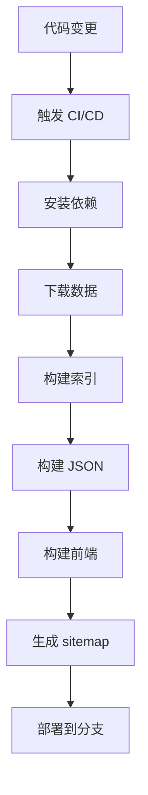

# 开发环境搭建与架构说明 / Development Environment & Architecture Guide

本文档介绍项目的技术架构、开发环境搭建、构建流程、分支管理规范和 CI/CD 流程。

## 📋 目录 / Table of Contents

- [🏗️ 技术架构 / Technical Architecture](#-技术架构--technical-architecture)
- [💻 开发环境搭建 / Development Environment Setup](#-开发环境搭建--development-environment-setup)
- [🔄 构建流程 / Build Process](#-构建流程--build-process)
- [🌿 分支管理 / Branch Management](#-分支管理--branch-management)
- [🔄 CI/CD 流程 / CI/CD Pipeline](#-cicd-流程--cicd-pipeline)
- [📝 代码规范 / Code Standards](#-代码规范--code-standards)
- [🧪 测试指南 / Testing Guide](#-测试指南--testing-guide)
- [🚀 部署流程 / Deployment Process](#-部署流程--deployment-process)

## 🏗️ 技术架构 / Technical Architecture

### 仓库架构 / Repository Architecture

#### 主仓库 (Main Repository)
**名称**: `banned-historical-archives/banned-historical-archives.github.io`

| 分支 | 用途 | 构建产物 | 说明 |
|------|------|----------|------|
| `master` | 源代码分支 | - | 主要开发分支 |
| `gh-pages` | 静态网站 | `out/` | GitHub Pages 自动部署 |
| `json` | JSON 数据 | `json/` | 文章 JSON 数据 |
| `indexes` | 索引数据 | `indexes/` | 搜索索引数据 |
| `txt` | 文本数据 | `txt/` | 纯文本格式导出 |

#### 资源仓库 (Resource Repositories)
**名称**: `banned-historical-archives/banned-historical-archives0` ~ `banned-historical-archives31`

| 分支 | 用途 | 数据类型 | 说明 |
|------|------|----------|------|
| `main` | 原始文件 | PDF、图片、文档 | 原始档案文件 |
| `config` | 配置文件 | JSON/TS 配置 | 元数据和配置 |
| `parsed` | 解析数据 | JSON | OCR 处理后的数据 |
| `ocr_cache` | OCR 缓存 | JSON | OCR 识别结果缓存 |
| `ocr_patch` | OCR 补丁 | JSON | OCR 结果人工修正 |

### 系统架构 / System Architecture

```
┌─────────────────────────────────────────────────────────────┐
│                    用户访问层 / User Access Layer           │
│  ┌─────────────────────────────────────────────────────┐    │
│  │            GitHub Pages (gh-pages 分支)             │    │
│  │  ┌─────────────────────────────────────────────────┐ │    │
│  │  │         Next.js 静态网站 (out/)               │ │    │
│  │  │  ┌─────────────────────────────────────────────┐ │ │    │
│  │  │  │      React 前端应用                      │ │ │    │
│  │  │  └─────────────────────────────────────────────┘ │ │    │
│  │  └─────────────────────────────────────────────────┘ │    │
│  └─────────────────────────────────────────────────────┘    │
└─────────────────────────────────────────────────────────────┘
                                   │
                                   ▼ HTTP 请求
┌─────────────────────────────────────────────────────────────┐
│                 数据访问层 / Data Access Layer              │
│  ┌─────────────────────────────────────────────────────┐    │
│  │         GitHub Raw Content API                    │    │
│  │  ┌─────────────────────────────────────────────────┐ │    │
│  │  │   json 分支: 文章数据 (JSON)                  │ │    │
│  │  │   indexes 分支: 索引数据 (搜索)               │ │    │
│  │  └─────────────────────────────────────────────────┘ │    │
│  └─────────────────────────────────────────────────────┘    │
└─────────────────────────────────────────────────────────────┘
                                   │
                                   ▼ (可选)
┌─────────────────────────────────────────────────────────────┐
│               搜索引擎层 / Search Engine Layer             │
│  ┌─────────────────────────────────────────────────────┐    │
│  │         Elasticsearch (Docker)                    │    │
│  │  ┌─────────────────────────────────────────────────┐ │    │
│  │  │   全文搜索索引                               │ │    │
│  │  │   实时搜索功能                               │ │    │
│  │  └─────────────────────────────────────────────────┘ │    │
│  └─────────────────────────────────────────────────────┘    │
└─────────────────────────────────────────────────────────────┘
```

### 技术栈 / Technology Stack

#### 前端 / Frontend
- **框架**: Next.js 15 (React 18)
- **语言**: TypeScript
- **UI库**: Material-UI (MUI)
- **构建**: Next.js Build (Static Export)
- **部署**: GitHub Pages

#### 后端 / Backend
- **语言**: TypeScript (Node.js)
- **构建脚本**: 自研构建系统
- **数据处理**: OCR + 文本解析
- **搜索引擎**: Elasticsearch 8.x

#### 数据处理 / Data Processing
- **OCR引擎**: PaddleOCR
- **数据格式**: 自定义 JSON 格式
- **版本控制**: Git LFS (大文件)
- **存储**: Git 仓库 (分布式)

## 💻 开发环境搭建 / Development Environment Setup

### 系统要求 / System Requirements

#### 必备软件 / Required Software
- **Node.js**: >= 14.0.0 (推荐 18.x LTS)
- **npm**: >= 6.0.0 (推荐最新)
- **Git**: >= 2.0.0
- **Docker**: >= 20.10.0 (可选，用于本地搜索)

#### 推荐配置 / Recommended Configuration
- **内存**: 8GB+ RAM
- **磁盘**: 20GB+ 可用空间
- **网络**: 稳定的互联网连接

### 安装步骤 / Installation Steps

#### 1. 克隆项目 / Clone Repository
```bash
# 克隆主仓库
git clone https://github.com/banned-historical-archives/banned-historical-archives.github.io.git
cd banned-historical-archives.github.io

# 可选：克隆子模块 (如果有)
git submodule update --init --recursive
```

#### 2. 安装依赖 / Install Dependencies
```bash
# 安装 Node.js 依赖
npm install

# 如果安装失败，清理缓存重试
npm cache clean --force
rm -rf node_modules package-lock.json
npm install

# 验证安装
npm --version
node --version
```

#### 3. 下载数据 (可选) / Download Data (Optional)
```bash
# 下载解析后的数据 (推荐)
npm run init-parsed

# 下载配置文件
npm run init-config

# 可选：下载原始文件 (很大)
npm run init-raw

# 可选：下载 OCR 缓存
npm run init-ocr_cache
```

#### 4. 构建数据 / Build Data
```bash
# 构建索引 (必需)
npm run build-indexes

# 构建文章 JSON (必需)
npm run build-article-json

# 可选：构建 TXT 导出
npm run build-txt
```

#### 5. 构建前端 / Build Frontend
```bash
# 开发模式 (热重载)
npm run dev

# 生产构建
npm run build

# 启动生产服务器
npx serve@latest out
```

### 开发环境配置 / Development Environment Configuration

#### 环境变量 / Environment Variables
创建 `.env.local` 文件：

```bash
# 开发环境配置
NODE_ENV=development

# Elasticsearch 配置 (如果使用本地搜索)
ES_URL=http://localhost:9200
ES_USERNAME=elastic
ES_PASSWORD=password

# 功能开关
LOCAL_SEARCH_ENGINE=1
LOCAL_INDEXES=1

# 调试配置
DEBUG=*
```

#### IDE 配置 / IDE Configuration

**VS Code 推荐扩展**:
- TypeScript and JavaScript Language Features
- ESLint
- Prettier
- Docker
- GitLens

**VS Code 设置** (.vscode/settings.json):
```json
{
  "typescript.preferences.importModuleSpecifier": "relative",
  "editor.formatOnSave": true,
  "editor.defaultFormatter": "esbenp.vscode-prettier",
  "editor.codeActionsOnSave": {
    "source.fixAll.eslint": true
  },
  "files.associations": {
    "*.md": "markdown"
  }
}
```

### 开发工作流 / Development Workflow

#### 本地开发 / Local Development
```bash
# 1. 启动开发服务器
npm run dev

# 2. 浏览器访问 http://localhost:3000

# 3. 修改代码，自动热重载

# 4. 运行测试
npm test

# 5. 代码检查
npm run lint
```

#### 调试技巧 / Debugging Tips
```bash
# 启用详细日志
DEBUG=* npm run dev

# 检查构建产物
npm run build && ls -la out/

# 验证数据
node -e "console.log(require('./indexes/file_count.json'))"
```

## 🔄 构建流程 / Build Process

### 完整构建流程 / Complete Build Process



### 详细步骤 / Detailed Steps

#### 1. 数据准备阶段 / Data Preparation Phase
```bash
# 下载资源仓库数据
npm run init-parsed      # 解析后的数据
npm run init-config      # 配置文件

# 验证数据完整性
ls -la parsed/ config/
```

#### 2. 数据处理阶段 / Data Processing Phase
```bash
# 构建搜索索引
npm run build-indexes
# 输出: indexes/ 目录

# 构建文章 JSON 数据
npm run build-article-json
# 输出: json/ 目录

# 可选：构建 TXT 导出
npm run build-txt
# 输出: txt/ 分支
```

#### 3. 前端构建阶段 / Frontend Build Phase
```bash
# 构建生产版本
npm run build
# 输出: out/ 目录

# 生成网站地图
npm run postbuild
# 输出: out/sitemap.xml
```

#### 4. 部署阶段 / Deployment Phase
```bash
# 推送到 gh-pages 分支
git add out/
git commit -m "Build static site"
git push origin gh-pages

# 推送到数据分支
git checkout json
git add json/
git commit -m "Update JSON data"
git push origin json
```

### 构建脚本说明 / Build Scripts Explanation

| 脚本 | 用途 | 输出 | 说明 |
|------|------|------|------|
| `npm run init-parsed` | 下载解析数据 | `parsed/` | 从 GitHub 下载 |
| `npm run init-config` | 下载配置数据 | `config/` | 从 GitHub 下载 |
| `npm run build-indexes` | 构建索引 | `indexes/` | 生成搜索索引 |
| `npm run build-article-json` | 构建 JSON | `json/` | 生成文章数据 |
| `npm run build` | 前端构建 | `out/` | Next.js 静态导出 |
| `npm run postbuild` | 生成地图 | `out/sitemap.xml` | 网站地图 |

### 构建优化 / Build Optimization

#### 并行构建 / Parallel Building
```bash
# 使用更多 CPU 核心
export NODE_OPTIONS="--max-old-space-size=4096"

# 并行处理数据
npm run build-indexes &
npm run build-article-json &
wait
```

#### 增量构建 / Incremental Building
```bash
# 只重新构建变更的数据
# 修改 backend/build-indexes.ts 添加增量逻辑

# 使用缓存
npm install --prefer-offline
```

## 🌿 分支管理 / Branch Management

### 分支命名规范 / Branch Naming Convention

#### 功能分支 / Feature Branches
```
feature/功能名称          # 新功能开发
feature/add-search        # 添加搜索功能

bugfix/问题描述           # 问题修复
bugfix/fix-build-error   # 修复构建错误

refactor/重构内容         # 代码重构
refactor/cleanup-code    # 代码清理

docs/文档内容             # 文档更新
docs/update-readme       # 更新 README
```

#### 版本分支 / Release Branches
```
release/v1.0.0            # 版本发布分支
hotfix/v1.0.1             # 热修复分支
```

### 分支管理流程 / Branch Management Workflow

#### 开发新功能 / Develop New Feature
```bash
# 1. 从 master 创建功能分支
git checkout master
git pull origin master
git checkout -b feature/add-dark-mode

# 2. 开发功能
# ... 编写代码 ...

# 3. 提交更改
git add .
git commit -m "feat: add dark mode toggle"

# 4. 推送分支
git push origin feature/add-dark-mode

# 5. 创建 Pull Request
# 在 GitHub 上创建 PR
```

#### 合并代码 / Merge Code
```bash
# 1. 更新主分支
git checkout master
git pull origin master

# 2. 合并功能分支
git merge feature/add-dark-mode

# 3. 推送主分支
git push origin master

# 4. 删除功能分支
git branch -d feature/add-dark-mode
git push origin --delete feature/add-dark-mode
```

### 分支保护规则 / Branch Protection Rules

#### Master 分支保护 / Master Branch Protection
- ✅ 需要 Pull Request 审核
- ✅ 需要 CI/CD 通过
- ✅ 禁止直接推送
- ✅ 需要至少一个批准

#### 自动分支 / Automated Branches
- `gh-pages`: 自动从 master 构建部署
- `json`: 自动更新数据
- `indexes`: 自动更新索引
- `txt`: 自动更新文本导出

## 🔄 CI/CD 流程 / CI/CD Pipeline

### GitHub Actions 工作流 / GitHub Actions Workflows

#### 主仓库 CI/CD (.github/workflows/build.yml)
```yaml
name: Build and Deploy
on:
  push:
    branches: [ master ]
  pull_request:
    branches: [ master ]

jobs:
  build:
    runs-on: ubuntu-latest
    steps:
      - uses: actions/checkout@v3
      - uses: actions/setup-node@v3
        with:
          node-version: '18'
      - name: Install dependencies
        run: npm ci
      - name: Download data
        run: |
          npm run init-parsed
          npm run init-config
      - name: Build data
        run: |
          npm run build-indexes
          npm run build-article-json
      - name: Build frontend
        run: npm run build
      - name: Deploy to gh-pages
        uses: peaceiris/actions-gh-pages@v3
        with:
          github_token: ${{ secrets.GITHUB_TOKEN }}
          publish_dir: ./out
```

#### 资源仓库 CI/CD (banned-historical-archives0/.github/workflows/)
```yaml
name: Build Parsed Data
on:
  push:
    branches: [ config, ocr_cache, ocr_patch ]

jobs:
  build:
    runs-on: ubuntu-latest
    steps:
      - name: Checkout
        uses: actions/checkout@v3
      - name: Setup Node.js
        uses: actions/setup-node@v3
        with:
          node-version: '18'
      - name: Install dependencies
        run: npm ci
      - name: Build parsed data
        run: npm run build-parsed
      - name: Deploy to parsed branch
        run: |
          git checkout -b parsed
          git add .
          git commit -m "Build parsed data"
          git push origin parsed
```

### 触发条件 / Trigger Conditions

#### 自动触发 / Automatic Triggers
- **Push to master**: 构建主分支
- **PR to master**: 运行测试和构建
- **资源仓库变更**: 重新构建数据

#### 手动触发 / Manual Triggers
```bash
# 手动触发 GitHub Actions
gh workflow run build.yml

# 或在 GitHub 界面手动触发
```

### 构建产物部署 / Build Artifacts Deployment

#### 分支自动部署 / Branch Auto-Deployment
- `gh-pages` 分支 → GitHub Pages
- `json` 分支 → JSON 数据 API
- `indexes` 分支 → 索引数据 API
- `txt` 分支 → 文本导出下载

#### 部署验证 / Deployment Verification
```bash
# 检查 GitHub Pages
curl https://banned-historical-archives.github.io

# 检查数据 API
curl https://raw.githubusercontent.com/banned-historical-archives/banned-historical-archives.github.io/json/json/883/883eeb87ad.json

# 检查索引 API
curl https://raw.githubusercontent.com/banned-historical-archives/banned-historical-archives.github.io/refs/heads/indexes/indexes/file_count.json
```

## 📝 代码规范 / Code Standards

### TypeScript 规范 / TypeScript Standards

#### 文件命名 / File Naming
```typescript
// 正确
article-viewer.tsx
articleViewer.ts
article_viewer.test.ts

// 错误
articleviewer.tsx
ArticleViewer.tsx
```

#### 导入顺序 / Import Order
```typescript
// 1. React 相关
import React from 'react';

// 2. 第三方库
import { useState } from 'react';
import axios from 'axios';

// 3. 本地模块
import { Article } from '../types';
import Layout from '../components/Layout';

// 4. 工具函数
import { formatDate } from '../utils/date';
```

#### 类型定义 / Type Definitions
```typescript
// 好的类型定义
interface Article {
  id: string;
  title: string;
  authors: string[];
  dates: Date[];
  content: Content[];
}

// 使用泛型
interface ApiResponse<T> {
  data: T;
  error?: string;
  status: number;
}
```

### React 组件规范 / React Component Standards

#### 函数组件 / Functional Components
```typescript
interface ArticleCardProps {
  article: Article;
  onClick?: (article: Article) => void;
}

const ArticleCard: React.FC<ArticleCardProps> = ({ article, onClick }) => {
  const handleClick = () => {
    onClick?.(article);
  };

  return (
    <Card onClick={handleClick}>
      <Typography variant="h6">{article.title}</Typography>
      <Typography variant="body2">{article.authors.join(', ')}</Typography>
    </Card>
  );
};

export default ArticleCard;
```

#### 自定义 Hook / Custom Hooks
```typescript
const useArticle = (id: string) => {
  const [article, setArticle] = useState<Article | null>(null);
  const [loading, setLoading] = useState(true);
  const [error, setError] = useState<string | null>(null);

  useEffect(() => {
    const fetchArticle = async () => {
      try {
        setLoading(true);
        const response = await fetch(`/api/articles/${id}`);
        const data = await response.json();
        setArticle(data);
      } catch (err) {
        setError(err.message);
      } finally {
        setLoading(false);
      }
    };

    fetchArticle();
  }, [id]);

  return { article, loading, error };
};
```

### 提交规范 / Commit Standards

#### 提交信息格式 / Commit Message Format
```
<type>(<scope>): <subject>

<body>

<footer>
```

#### 类型定义 / Type Definitions
- `feat`: 新功能
- `fix`: 修复问题
- `docs`: 文档更新
- `style`: 代码格式调整
- `refactor`: 代码重构
- `test`: 测试相关
- `chore`: 构建过程或工具配置

#### 示例 / Examples
```bash
# 功能提交
feat(search): add Elasticsearch integration

- Add Elasticsearch client configuration
- Implement search API endpoints
- Update search component with real-time results

Closes #123

# 修复提交
fix(build): resolve memory issue in production build

- Increase Node.js memory limit to 4GB
- Optimize bundle size with code splitting
- Add build performance monitoring

# 文档提交
docs(readme): update installation instructions

- Add Docker installation steps
- Update system requirements
- Add troubleshooting section
```

## 🧪 测试指南 / Testing Guide

### 测试类型 / Test Types

#### 单元测试 / Unit Tests
```typescript
// utils/date.test.ts
import { formatDate } from './date';

describe('formatDate', () => {
  it('should format date correctly', () => {
    const date = new Date('2023-01-01');
    expect(formatDate(date)).toBe('2023-01-01');
  });

  it('should handle invalid dates', () => {
    expect(() => formatDate(null)).toThrow('Invalid date');
  });
});
```

#### 组件测试 / Component Tests
```typescript
// components/ArticleCard.test.tsx
import { render, screen } from '@testing-library/react';
import ArticleCard from './ArticleCard';

const mockArticle = {
  id: '123',
  title: 'Test Article',
  authors: ['Author 1', 'Author 2'],
  dates: [new Date('2023-01-01')],
};

describe('ArticleCard', () => {
  it('renders article title', () => {
    render(<ArticleCard article={mockArticle} />);
    expect(screen.getByText('Test Article')).toBeInTheDocument();
  });

  it('renders authors', () => {
    render(<ArticleCard article={mockArticle} />);
    expect(screen.getByText('Author 1, Author 2')).toBeInTheDocument();
  });
});
```

#### 集成测试 / Integration Tests
```typescript
// 测试数据加载流程
describe('Article Loading', () => {
  it('loads article data from API', async () => {
    const mockResponse = { id: '123', title: 'Test' };
    global.fetch = jest.fn(() =>
      Promise.resolve({
        json: () => Promise.resolve(mockResponse),
      })
    );

    const { result } = renderHook(() => useArticle('123'), {
      wrapper: TestWrapper,
    });

    await waitFor(() => {
      expect(result.current.article).toEqual(mockResponse);
    });
  });
});
```

### 运行测试 / Running Tests

```bash
# 运行所有测试
npm test

# 运行特定测试文件
npm test -- utils/date.test.ts

# 运行测试并生成覆盖率报告
npm run test:coverage

# 运行 E2E 测试 (如果有)
npm run test:e2e

# 监听模式 (开发时)
npm run test:watch
```

### 测试配置 / Test Configuration

#### Jest 配置 (jest.config.js)
```javascript
module.exports = {
  testEnvironment: 'jsdom',
  setupFilesAfterEnv: ['<rootDir>/jest.setup.ts'],
  moduleNameMapping: {
    '^@/(.*)$': '<rootDir>/src/$1',
  },
  collectCoverageFrom: [
    'src/**/*.{ts,tsx}',
    '!src/**/*.d.ts',
  ],
  coverageThreshold: {
    global: {
      branches: 80,
      functions: 80,
      lines: 80,
      statements: 80,
    },
  },
};
```

#### 测试工具 / Testing Tools
- **Jest**: 测试运行器和断言库
- **React Testing Library**: React 组件测试
- **@testing-library/jest-dom**: DOM 断言扩展
- **msw**: API 模拟

## 🚀 部署流程 / Deployment Process

### 生产环境部署 / Production Deployment

#### GitHub Pages 自动部署
```bash
# 推送到 master 分支自动触发部署
git add .
git commit -m "feat: add new feature"
git push origin master

# GitHub Actions 会自动：
# 1. 安装依赖
# 2. 下载数据
# 3. 构建应用
# 4. 部署到 gh-pages 分支
```

#### 手动部署 / Manual Deployment
```bash
# 1. 本地构建
npm run build

# 2. 验证构建产物
ls -la out/

# 3. 推送到 gh-pages 分支
git checkout gh-pages
cp -r out/* .
git add .
git commit -m "Deploy to production"
git push origin gh-pages
```

### 环境配置 / Environment Configuration

#### 生产环境变量 / Production Environment Variables
```bash
# .env.production
NODE_ENV=production
LOCAL_SEARCH_ENGINE=0  # 生产环境不使用本地搜索
LOCAL_INDEXES=0       # 使用远程索引

# API 配置
API_BASE_URL=https://api.example.com
```

#### CDN 配置 / CDN Configuration
```javascript
// next.config.js
module.exports = {
  images: {
    loader: 'imgix',
    path: 'https://cdn.example.com/',
  },
  assetPrefix: process.env.NODE_ENV === 'production' ? 'https://cdn.example.com' : '',
};
```

### 监控和维护 / Monitoring and Maintenance

#### 性能监控 / Performance Monitoring
```typescript
// pages/_app.tsx
import { useEffect } from 'react';

export default function App({ Component, pageProps }) {
  useEffect(() => {
    // 添加性能监控
    if (typeof window !== 'undefined' && 'performance' in window) {
      window.addEventListener('load', () => {
        const perfData = performance.getEntriesByType('navigation')[0];
        console.log('Page load time:', perfData.loadEventEnd - perfData.loadEventStart);
      });
    }
  }, []);

  return <Component {...pageProps} />;
}
```

#### 错误监控 / Error Monitoring
```typescript
// utils/errorReporting.ts
export const reportError = (error: Error, context?: any) => {
  console.error('Error occurred:', error, context);

  // 发送到错误监控服务
  if (process.env.NODE_ENV === 'production') {
    // Sentry, LogRocket 等
  }
};
```

### 备份和恢复 / Backup and Recovery

#### 数据备份 / Data Backup
```bash
# 备份脚本
#!/bin/bash
DATE=$(date +%Y%m%d_%H%M%S)
BACKUP_DIR="backups/$DATE"

mkdir -p "$BACKUP_DIR"

# 备份代码
git archive --format=tar.gz -o "$BACKUP_DIR/code.tar.gz" HEAD

# 备份数据
cp -r parsed "$BACKUP_DIR/"
cp -r config "$BACKUP_DIR/"
cp -r indexes "$BACKUP_DIR/"

# 压缩备份
tar -czf "backup_$DATE.tar.gz" "$BACKUP_DIR"
```

#### 恢复流程 / Recovery Process
```bash
# 1. 停止服务
docker compose down

# 2. 恢复代码
git checkout <last-good-commit>

# 3. 恢复数据
tar -xzf backup_20231201_120000.tar.gz
cp -r backups/20231201_120000/parsed ./
cp -r backups/20231201_120000/config ./

# 4. 重启服务
docker compose up -d
```

## 📚 相关文档 / Related Documentation

- [本地运行指南](./local.md)
- [搜索配置指南](./local-search-engine.md)
- [标准化文档](./standardization.md)
- [录入与校对](./upload-and-correction.md)
- [部署指南](./DEPLOYMENT.md)
- [故障排查](./TROUBLESHOOTING.md)
- [贡献指南](../CONTRIBUTING.md)

---

**注意**: 开发环境搭建可能需要一些时间，请耐心等待数据下载和构建完成。如遇到问题，请查看[故障排查指南](./TROUBLESHOOTING.md)。