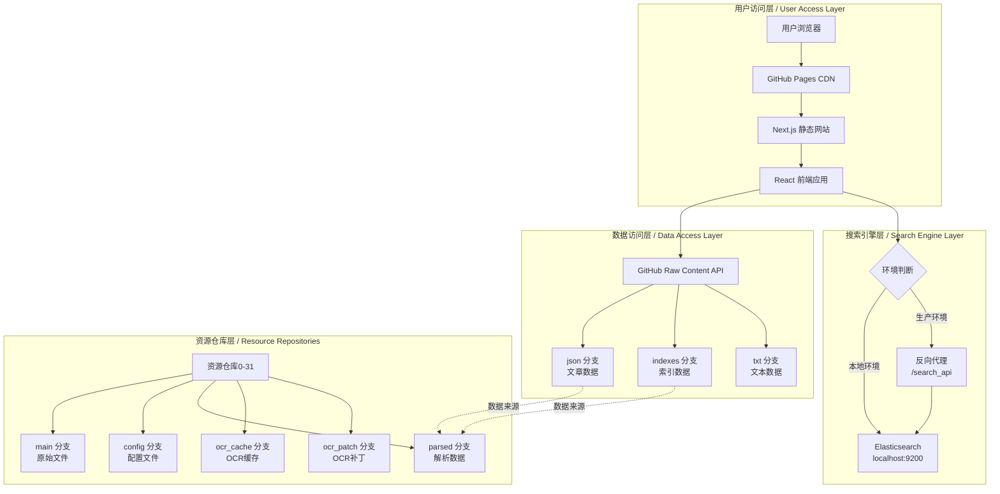
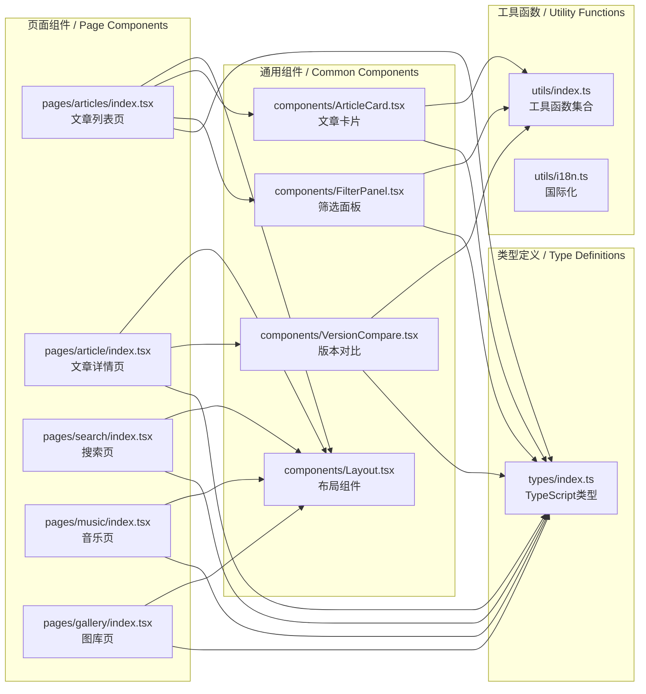
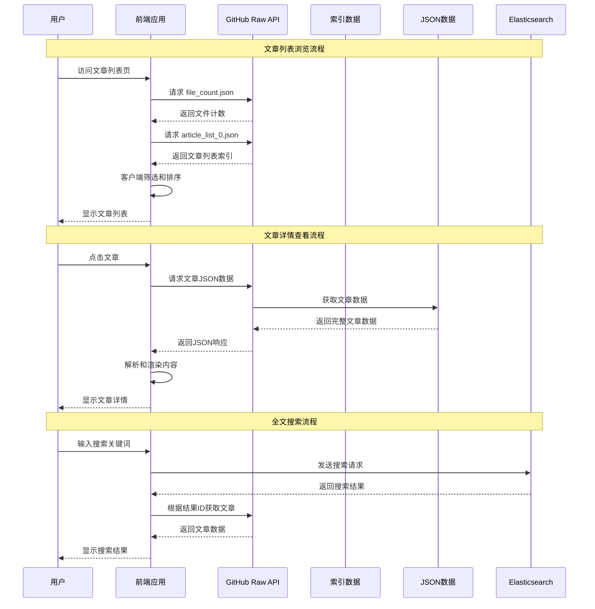
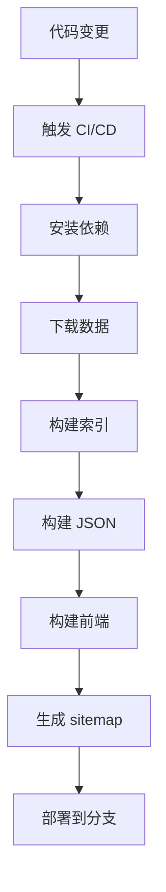

# 开发环境搭建与架构说明 / Development Environment & Architecture Guide

本文档介绍项目的技术架构、开发环境搭建、构建流程、分支管理规范和 CI/CD 流程。

## 📋 目录 / Table of Contents

- [🏗️ 技术架构 / Technical Architecture](#-技术架构--technical-architecture)
- [💻 开发环境搭建 / Development Environment Setup](#-开发环境搭建--development-environment-setup)
- [🔄 构建流程 / Build Process](#-构建流程--build-process)
- [🌿 分支管理 / Branch Management](#-分支管理--branch-management)
- [🔄 CI/CD 流程 / CI/CD Pipeline](#-cicd-流程--cicd-pipeline)
- [📝 代码规范 / Code Standards](#-代码规范--code-standards)
- [🧪 测试指南 / Testing Guide](#-测试指南--testing-guide)
- [🚀 部署流程 / Deployment Process](#-部署流程--deployment-process)

## 🏗️ 技术架构 / Technical Architecture

### 仓库架构 / Repository Architecture

#### 主仓库 (Main Repository)

**名称**: `banned-historical-archives/banned-historical-archives.github.io`

| 分支 | 用途 | 构建产物 | 说明 |
|------|------|----------|------|
| `master` | 源代码分支 | - | 主要开发分支 |
| `gh-pages` | 静态网站 | `out/` | GitHub Pages 自动部署 |
| `json` | JSON 数据 | `json/` | 文章 JSON 数据 |
| `indexes` | 索引数据 | `indexes/` | 搜索索引数据 |
| `txt` | 文本数据 | `txt/` | 纯文本格式导出 |

#### 资源仓库 (Resource Repositories)

**名称**: `banned-historical-archives/banned-historical-archives0` ~ `banned-historical-archives31`

| 分支 | 用途 | 数据类型 | 说明 |
|------|------|----------|------|
| `main` | 原始文件 | PDF、图片、文档 | 原始档案文件 |
| `config` | 配置文件 | JSON/TS 配置 | 元数据和配置 |
| `parsed` | 解析数据 | JSON | OCR 处理后的数据 |
| `ocr_cache` | OCR 缓存 | JSON | OCR 识别结果缓存 |
| `ocr_patch` | OCR 补丁 | JSON | OCR 结果人工修正 |

### 系统架构 / System Architecture

#### 整体架构图 / Overall Architecture Diagram



#### 详细架构说明 / Detailed Architecture Description

**分层架构设计**:

1. **用户访问层**: 基于 GitHub Pages 的静态网站，使用 Next.js 构建，React 渲染
2. **数据访问层**: 通过 GitHub Raw Content API 提供数据，无需后端服务器
3. **搜索引擎层**: 可选的 Elasticsearch 全文搜索，支持本地和生产环境
4. **资源仓库层**: 32个分布式资源仓库，存储原始文件和解析数据

#### 组件依赖关系图 / Component Dependency Diagram



#### 数据流图 / Data Flow Diagram



### 技术栈 / Technology Stack

#### 前端 / Frontend

- **框架**: Next.js 15 (React 18)
- **语言**: TypeScript
- **UI库**: Material-UI (MUI)
- **构建**: Next.js Build (Static Export)
- **部署**: GitHub Pages

#### 后端 / Backend

- **语言**: TypeScript (Node.js)
- **构建脚本**: 自研构建系统
- **数据处理**: OCR + 文本解析
- **搜索引擎**: Elasticsearch 8.x

#### 数据处理 / Data Processing

- **OCR引擎**: PaddleOCR
- **数据格式**: 自定义 JSON 格式
- **版本控制**: Git LFS (大文件)
- **存储**: Git 仓库 (分布式)

## 💻 开发环境搭建 / Development Environment Setup

### 系统要求 / System Requirements

#### 必备软件 / Required Software

- **Node.js**: >= 14.0.0 (推荐 18.x LTS)
- **npm**: >= 6.0.0 (推荐最新)
- **Git**: >= 2.0.0
- **Docker**: >= 20.10.0 (可选，用于本地搜索)

#### 推荐配置 / Recommended Configuration

- **内存**: 8GB+ RAM
- **磁盘**: 20GB+ 可用空间
- **网络**: 稳定的互联网连接

### 安装步骤 / Installation Steps

#### 1. 克隆项目 / Clone Repository

```bash
# 克隆主仓库
git clone https://github.com/banned-historical-archives/banned-historical-archives.github.io.git
cd banned-historical-archives.github.io

# 可选：克隆子模块 (如果有)
git submodule update --init --recursive
```

#### 2. 安装依赖 / Install Dependencies

```bash
# 安装 Node.js 依赖
npm install

# 如果安装失败，清理缓存重试
npm cache clean --force
rm -rf node_modules package-lock.json
npm install

# 验证安装
npm --version
node --version
```

#### 3. 下载数据 (可选) / Download Data (Optional)

```bash
# 下载解析后的数据 (推荐)
npm run init-parsed

# 下载配置文件
npm run init-config

# 可选：下载原始文件 (很大)
npm run init-raw

# 可选：下载 OCR 缓存
npm run init-ocr_cache
```

#### 4. 构建数据 / Build Data

```bash
# 构建索引 (必需)
npm run build-indexes

# 构建文章 JSON (必需)
npm run build-article-json

# 可选：构建 TXT 导出
npm run build-txt
```

#### 5. 构建前端 / Build Frontend

```bash
# 开发模式 (热重载)
npm run dev

# 生产构建
npm run build

# 启动生产服务器
npx serve@latest out
```

### 开发环境配置 / Development Environment Configuration

#### 环境变量 / Environment Variables

创建 `.env.local` 文件：

```bash
# 开发环境配置
NODE_ENV=development

# Elasticsearch 配置 (如果使用本地搜索)
ES_URL=http://localhost:9200
ES_USERNAME=elastic
ES_PASSWORD=password

# 功能开关
LOCAL_SEARCH_ENGINE=1
LOCAL_INDEXES=1

# 调试配置
DEBUG=*
```

#### IDE 配置 / IDE Configuration

**VS Code 推荐扩展**:

- TypeScript and JavaScript Language Features
- ESLint
- Prettier
- Docker
- GitLens

**VS Code 设置** (.vscode/settings.json):

```json
{
  "typescript.preferences.importModuleSpecifier": "relative",
  "editor.formatOnSave": true,
  "editor.defaultFormatter": "esbenp.vscode-prettier",
  "editor.codeActionsOnSave": {
    "source.fixAll.eslint": true
  },
  "files.associations": {
    "*.md": "markdown"
  }
}
```

### 开发工作流 / Development Workflow

#### 本地开发 / Local Development

```bash
# 1. 启动开发服务器
npm run dev

# 2. 浏览器访问 http://localhost:3000

# 3. 修改代码，自动热重载

# 4. 运行测试
npm test

# 5. 代码检查
npm run lint
```

#### 调试技巧 / Debugging Tips

```bash
# 启用详细日志
DEBUG=* npm run dev

# 检查构建产物
npm run build && ls -la out/

# 验证数据
node -e "console.log(require('./indexes/file_count.json'))"
```

## 🔄 构建流程 / Build Process

### 完整构建流程 / Complete Build Process



### 详细步骤 / Detailed Steps

#### 1. 数据准备阶段 / Data Preparation Phase

```bash
# 下载资源仓库数据
npm run init-parsed      # 解析后的数据
npm run init-config      # 配置文件

# 验证数据完整性
ls -la parsed/ config/
```

#### 2. 数据处理阶段 / Data Processing Phase

```bash
# 构建搜索索引
npm run build-indexes
# 输出: indexes/ 目录

# 构建文章 JSON 数据
npm run build-article-json
# 输出: json/ 目录

# 可选：构建 TXT 导出
npm run build-txt
# 输出: txt/ 分支
```

#### 3. 前端构建阶段 / Frontend Build Phase

```bash
# 构建生产版本
npm run build
# 输出: out/ 目录

# 生成网站地图
npm run postbuild
# 输出: out/sitemap.xml
```

#### 4. 部署阶段 / Deployment Phase

```bash
# 推送到 gh-pages 分支
git add out/
git commit -m "Build static site"
git push origin gh-pages

# 推送到数据分支
git checkout json
git add json/
git commit -m "Update JSON data"
git push origin json
```

### 构建脚本说明 / Build Scripts Explanation

| 脚本 | 用途 | 输出 | 说明 |
|------|------|------|------|
| `npm run init-parsed` | 下载解析数据 | `parsed/` | 从 GitHub 下载 |
| `npm run init-config` | 下载配置数据 | `config/` | 从 GitHub 下载 |
| `npm run build-indexes` | 构建索引 | `indexes/` | 生成搜索索引 |
| `npm run build-article-json` | 构建 JSON | `json/` | 生成文章数据 |
| `npm run build` | 前端构建 | `out/` | Next.js 静态导出 |
| `npm run postbuild` | 生成地图 | `out/sitemap.xml` | 网站地图 |

### 构建优化 / Build Optimization

#### 并行构建 / Parallel Building

```bash
# 使用更多 CPU 核心
export NODE_OPTIONS="--max-old-space-size=4096"

# 并行处理数据
npm run build-indexes &
npm run build-article-json &
wait
```

#### 增量构建 / Incremental Building

```bash
# 只重新构建变更的数据
# 修改 backend/build-indexes.ts 添加增量逻辑

# 使用缓存
npm install --prefer-offline
```

## 🌿 分支管理 / Branch Management

### 分支命名规范 / Branch Naming Convention

#### 功能分支 / Feature Branches

```
feature/功能名称          # 新功能开发
feature/add-search        # 添加搜索功能

bugfix/问题描述           # 问题修复
bugfix/fix-build-error   # 修复构建错误

refactor/重构内容         # 代码重构
refactor/cleanup-code    # 代码清理

docs/文档内容             # 文档更新
docs/update-readme       # 更新 README
```

#### 版本分支 / Release Branches

```
release/v1.0.0            # 版本发布分支
hotfix/v1.0.1             # 热修复分支
```

### 分支管理流程 / Branch Management Workflow

#### 开发新功能 / Develop New Feature

```bash
# 1. 从 master 创建功能分支
git checkout master
git pull origin master
git checkout -b feature/add-dark-mode

# 2. 开发功能
# ... 编写代码 ...

# 3. 提交更改
git add .
git commit -m "feat: add dark mode toggle"

# 4. 推送分支
git push origin feature/add-dark-mode

# 5. 创建 Pull Request
# 在 GitHub 上创建 PR
```

#### 合并代码 / Merge Code

```bash
# 1. 更新主分支
git checkout master
git pull origin master

# 2. 合并功能分支
git merge feature/add-dark-mode

# 3. 推送主分支
git push origin master

# 4. 删除功能分支
git branch -d feature/add-dark-mode
git push origin --delete feature/add-dark-mode
```

### 分支保护规则 / Branch Protection Rules

#### Master 分支保护 / Master Branch Protection

- ✅ 需要 Pull Request 审核
- ✅ 需要 CI/CD 通过
- ✅ 禁止直接推送
- ✅ 需要至少一个批准

#### 自动分支 / Automated Branches

- `gh-pages`: 自动从 master 构建部署
- `json`: 自动更新数据
- `indexes`: 自动更新索引
- `txt`: 自动更新文本导出

## 🔄 CI/CD 流程 / CI/CD Pipeline

### GitHub Actions 工作流 / GitHub Actions Workflows

#### 主仓库 CI/CD (.github/workflows/build.yml)

```yaml
name: Build and Deploy
on:
  push:
    branches: [ master ]
  pull_request:
    branches: [ master ]

jobs:
  build:
    runs-on: ubuntu-latest
    steps:
      - uses: actions/checkout@v3
      - uses: actions/setup-node@v3
        with:
          node-version: '18'
      - name: Install dependencies
        run: npm ci
      - name: Download data
        run: |
          npm run init-parsed
          npm run init-config
      - name: Build data
        run: |
          npm run build-indexes
          npm run build-article-json
      - name: Build frontend
        run: npm run build
      - name: Deploy to gh-pages
        uses: peaceiris/actions-gh-pages@v3
        with:
          github_token: ${{ secrets.GITHUB_TOKEN }}
          publish_dir: ./out
```

#### 资源仓库 CI/CD (banned-historical-archives0/.github/workflows/)

```yaml
name: Build Parsed Data
on:
  push:
    branches: [ config, ocr_cache, ocr_patch ]

jobs:
  build:
    runs-on: ubuntu-latest
    steps:
      - name: Checkout
        uses: actions/checkout@v3
      - name: Setup Node.js
        uses: actions/setup-node@v3
        with:
          node-version: '18'
      - name: Install dependencies
        run: npm ci
      - name: Build parsed data
        run: npm run build-parsed
      - name: Deploy to parsed branch
        run: |
          git checkout -b parsed
          git add .
          git commit -m "Build parsed data"
          git push origin parsed
```

### 触发条件 / Trigger Conditions

#### 自动触发 / Automatic Triggers

- **Push to master**: 构建主分支
- **PR to master**: 运行测试和构建
- **资源仓库变更**: 重新构建数据

#### 手动触发 / Manual Triggers

```bash
# 手动触发 GitHub Actions
gh workflow run build.yml

# 或在 GitHub 界面手动触发
```

### 构建产物部署 / Build Artifacts Deployment

#### 分支自动部署 / Branch Auto-Deployment

- `gh-pages` 分支 → GitHub Pages
- `json` 分支 → JSON 数据 API
- `indexes` 分支 → 索引数据 API
- `txt` 分支 → 文本导出下载

#### 部署验证 / Deployment Verification

```bash
# 检查 GitHub Pages
curl https://banned-historical-archives.github.io

# 检查数据 API
curl https://raw.githubusercontent.com/banned-historical-archives/banned-historical-archives.github.io/json/json/883/883eeb87ad.json

# 检查索引 API
curl https://raw.githubusercontent.com/banned-historical-archives/banned-historical-archives.github.io/refs/heads/indexes/indexes/file_count.json
```

## 📝 代码规范 / Code Standards

### TypeScript 规范 / TypeScript Standards

#### 文件命名 / File Naming

```typescript
// 正确
article-viewer.tsx
articleViewer.ts
article_viewer.test.ts

// 错误
articleviewer.tsx
ArticleViewer.tsx
```

#### 导入顺序 / Import Order

```typescript
// 1. React 相关
import React from 'react';

// 2. 第三方库
import { useState } from 'react';
import axios from 'axios';

// 3. 本地模块
import { Article } from '../types';
import Layout from '../components/Layout';

// 4. 工具函数
import { formatDate } from '../utils/date';
```

#### 类型定义 / Type Definitions

```typescript
// 好的类型定义
interface Article {
  id: string;
  title: string;
  authors: string[];
  dates: Date[];
  content: Content[];
}

// 使用泛型
interface ApiResponse<T> {
  data: T;
  error?: string;
  status: number;
}
```

### React 组件规范 / React Component Standards

#### 函数组件 / Functional Components

```typescript
interface ArticleCardProps {
  article: Article;
  onClick?: (article: Article) => void;
}

const ArticleCard: React.FC<ArticleCardProps> = ({ article, onClick }) => {
  const handleClick = () => {
    onClick?.(article);
  };

  return (
    <Card onClick={handleClick}>
      <Typography variant="h6">{article.title}</Typography>
      <Typography variant="body2">{article.authors.join(', ')}</Typography>
    </Card>
  );
};

export default ArticleCard;
```

#### 自定义 Hook / Custom Hooks

```typescript
const useArticle = (id: string) => {
  const [article, setArticle] = useState<Article | null>(null);
  const [loading, setLoading] = useState(true);
  const [error, setError] = useState<string | null>(null);

  useEffect(() => {
    const fetchArticle = async () => {
      try {
        setLoading(true);
        const response = await fetch(`/api/articles/${id}`);
        const data = await response.json();
        setArticle(data);
      } catch (err) {
        setError(err.message);
      } finally {
        setLoading(false);
      }
    };

    fetchArticle();
  }, [id]);

  return { article, loading, error };
};
```

### 提交规范 / Commit Standards

#### 提交信息格式 / Commit Message Format

```
<type>(<scope>): <subject>

<body>

<footer>
```

#### 类型定义 / Type Definitions

- `feat`: 新功能
- `fix`: 修复问题
- `docs`: 文档更新
- `style`: 代码格式调整
- `refactor`: 代码重构
- `test`: 测试相关
- `chore`: 构建过程或工具配置

#### 示例 / Examples

```bash
# 功能提交
feat(search): add Elasticsearch integration

- Add Elasticsearch client configuration
- Implement search API endpoints
- Update search component with real-time results

Closes #123

# 修复提交
fix(build): resolve memory issue in production build

- Increase Node.js memory limit to 4GB
- Optimize bundle size with code splitting
- Add build performance monitoring

# 文档提交
docs(readme): update installation instructions

- Add Docker installation steps
- Update system requirements
- Add troubleshooting section
```

## 🧪 测试指南 / Testing Guide

### 测试框架 / Testing Framework

本项目使用 **Vitest** 作为测试框架。Vitest 是一个基于 Vite 的快速测试运行器，与 Vite 构建工具深度集成，提供更快的测试执行速度和更好的开发体验。

This project uses **Vitest** as the testing framework. Vitest is a fast test runner based on Vite, deeply integrated with Vite build tools, providing faster test execution and better developer experience.

### 当前测试状态 / Current Test Status

- **测试框架**: Vitest ^0.19.1
- **测试文件位置**: `test/` 目录
- **现有测试文件**:
  - `test/utils.test.ts` - 工具函数单元测试（6个测试用例）
  - `test/create-ocr-issue.test.ts` - OCR 自动化文稿录入测试（当前被跳过）
  - `test/setup.ts` - 测试环境设置文件
  - `test/__snapshots__/utils.test.ts.snap` - 工具函数快照测试
- **测试脚本**: 已配置在 `package.json` 中，可使用 `npm test` 运行

### 测试类型 / Test Types

#### 单元测试 / Unit Tests

```typescript
// test/utils.test.ts
import { describe, it, expect } from 'vitest';
import { md5, crypto_md5 } from '../utils';

describe('md5', () => {
  it('should generate correct MD5 hash', () => {
    const result = md5('hello world');
    expect(result).toBe('5eb63bbbe01eeed093cb22bb8f5acdc3');
  });
});

describe('crypto_md5', () => {
  it('should generate correct MD5 hash using crypto', () => {
    const result = crypto_md5('hello world');
    expect(result).toBe('5eb63bbbe01eeed093cb22bb8f5acdc3');
  });
});
```

#### 组件测试 / Component Tests

```typescript
// test/components/ArticleCard.test.tsx
import { describe, it, expect } from 'vitest';
import { render, screen } from '@testing-library/react';
import ArticleCard from '../../components/ArticleCard';

const mockArticle = {
  id: '123',
  title: 'Test Article',
  authors: ['Author 1', 'Author 2'],
  dates: [{ year: 2023, month: 1, day: 1 }],
  is_range_date: false,
  parts: [{ text: 'Content', type: 'paragraph' }],
  comments: [],
};

describe('ArticleCard', () => {
  it('renders article title', () => {
    render(<ArticleCard article={mockArticle} />);
    expect(screen.getByText('Test Article')).toBeInTheDocument();
  });

  it('renders authors', () => {
    render(<ArticleCard article={mockArticle} />);
    expect(screen.getByText('Author 1, Author 2')).toBeInTheDocument();
  });
});
```

#### 集成测试 / Integration Tests

```typescript
// test/integration/article-loading.test.ts
import { describe, it, expect, vi, beforeEach, afterEach } from 'vitest';

describe('Article Loading', () => {
  beforeEach(() => {
    global.fetch = vi.fn();
  });

  afterEach(() => {
    vi.restoreAllMocks();
  });

  it('loads article data from API', async () => {
    const mockResponse = { id: '123', title: 'Test' };
    vi.mocked(global.fetch).mockResolvedValueOnce({
      json: async () => mockResponse,
    } as Response);

    const response = await fetch('/api/articles/123');
    const data = await response.json();

    expect(data).toEqual(mockResponse);
  });
});
```

### 运行测试 / Running Tests

**注意**: 当前已配置测试脚本，可以使用以下方式运行测试：

**Note**: Test scripts are configured in `package.json`. You can run tests using the following methods:

```bash
# 使用 npx 直接运行 Vitest
# Run Vitest directly using npx
npx vitest

# 运行所有测试
# Run all tests
npx vitest run

# 运行特定测试文件
# Run specific test file
npx vitest run test/utils.test.ts

# 监听模式 (开发时)
# Watch mode (for development)
npx vitest watch

# 运行测试并生成覆盖率报告（需要 Vitest 4.0+，当前版本不支持）
# Run tests with coverage report (requires Vitest 4.0+, not supported in current version)
# 当前使用: npm run test:coverage（会显示版本要求提示）
# Currently use: npm run test:coverage (will show version requirement message)
npx vitest run --coverage

# 运行 UI 模式（可视化界面）
# Run UI mode (visual interface)
npx vitest --ui
```

**提示**: 可以使用以下npm脚本运行测试：

**Tip**: You can use the following npm scripts to run tests:

### 测试配置 / Test Configuration

#### Vitest 配置 (vitest.config.ts)

```typescript
import { defineConfig } from 'vitest/config';
import path from 'path';

export default defineConfig({
  test: {
    environment: 'jsdom', // 用于 React 组件测试
    globals: true, // 启用全局 API（describe, it, expect 等）
    setupFiles: ['./test/setup.ts'], // 测试设置文件
    include: ['test/**/*.{test,spec}.{ts,tsx}'], // 测试文件匹配模式
    // 覆盖率配置 (当前 Vitest 0.19.1 版本不支持内置覆盖率，需要升级到 4.0+ 或使用 c8)
    // coverage: {
    //   provider: 'v8', // 使用 v8 覆盖率提供者
    //   reporter: ['text', 'json', 'html'], // 覆盖率报告格式
    //   exclude: [
    //     'node_modules/',
    //     'test/',
    //     '**/*.d.ts',
    //     '**/*.config.*',
    //     '**/dist/',
    //     '**/out/',
    //     '**/build/',
    //     '**/.next/',
    //     'docs/',
    //     'scripts/',
    //     'migration/',
    //     'public/',
    //     'styles/',
    //   ],
    //   thresholds: {
    //     lines: 80,
    //     functions: 80,
    //     branches: 75,
    //     statements: 80,
    //   },
    // },
  },
  resolve: {
    alias: {
      '@': path.resolve(__dirname), // 路径别名
    },
  },
});
```

**注意 / Note**: 
- 当前 Vitest 版本为 0.19.1，不支持内置覆盖率功能
- 需要升级到 Vitest 4.0+ 才能启用覆盖率配置
- 升级后取消注释 `coverage` 配置即可使用

#### 快照测试 / Snapshot Testing

Vitest 支持快照测试，用于验证复杂对象的输出。项目中的 `test/__snapshots__/utils.test.ts.snap` 包含了工具函数的快照测试。

Vitest supports snapshot testing for verifying complex object outputs. The project's `test/__snapshots__/utils.test.ts.snap` contains snapshot tests for utility functions.

```typescript
import { describe, it, expect } from 'vitest';
import { apply_patch_v2 } from '../utils';

describe('apply_patch_v2', () => {
  it('should apply patch correctly', () => {
    const result = apply_patch_v2(originalData, patch);
    expect(result).toMatchSnapshot();
  });
});
```

### 测试工具 / Testing Tools

- **Vitest**: 测试运行器和断言库（基于 Vite，速度快）
- **@testing-library/react**: React 组件测试工具
- **@testing-library/jest-dom**: DOM 断言扩展（需要配置）
- **jsdom**: DOM 环境模拟（用于组件测试）

### 测试工程发展规划 / Testing Engineering Development Plan

#### 当前状态 / Current Status

根据测试代码调查，当前项目的测试覆盖情况：

**Current test coverage status based on code investigation:**

- ✅ **测试框架已配置**: Vitest ^0.19.1 已安装，`vitest.config.ts` 已创建
- ✅ **测试基础设施**: `package.json` 中已配置测试脚本，`test/utils.test.ts` 已恢复
- ⚠️ **测试覆盖率严重不足**: 
  - 仅有 2 个测试文件，6 个测试用例通过，1 个跳过
  - 16 个 React 组件文件完全没有测试
  - `utils/index.ts` 中 12 个导出函数，测试覆盖很少
  - 大量源代码文件未覆盖

#### 当前测试工程存在的问题 / Current Testing Engineering Issues

**基于深入分析，当前测试工程存在以下关键问题：**

**Based on in-depth analysis, the current testing engineering has the following key issues:**

##### 1. 测试覆盖率严重不足 / Severely Insufficient Test Coverage

- **现状 / Status**: 
  - 测试文件数量：2 个（`test/utils.test.ts`, `test/create-ocr-issue.test.ts`）
  - 通过测试：6 个
  - 跳过测试：1 个（OCR 集成测试）
  - React 组件：16 个文件，0 个测试
  - 工具函数：12 个导出函数，部分测试

- **问题影响 / Impact**:
  - 无法有效保障代码质量
  - 难以 catch 潜在 bug
  - 重构风险高
  - 缺乏回归测试保障

##### 2. 版本和技术栈落后 / Outdated Versions and Tech Stack

- **Vitest 版本问题 / Vitest Version Issue**:
  - 当前版本：0.19.1（2023 年发布）
  - 问题：无法使用内置覆盖率功能（需要 4.0+）
  - 影响：`vitest.config.ts` 中覆盖率配置被注释，无法生成覆盖率报告

- **依赖缺失 / Missing Dependencies**:
  - 缺少 `@testing-library/react`（React 组件测试必需）
  - 缺少 `@testing-library/jest-dom`（DOM 断言扩展）
  - 影响：无法进行 React 组件测试

##### 3. 测试类型不完整 / Incomplete Test Types

- ✅ **单元测试（部分）**: `utils` 函数测试存在但不完整
- ❌ **React 组件测试**: 完全缺失（16 个组件文件）
- ❌ **集成测试**: 只有 1 个被跳过的 OCR 集成测试
- ❌ **端到端测试**: 完全缺失

##### 4. CI/CD 集成缺失 / Missing CI/CD Integration

- **现状 / Status**: 
  - 有多个 GitHub workflows（`.github/workflows/`）
  - 但没有测试相关的 workflow
  - 没有自动化测试运行
  - 没有测试报告生成
  - 没有覆盖率检查

##### 5. 测试质量和维护性问题 / Test Quality and Maintainability Issues

- **跳过的重要测试**: OCR 集成测试被跳过，没有 mock 替代方案
- **边界条件测试**: 缺少错误处理、边界条件测试
- **快照测试维护**: 快照文件可能过期，缺少自动更新机制
- **测试稳定性**: `test/setup.ts` 文件存在但为空，缺少全局配置

##### 6. 配置和工具链不完整 / Incomplete Configuration and Toolchain

- **测试环境**: `test/setup.ts` 文件存在但为空
- **测试脚本**: 覆盖率脚本显示版本限制信息，但没有替代方案
- **类型支持**: 缺少针对测试的 TypeScript 配置优化

##### 7. 架构和组织问题 / Architecture and Organization Issues

- **测试文件结构**: 缺少组件测试目录结构（如 `test/components/`）
- **测试数据管理**: 缺少测试 fixtures 和 mock 数据
- **测试文档**: 虽然有文档，但缺少实际测试示例

#### 短期目标（1-3个月）/ Short-term Goals (1-3 months)

1. **升级测试框架和依赖 / Upgrade Testing Framework and Dependencies** ⚠️ **高优先级**
   - 升级 Vitest 到 4.0+ 版本以支持覆盖率功能
   - 安装 `@testing-library/react` 和 `@testing-library/jest-dom`
   - 更新 `vitest.config.ts` 启用覆盖率配置
   - 验证所有测试在新版本下正常运行

2. **提高核心功能测试覆盖率 / Improve Core Function Test Coverage** ⚠️ **高优先级**
   - 为 `utils/index.ts` 中所有 12 个导出函数编写完整单元测试
   - 补充边界条件测试和错误处理测试
   - 为 `backend/` 中的关键脚本添加测试
   - 目标覆盖率：核心工具函数 >= 80%

3. **建立测试规范和 CI/CD 集成 / Establish Testing Standards and CI/CD Integration** ⚠️ **高优先级**
   - 创建 `.github/workflows/test.yml` 测试 workflow
   - 配置自动化测试运行和报告生成
   - 建立测试文件组织结构（`test/components/`, `test/integration/` 等）
   - 完善 `test/setup.ts` 全局测试配置

#### 中期目标（3-6个月）/ Medium-term Goals (3-6 months)

1. **组件测试 / Component Testing** ⚠️ **关键缺失**
   - 为所有 16 个 React 组件编写测试
   - 优先测试核心组件：Article, Navbar, Layout, DiffViewer 等
   - 配置 React Testing Library 和 DOM 断言
   - 目标覆盖率：组件 >= 70%

2. **集成测试 / Integration Testing** ⚠️ **关键缺失**
   - 为数据加载流程添加集成测试
   - 为搜索功能添加集成测试
   - 为 OCR 工作流添加 mock 测试（替代被跳过的测试）
   - 为 API 端点添加测试

3. **测试工具链完善 / Testing Toolchain Enhancement**
   - 配置测试覆盖率报告自动生成（升级 Vitest 后）
   - 集成测试覆盖率到 CI/CD pipeline
   - 设置测试覆盖率阈值检查（阻止低覆盖率 PR）
   - 建立测试 fixtures 和 mock 数据管理

#### 长期目标（6-12个月）/ Long-term Goals (6-12 months)

1. **E2E 测试 / End-to-End Testing**
   - 引入 Playwright 或 Cypress
   - 为主要用户流程编写 E2E 测试
   - 配置 E2E 测试自动化

2. **性能测试 / Performance Testing**
   - 为关键路径添加性能测试
   - 监控测试执行时间
   - 建立性能基准

3. **测试最佳实践 / Testing Best Practices**
   - 建立测试代码审查流程
   - 编写测试最佳实践文档
   - 定期进行测试质量评估

### 测试最佳实践 / Testing Best Practices

#### 测试编写原则 / Test Writing Principles

1. **AAA 模式 / AAA Pattern**
   ```typescript
   describe('functionName', () => {
     it('should do something', () => {
       // Arrange: 准备测试数据
       const input = 'test input';
       
       // Act: 执行被测试的函数
       const result = functionName(input);
       
       // Assert: 验证结果
       expect(result).toBe('expected output');
     });
   });
   ```

2. **测试独立性 / Test Independence**
   - 每个测试应该独立运行
   - 避免测试之间的依赖关系
   - 使用 `beforeEach` 和 `afterEach` 清理状态

3. **有意义的测试名称 / Meaningful Test Names**
   ```typescript
   // ✅ 好的测试名称
   it('should return error when input is empty', () => { ... });
   it('should format date correctly for valid input', () => { ... });
   
   // ❌ 不好的测试名称
   it('test1', () => { ... });
   it('works', () => { ... });
   ```

4. **测试边界情况 / Test Edge Cases**
   - 空值、null、undefined
   - 边界值（最大值、最小值）
   - 异常情况

#### 测试优先级 / Test Priority

1. **高优先级 / High Priority**
   - 核心业务逻辑函数
   - 数据处理和转换函数
   - 安全相关功能

2. **中优先级 / Medium Priority**
   - UI 组件
   - API 端点
   - 工具函数

3. **低优先级 / Low Priority**
   - 简单的辅助函数
   - 配置相关代码
   - 第三方库封装

### 测试改进建议 / Testing Improvement Recommendations

#### 立即改进（已完成）/ Immediate Improvements (Completed)

1. ✅ **测试脚本已添加到 package.json**
   - `test`: `vitest run`
   - `test:watch`: `vitest watch`
   - `test:coverage`: 显示版本要求提示
   - `test:ui`: `vitest --ui`

2. ✅ **vitest.config.ts 已创建**
   - 配置了 jsdom 测试环境
   - 配置了路径别名
   - 覆盖率配置已注释（等待 Vitest 升级）

3. ✅ **test/utils.test.ts 已恢复**
   - 基于快照文件恢复
   - 包含 `apply_patch_v2` 测试
   - `extract_dates` 测试已注释（函数不存在）

#### 紧急改进（待完成）/ Urgent Improvements (Pending)

1. **升级 Vitest 到 4.0+** ⚠️ **阻塞覆盖率功能**
   ```bash
   npm install -D vitest@^4.0.0 @vitest/coverage-v8@^4.0.0
   ```
   - 启用 `vitest.config.ts` 中的覆盖率配置
   - 更新 `package.json` 中的 `test:coverage` 脚本
   - 验证所有测试在新版本下正常运行

2. **安装 React 测试依赖** ⚠️ **阻塞组件测试**
   ```bash
   npm install -D @testing-library/react @testing-library/jest-dom
   ```
   - 配置 `test/setup.ts` 引入 `@testing-library/jest-dom`
   - 为 React 组件测试做准备

3. **创建测试 CI/CD Workflow** ⚠️ **阻塞自动化测试**
   - 创建 `.github/workflows/test.yml`
   - 配置自动运行测试
   - 配置覆盖率报告上传
   - 设置 PR 检查

4. **补充核心函数测试** ⚠️ **提高覆盖率**
   - 为 `utils/index.ts` 中所有函数编写测试
   - 添加边界条件和错误处理测试
   - 目标：核心函数覆盖率 >= 80%

5. **开始组件测试** ⚠️ **填补关键空白**
   - 选择 2-3 个核心组件开始
   - 建立组件测试模板
   - 逐步扩展到所有组件

#### 持续改进 / Continuous Improvements

1. **建立测试文化 / Build Testing Culture**
   - 在代码审查中要求测试（PR 必须包含测试）
   - 新功能必须包含测试（否则 PR 不合并）
   - 定期审查测试覆盖率（每月检查）
   - 设置覆盖率阈值（阻止低覆盖率代码合并）

2. **测试驱动开发 / Test-Driven Development**
   - 鼓励先写测试再写实现（TDD）
   - 使用测试指导重构（确保重构安全）
   - 保持测试代码质量（测试代码也需要 review）

3. **测试文档化 / Test Documentation**
   - 为复杂测试添加注释
   - 维护测试最佳实践文档
   - 分享测试经验和技巧
   - 建立测试示例库

4. **测试数据管理 / Test Data Management**
   - 创建 `test/fixtures/` 目录存储测试数据
   - 建立 mock 数据管理规范
   - 共享测试工具函数（`test/utils/`）

5. **测试性能优化 / Test Performance Optimization**
   - 优化测试执行时间
   - 并行运行测试
   - 缓存测试结果

## 🚀 部署流程 / Deployment Process

### 生产环境部署 / Production Deployment

#### GitHub Pages 自动部署

```bash
# 推送到 master 分支自动触发部署
git add .
git commit -m "feat: add new feature"
git push origin master

# GitHub Actions 会自动：
# 1. 安装依赖
# 2. 下载数据
# 3. 构建应用
# 4. 部署到 gh-pages 分支
```

#### 手动部署 / Manual Deployment

```bash
# 1. 本地构建
npm run build

# 2. 验证构建产物
ls -la out/

# 3. 推送到 gh-pages 分支
git checkout gh-pages
cp -r out/* .
git add .
git commit -m "Deploy to production"
git push origin gh-pages
```

### 环境配置 / Environment Configuration

#### 生产环境变量 / Production Environment Variables

```bash
# .env.production
NODE_ENV=production
LOCAL_SEARCH_ENGINE=0  # 生产环境不使用本地搜索
LOCAL_INDEXES=0       # 使用远程索引

# API 配置
API_BASE_URL=https://api.example.com
```

#### CDN 配置 / CDN Configuration

```javascript
// next.config.js
module.exports = {
  images: {
    loader: 'imgix',
    path: 'https://cdn.example.com/',
  },
  assetPrefix: process.env.NODE_ENV === 'production' ? 'https://cdn.example.com' : '',
};
```

### 监控和维护 / Monitoring and Maintenance

#### 性能监控 / Performance Monitoring

```typescript
// pages/_app.tsx
import { useEffect } from 'react';

export default function App({ Component, pageProps }) {
  useEffect(() => {
    // 添加性能监控
    if (typeof window !== 'undefined' && 'performance' in window) {
      window.addEventListener('load', () => {
        const perfData = performance.getEntriesByType('navigation')[0];
        console.log('Page load time:', perfData.loadEventEnd - perfData.loadEventStart);
      });
    }
  }, []);

  return <Component {...pageProps} />;
}
```

#### 错误监控 / Error Monitoring

```typescript
// utils/errorReporting.ts
export const reportError = (error: Error, context?: any) => {
  console.error('Error occurred:', error, context);

  // 发送到错误监控服务
  if (process.env.NODE_ENV === 'production') {
    // Sentry, LogRocket 等
  }
};
```

### 备份和恢复 / Backup and Recovery

#### 数据备份 / Data Backup

```bash
# 备份脚本
#!/bin/bash
DATE=$(date +%Y%m%d_%H%M%S)
BACKUP_DIR="backups/$DATE"

mkdir -p "$BACKUP_DIR"

# 备份代码
git archive --format=tar.gz -o "$BACKUP_DIR/code.tar.gz" HEAD

# 备份数据
cp -r parsed "$BACKUP_DIR/"
cp -r config "$BACKUP_DIR/"
cp -r indexes "$BACKUP_DIR/"

# 压缩备份
tar -czf "backup_$DATE.tar.gz" "$BACKUP_DIR"
```

#### 恢复流程 / Recovery Process

```bash
# 1. 停止服务
docker compose down

# 2. 恢复代码
git checkout <last-good-commit>

# 3. 恢复数据
tar -xzf backup_20231201_120000.tar.gz
cp -r backups/20231201_120000/parsed ./
cp -r backups/20231201_120000/config ./

# 4. 重启服务
docker compose up -d
```

## ⚠️ 错误处理机制 / Error Handling Mechanism

### 前端错误处理 / Frontend Error Handling

#### API 请求错误处理

```typescript
// 统一的错误处理函数
async function safeFetch<T>(url: string, options?: RequestInit): Promise<T | null> {
  try {
    const response = await fetch(url, options);
    
    if (!response.ok) {
      // 根据状态码处理不同错误
      switch (response.status) {
        case 404:
          console.error(`资源不存在: ${url}`);
          return null;
        case 403:
          console.error(`访问被拒绝: ${url}`);
          return null;
        case 500:
          console.error(`服务器错误: ${url}`);
          // 可以重试
          return retryFetch(url, options);
        default:
          throw new Error(`HTTP ${response.status}: ${response.statusText}`);
      }
    }
    
    return await response.json();
  } catch (error) {
    console.error(`请求失败: ${url}`, error);
    return null;
  }
}

// 重试机制
async function retryFetch<T>(
  url: string,
  options?: RequestInit,
  maxRetries = 3
): Promise<T | null> {
  for (let i = 0; i < maxRetries; i++) {
    try {
      await sleep(1000 * (i + 1)); // 指数退避
      const response = await fetch(url, options);
      if (response.ok) {
        return await response.json();
      }
    } catch (error) {
      if (i === maxRetries - 1) {
        console.error(`重试失败 (${maxRetries}次): ${url}`, error);
        return null;
      }
    }
  }
  return null;
}
```

#### React 组件错误边界

```typescript
// components/ErrorBoundary.tsx
import React, { Component, ErrorInfo, ReactNode } from 'react';

interface Props {
  children: ReactNode;
  fallback?: ReactNode;
}

interface State {
  hasError: boolean;
  error?: Error;
}

class ErrorBoundary extends Component<Props, State> {
  constructor(props: Props) {
    super(props);
    this.state = { hasError: false };
  }

  static getDerivedStateFromError(error: Error): State {
    return { hasError: true, error };
  }

  componentDidCatch(error: Error, errorInfo: ErrorInfo) {
    console.error('组件错误:', error, errorInfo);
    // 可以发送错误到监控服务
  }

  render() {
    if (this.state.hasError) {
      return this.props.fallback || (
        <div>
          <h2>出现错误</h2>
          <p>{this.state.error?.message}</p>
          <button onClick={() => this.setState({ hasError: false })}>
            重试
          </button>
        </div>
      );
    }

    return this.props.children;
  }
}
```

### 构建错误处理 / Build Error Handling

#### 数据构建错误处理

```typescript
// backend/build-indexes.ts 中的错误处理示例
async function buildIndexes() {
  try {
    // 验证数据完整性
    if (!fs.existsSync('parsed/')) {
      throw new Error('parsed/ 目录不存在，请先运行 npm run init-parsed');
    }

    // 构建索引
    const indexes = await processAllArticles();
    
    // 验证构建结果
    if (indexes.articles.length === 0) {
      throw new Error('构建的索引为空，请检查数据源');
    }

    // 保存索引
    await saveIndexes(indexes);
    
    console.log(`成功构建 ${indexes.articles.length} 条索引`);
  } catch (error) {
    console.error('构建索引失败:', error);
    process.exit(1); // 退出并返回错误码
  }
}
```

#### 构建验证

```bash
# 构建后验证脚本
#!/bin/bash
# scripts/verify-build.sh

echo "验证构建结果..."

# 检查必要文件是否存在
if [ ! -f "indexes/file_count.json" ]; then
  echo "错误: file_count.json 不存在"
  exit 1
fi

# 检查 JSON 格式
if ! jq empty indexes/file_count.json 2>/dev/null; then
  echo "错误: file_count.json 格式无效"
  exit 1
fi

# 检查文章数据
if [ ! -d "json/json" ]; then
  echo "错误: json/json 目录不存在"
  exit 1
fi

echo "构建验证通过"
```

### 异常情况处理 / Exception Handling

#### 常见异常情况

| 异常类型 | 原因 | 处理方式 |
|---------|------|---------|
| 网络超时 | GitHub API 响应慢 | 实现重试机制，增加超时时间 |
| 数据格式错误 | JSON 解析失败 | 验证数据格式，提供错误提示 |
| 文件缺失 | 资源仓库数据未下载 | 提示用户运行初始化命令 |
| 内存不足 | 数据量过大 | 分批处理，增加内存限制 |
| 构建失败 | 依赖问题或代码错误 | 记录详细错误日志，提供修复建议 |

#### 错误日志记录

```typescript
// utils/logger.ts
interface LogLevel {
  ERROR: 'error';
  WARN: 'warn';
  INFO: 'info';
  DEBUG: 'debug';
}

export function logError(error: Error, context?: Record<string, any>) {
  const logEntry = {
    timestamp: new Date().toISOString(),
    level: 'error',
    message: error.message,
    stack: error.stack,
    context,
  };

  // 开发环境：输出到控制台
  if (process.env.NODE_ENV === 'development') {
    console.error('错误日志:', logEntry);
  }

  // 生产环境：发送到监控服务
  if (process.env.NODE_ENV === 'production') {
    // 发送到 Sentry, LogRocket 等
    // sendToMonitoringService(logEntry);
  }
}
```

## 🚀 性能优化指南 / Performance Optimization Guide

### 前端性能优化 / Frontend Performance Optimization

#### 代码分割和懒加载

```typescript
// 动态导入大型组件
import dynamic from 'next/dynamic';

const ArticleViewer = dynamic(() => import('../components/ArticleViewer'), {
  loading: () => <div>加载中...</div>,
  ssr: false, // 如果组件不需要 SSR
});

// 路由级别的代码分割
const SearchPage = dynamic(() => import('./search'), {
  loading: () => <div>加载搜索页面...</div>,
});
```

#### 数据缓存策略

```typescript
// utils/cache.ts
class DataCache {
  private cache = new Map<string, { data: any; timestamp: number }>();
  private readonly TTL = 5 * 60 * 1000; // 5分钟

  get<T>(key: string): T | null {
    const cached = this.cache.get(key);
    if (cached && Date.now() - cached.timestamp < this.TTL) {
      return cached.data as T;
    }
    return null;
  }

  set<T>(key: string, data: T): void {
    this.cache.set(key, { data, timestamp: Date.now() });
  }

  clear(): void {
    this.cache.clear();
  }
}

// 使用示例
const cache = new DataCache();

async function getArticle(id: string) {
  const cacheKey = `article-${id}`;
  const cached = cache.get(cacheKey);
  if (cached) return cached;

  const data = await fetchArticle(id);
  cache.set(cacheKey, data);
  return data;
}
```

#### 虚拟滚动（大数据列表）

```typescript
// 使用 react-window 或 react-virtualized
import { FixedSizeList } from 'react-window';

function ArticleList({ articles }: { articles: Article[] }) {
  const Row = ({ index, style }: { index: number; style: React.CSSProperties }) => (
    <div style={style}>
      <ArticleCard article={articles[index]} />
    </div>
  );

  return (
    <FixedSizeList
      height={600}
      itemCount={articles.length}
      itemSize={120}
      width="100%"
    >
      {Row}
    </FixedSizeList>
  );
}
```

### 构建性能优化 / Build Performance Optimization

#### 并行构建

```typescript
// backend/build-indexes.ts
import { Worker } from 'worker_threads';

async function buildIndexesParallel() {
  const cpuCount = require('os').cpus().length;
  const chunkSize = Math.ceil(totalArticles / cpuCount);
  
  const workers = [];
  for (let i = 0; i < cpuCount; i++) {
    const start = i * chunkSize;
    const end = Math.min(start + chunkSize, totalArticles);
    
    const worker = new Worker('./build-worker.js', {
      workerData: { start, end },
    });
    
    workers.push(worker);
  }

  const results = await Promise.all(
    workers.map(worker => new Promise((resolve, reject) => {
      worker.on('message', resolve);
      worker.on('error', reject);
    }))
  );

  // 合并结果
  return mergeResults(results);
}
```

#### 增量构建

```typescript
// 只构建变更的数据
interface BuildCache {
  lastBuildTime: number;
  processedFiles: Set<string>;
}

async function buildIncremental() {
  const cache = loadBuildCache();
  const now = Date.now();
  
  // 只处理修改时间晚于上次构建的文件
  const filesToProcess = getAllFiles().filter(file => {
    const stats = fs.statSync(file);
    return stats.mtimeMs > cache.lastBuildTime || 
           !cache.processedFiles.has(file);
  });

  // 处理变更的文件
  for (const file of filesToProcess) {
    await processFile(file);
    cache.processedFiles.add(file);
  }

  cache.lastBuildTime = now;
  saveBuildCache(cache);
}
```

#### 内存优化

```bash
# 增加 Node.js 内存限制
export NODE_OPTIONS="--max-old-space-size=4096"

# 或使用 npm 脚本
{
  "scripts": {
    "build": "NODE_OPTIONS='--max-old-space-size=4096' next build"
  }
}
```

### 数据加载优化 / Data Loading Optimization

#### 分页加载

```typescript
// 实现分页加载，避免一次性加载所有数据
async function loadArticlesPage(page: number, pageSize = 50) {
  const start = page * pageSize;
  const end = start + pageSize;
  
  // 只加载当前页的数据
  const pageData = await fetch(`/api/articles?start=${start}&end=${end}`);
  return pageData;
}
```

#### 预加载关键资源

```typescript
// 预加载下一页数据
useEffect(() => {
  if (currentPage < totalPages) {
    // 预加载下一页
    const nextPageData = loadArticlesPage(currentPage + 1);
    cache.set(`page-${currentPage + 1}`, nextPageData);
  }
}, [currentPage]);
```

#### CDN 优化

```javascript
// next.config.js
module.exports = {
  // 使用 CDN 加速静态资源
  assetPrefix: process.env.NODE_ENV === 'production' 
    ? 'https://cdn.example.com' 
    : '',
  
  // 图片优化
  images: {
    domains: ['raw.githubusercontent.com'],
    formats: ['image/avif', 'image/webp'],
  },
};
```

### 性能监控 / Performance Monitoring

#### 性能指标收集

```typescript
// utils/performance.ts
export function measurePerformance(name: string, fn: () => void) {
  const start = performance.now();
  fn();
  const end = performance.now();
  const duration = end - start;
  
  console.log(`[性能] ${name}: ${duration.toFixed(2)}ms`);
  
  // 发送到监控服务
  if (duration > 1000) {
    logSlowOperation(name, duration);
  }
}

// 页面加载性能
export function trackPageLoad() {
  if (typeof window !== 'undefined' && 'performance' in window) {
    window.addEventListener('load', () => {
      const perfData = performance.getEntriesByType('navigation')[0] as PerformanceNavigationTiming;
      
      const metrics = {
        dns: perfData.domainLookupEnd - perfData.domainLookupStart,
        tcp: perfData.connectEnd - perfData.connectStart,
        request: perfData.responseStart - perfData.requestStart,
        response: perfData.responseEnd - perfData.responseStart,
        dom: perfData.domContentLoadedEventEnd - perfData.domContentLoadedEventStart,
        load: perfData.loadEventEnd - perfData.loadEventStart,
      };
      
      console.log('页面加载性能:', metrics);
    });
  }
}
```

## 📚 相关文档 / Related Documentation

- [本地运行指南](./local.md)
- [搜索配置指南](./local-search-engine.md)
- [标准化文档](./standardization.md)
- [录入与校对](./upload-and-correction.md)
- [部署指南](./DEPLOYMENT.md)
- [故障排查](./TROUBLESHOOTING.md)
- [贡献指南](../CONTRIBUTING.md)
- [架构设计文档](./ARCHITECTURE.md)
- [数据流文档](./DATA_FLOW.md)

---

**注意**: 开发环境搭建可能需要一些时间，请耐心等待数据下载和构建完成。如遇到问题，请查看[故障排查指南](./TROUBLESHOOTING.md)。
