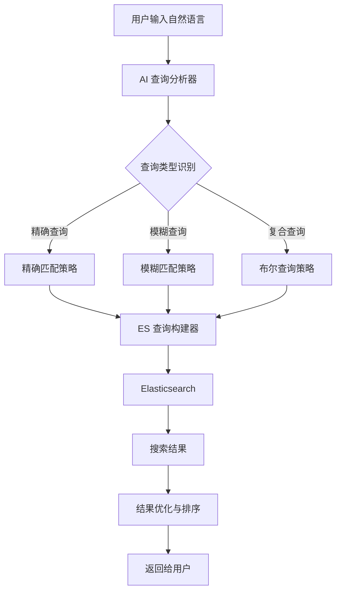

# 智能搜索方案 / Intelligent Search Plan

## 📋 方案概述 / Overview

本方案通过 AI 助手将用户的自然语言查询转换为优化的 Elasticsearch 查询，实现更智能的搜索体验，无需安装向量搜索支持。

## 🎯 目标 / Goals

1. **自然语言理解**: 将用户的自然语言查询转换为结构化的 ES 查询
2. **查询优化**: 自动选择最佳的查询策略（精确匹配、模糊匹配、多字段搜索等）
3. **同义词扩展**: 自动识别和扩展同义词、相关词
4. **智能排序**: 根据查询意图优化结果排序
5. **零配置**: 无需额外安装或配置，直接使用现有 ES

## 🏗️ 架构设计 / Architecture

### 系统架构图



### 组件设计

#### 1. 查询分析器 (Query Analyzer)

**功能**:
- 解析自然语言查询
- 提取关键实体（人物、时间、主题等）
- 识别查询意图（精确搜索、模糊搜索、范围搜索等）
- 提取搜索关键词

**输入示例**:
```
"找关于毛泽东在文化大革命时期的讲话"
"搜索1960年代关于经济建设的文章"
"查找包含'无产阶级'和'革命'的内容"
```

**输出结构**:
```typescript
interface QueryAnalysis {
  keywords: string[];           // 关键词列表
  entities: {                    // 实体识别
    person?: string[];           // 人物
    time?: {                     // 时间
      start?: number;
      end?: number;
      period?: string;
    };
    topic?: string[];            // 主题
  };
  intent: 'exact' | 'fuzzy' | 'range' | 'complex';  // 查询意图
  synonyms: string[];            // 同义词
  fields: string[];              // 目标字段
}
```

#### 2. 查询构建器 (Query Builder)

**功能**:
- 根据查询分析结果构建 ES 查询
- 选择最优查询策略
- 设置字段权重
- 配置高亮和排序

**查询策略**:

1. **精确匹配策略** (Exact Match)
   - 使用 `match_phrase` 或 `term`
   - 适用于：完整短语、专有名词

2. **模糊匹配策略** (Fuzzy Match)
   - 使用 `match` 或 `fuzzy`
   - 适用于：关键词搜索、容错搜索

3. **多字段策略** (Multi-field)
   - 使用 `multi_match`
   - 适用于：通用搜索，标题权重更高

4. **布尔查询策略** (Boolean)
   - 使用 `bool` 查询
   - 适用于：复杂条件、AND/OR/NOT 逻辑

5. **混合策略** (Hybrid)
   - 组合多种策略
   - 使用 `should` 提升相关性

#### 3. 同义词扩展器 (Synonym Expander)

**功能**:
- 识别关键词的同义词
- 扩展相关术语
- 支持领域特定词汇

**同义词库示例**:
```json
{
  "毛泽东": ["毛主席", "毛", "毛泽东同志"],
  "文化大革命": ["文革", "无产阶级文化大革命"],
  "讲话": ["发言", "指示", "论述", "谈话"],
  "经济建设": ["经济", "发展", "建设", "工业化"]
}
```

#### 4. 结果优化器 (Result Optimizer)

**功能**:
- 根据查询意图调整排序
- 过滤低相关性结果
- 优化高亮显示

## 📝 实现方案 / Implementation Plan

### 阶段 1: 基础查询分析器

**目标**: 实现基本的自然语言到 ES 查询转换

**功能**:
- [x] 关键词提取
- [x] 基本查询类型识别
- [x] 简单的 ES 查询构建

**使用方式**:

由于是静态站点，有两种使用方式：

#### 方式 1: 通过 AI 助手（推荐）

用户在对话中描述搜索需求，AI 助手（我）分析并生成优化的 ES 查询，然后用户可以直接使用。

**示例对话**:
```
用户: "帮我找关于毛泽东在文化大革命时期的讲话"

AI: 我为您构建了优化的查询：
{
  "query": {
    "bool": {
      "must": [
        {"match": {"content": "毛泽东"}},
        {"match_phrase": {"content": "文化大革命"}},
        {"match": {"content": "讲话"}}
      ],
      "should": [
        {"match": {"title": "毛泽东", "boost": 2}}
      ]
    }
  }
}

您可以直接在搜索页面使用这个查询，或者我可以帮您执行搜索。
```

#### 方式 2: 客户端工具函数

**函数签名**:
```typescript
function buildIntelligentQuery(
  naturalLanguageQuery: string,
  options?: SearchOptions
): ESQuery
```

**使用示例**:
```typescript
import { buildIntelligentQuery } from '@/utils/intelligent-search';

const query = buildIntelligentQuery("找关于毛泽东在文化大革命时期的讲话");
const response = await fetch(`${esUrl}/article/_search`, {
  method: 'POST',
  body: JSON.stringify(query)
});
```

### 阶段 2: 高级查询优化

**目标**: 添加同义词扩展和智能查询策略

**功能**:
- [ ] 同义词识别和扩展
- [ ] 多策略查询组合
- [ ] 查询结果重排序
- [ ] 查询性能优化

### 阶段 3: 领域特定优化

**目标**: 针对历史文献搜索的特殊优化

**功能**:
- [ ] 历史人物识别
- [ ] 时间范围解析
- [ ] 历史事件识别
- [ ] 专业术语扩展

## 🔧 技术实现 / Technical Implementation

### 项目架构说明

**重要**: 本项目使用 Next.js 静态导出（`output: 'export'`），不支持服务器端 API 路由。因此，智能搜索功能将在**客户端**实现。

### 实现方案

#### 方案 A: 客户端智能查询构建（推荐）

**优势**:
- 无需服务器，完全静态
- 利用 AI 助手（我）在对话中分析查询
- 实时构建优化的 ES 查询

**实现方式**:
1. 用户在搜索页面输入自然语言查询
2. 通过 AI 助手（我）分析查询意图
3. 生成优化的 ES 查询 JSON
4. 直接发送到 Elasticsearch

#### 方案 B: 客户端查询分析工具函数

**文件**: `utils/intelligent-search.ts`

**功能**:
- 基础查询分析（关键词提取、实体识别）
- 查询策略选择
- ES 查询构建

**限制**:
- 无法使用复杂的 AI 模型
- 需要预定义规则和同义词库

### 1. 智能搜索工具函数

**文件**: `utils/intelligent-search.ts`

**功能**:
- 查询分析（关键词提取、实体识别）
- 同义词扩展
- ES 查询构建
- 查询优化

### 2. 前端搜索组件增强

**文件**: `pages/search/index.tsx` 或新建 `pages/search/intelligent.tsx`

**功能**:
- 自然语言输入框
- 查询分析展示（可选）
- 智能查询构建
- 搜索结果展示
- 查询历史

### 3. 查询分析配置

**文件**: `config/search-synonyms.json`（可选）

**功能**:
- 同义词库
- 领域特定词汇
- 查询规则配置

## 📊 查询策略示例 / Query Strategy Examples

### 示例 1: 简单关键词搜索

**输入**: "毛泽东"

**分析**:
- 关键词: ["毛泽东"]
- 意图: exact
- 策略: 多字段搜索，标题权重更高

**ES 查询**:
```json
{
  "query": {
    "multi_match": {
      "query": "毛泽东",
      "fields": ["title^3", "content^1", "authors^2"],
      "type": "best_fields"
    }
  }
}
```

### 示例 2: 复合条件搜索

**输入**: "找关于毛泽东在文化大革命时期的讲话"

**分析**:
- 关键词: ["毛泽东", "文化大革命", "讲话"]
- 实体: {person: ["毛泽东"], topic: ["文化大革命", "讲话"]}
- 意图: complex
- 策略: 布尔查询，必须包含所有关键词

**ES 查询**:
```json
{
  "query": {
    "bool": {
      "must": [
        {"match": {"content": "毛泽东"}},
        {"match_phrase": {"content": "文化大革命"}},
        {"match": {"content": "讲话"}}
      ],
      "should": [
        {"match": {"title": "毛泽东", "boost": 2}},
        {"match_phrase": {"content": "文化大革命 讲话"}}
      ],
      "minimum_should_match": 1
    }
  }
}
```

### 示例 3: 时间范围搜索

**输入**: "搜索1960年代关于经济建设的文章"

**分析**:
- 关键词: ["经济建设", "文章"]
- 时间: {start: 1960, end: 1969}
- 意图: range
- 策略: 布尔查询 + 时间过滤

**ES 查询**:
```json
{
  "query": {
    "bool": {
      "must": [
        {"match": {"content": "经济建设"}},
        {"match": {"content": "文章"}}
      ],
      "filter": [
        {"range": {"dates.year": {"gte": 1960, "lte": 1969}}}
      ]
    }
  }
}
```

### 示例 4: 模糊搜索

**输入**: "关于革命的内容"

**分析**:
- 关键词: ["革命"]
- 意图: fuzzy
- 策略: 模糊匹配 + 同义词扩展

**ES 查询**:
```json
{
  "query": {
    "bool": {
      "should": [
        {"match": {"content": "革命"}},
        {"match": {"content": "革命运动"}},
        {"match": {"content": "革命斗争"}},
        {"fuzzy": {"content": {"value": "革命", "fuzziness": "AUTO"}}}
      ],
      "minimum_should_match": 1
    }
  }
}
```

## 🎨 用户界面设计 / UI Design

### 搜索界面增强

1. **智能搜索框**
   - 支持自然语言输入
   - 实时查询建议
   - 查询历史记录

2. **查询分析展示**（可选）
   - 显示解析的关键词
   - 显示查询策略
   - 显示同义词扩展

3. **搜索结果优化**
   - 相关性排序
   - 智能高亮
   - 结果分组

## 📈 性能优化 / Performance Optimization

1. **查询缓存**: 缓存常见查询的分析结果
2. **查询优化**: 选择最快的查询策略
3. **结果限制**: 合理设置 size 和 timeout
4. **异步处理**: 复杂分析异步执行

## 🧪 测试计划 / Testing Plan

### 测试用例

1. **简单查询测试**
   - 输入: "毛泽东"
   - 预期: 返回包含"毛泽东"的所有文章

2. **复合查询测试**
   - 输入: "毛泽东 文化大革命"
   - 预期: 返回同时包含两个关键词的文章

3. **时间范围测试**
   - 输入: "1960年代的经济建设"
   - 预期: 返回1960-1969年且包含"经济建设"的文章

4. **模糊查询测试**
   - 输入: "关于革命的内容"
   - 预期: 返回包含"革命"及相关词汇的文章

## 🚀 实施步骤 / Implementation Steps

### Step 1: 创建查询分析工具函数 (1-2 天)
- [ ] 创建 `utils/intelligent-search.ts`
- [ ] 实现基本的查询分析（关键词提取）
- [ ] 实现简单的 ES 查询构建
- [ ] 添加基础的同义词支持

### Step 2: 增强查询分析 (2-3 天)
- [ ] 添加实体识别（人物、时间、主题）
- [ ] 完善同义词扩展
- [ ] 优化查询策略选择
- [ ] 添加时间范围解析

### Step 3: 前端集成 (1-2 天)
- [ ] 更新搜索页面或创建智能搜索页面
- [ ] 集成查询分析工具
- [ ] 添加查询分析结果展示（可选）
- [ ] 优化结果展示和排序

### Step 4: 配置和优化 (1-2 天)
- [ ] 创建同义词配置文件
- [ ] 添加领域特定词汇
- [ ] 性能优化
- [ ] 用户体验优化

### Step 5: 文档和测试 (1 天)
- [ ] 编写使用文档
- [ ] 功能测试
- [ ] 示例查询测试

## 📚 参考资料 / References

- [Elasticsearch Query DSL](https://www.elastic.co/guide/en/elasticsearch/reference/current/query-dsl.html)
- [Elasticsearch Multi-match Query](https://www.elastic.co/guide/en/elasticsearch/reference/current/query-dsl-multi-match-query.html)
- [Elasticsearch Bool Query](https://www.elastic.co/guide/en/elasticsearch/reference/current/query-dsl-bool-query.html)

## 🔄 后续优化 / Future Enhancements

1. **AI 助手集成**: 在对话中直接提供智能搜索建议
2. **查询模板库**: 保存常用查询模板，快速复用
3. **查询历史学习**: 从用户搜索历史中学习优化
4. **向量搜索集成**: 如果方案1效果不够好，可以添加向量搜索（需要服务器支持）
5. **多语言支持**: 支持英文等其他语言的自然语言查询

## 💡 使用建议 / Usage Recommendations

### 推荐使用方式

**最佳实践**: 结合 AI 助手（我）使用

1. 用户在对话中描述搜索需求
2. AI 助手分析并生成优化的 ES 查询
3. 用户复制查询到搜索页面，或直接使用

**优势**:
- 充分利用 AI 的理解能力
- 无需复杂的客户端实现
- 灵活适应各种查询需求

### 客户端工具函数使用场景

适用于：
- 简单的关键词搜索优化
- 预定义的查询模式
- 不需要复杂 AI 分析的场景

