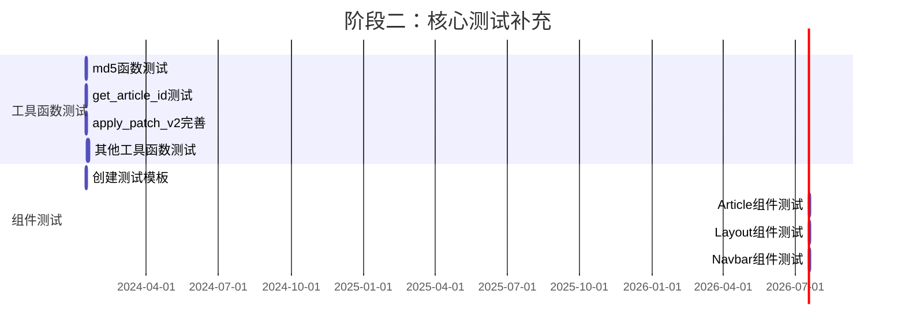
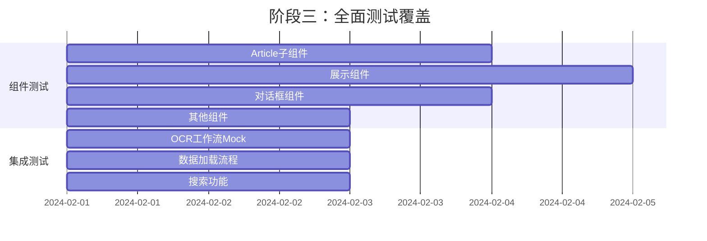
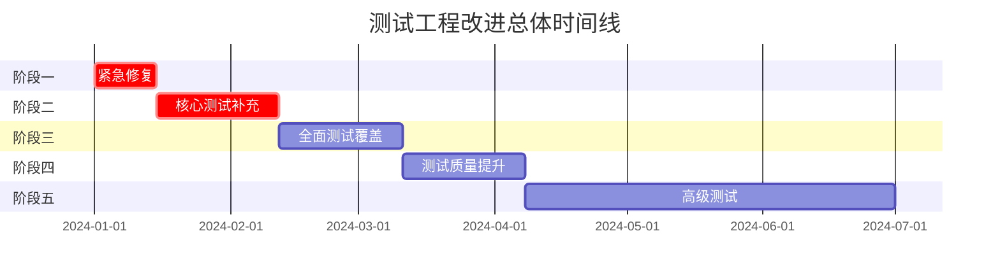

# 测试工程改进实施计划 / Testing Engineering Improvement Implementation Plan

本文档提供了测试工程改进的详细实施计划，包含分阶段任务和并行执行策略。

This document provides a detailed implementation plan for testing engineering improvements, including phased tasks and parallel execution strategies.

## 📋 目录 / Table of Contents

- [📊 计划概览 / Plan Overview](#-计划概览--plan-overview)
- [🎯 阶段一：紧急修复（1-2周）/ Phase 1: Urgent Fixes (1-2 weeks)](#-阶段一紧急修复1-2周--phase-1-urgent-fixes-1-2-weeks)
- [🔧 阶段二：核心测试补充（2-4周）/ Phase 2: Core Test Coverage (2-4 weeks)](#-阶段二核心测试补充2-4周--phase-2-core-test-coverage-2-4-weeks)
- [🚀 阶段三：全面测试覆盖（4-8周）/ Phase 3: Comprehensive Test Coverage (4-8 weeks)](#-阶段三全面测试覆盖4-8周--phase-3-comprehensive-test-coverage-4-8-weeks)
- [📈 阶段四：测试质量提升（8-12周）/ Phase 4: Test Quality Enhancement (8-12 weeks)](#-阶段四测试质量提升8-12周--phase-4-test-quality-enhancement-8-12-weeks)
- [🎓 阶段五：高级测试（12-24周）/ Phase 5: Advanced Testing (12-24 weeks)](#-阶段五高级测试12-24周--phase-5-advanced-testing-12-24-weeks)
- [📅 时间线和里程碑 / Timeline and Milestones](#-时间线和里程碑--timeline-and-milestones)
- [✅ 任务检查清单 / Task Checklist](#-任务检查清单--task-checklist)

## 📊 计划概览 / Plan Overview

### 总体目标 / Overall Goals

- **短期（1-3个月）**: 解决阻塞性问题，建立基础测试能力，核心功能覆盖率 >= 80%
- **中期（3-6个月）**: 建立完整测试体系，组件覆盖率 >= 70%，整体覆盖率 >= 50%
- **长期（6-12个月）**: 整体覆盖率 >= 60%，建立 E2E 测试和性能测试

### 执行策略 / Execution Strategy

- **并行执行**: 在满足依赖关系的前提下，尽可能并行执行任务
- **增量交付**: 每个阶段都有可交付的成果
- **持续验证**: 每个任务完成后立即验证
- **风险控制**: 关键任务设置检查点

### 任务状态说明 / Task Status Legend

- 🔴 **阻塞**: 必须完成才能继续
- 🟡 **重要**: 建议完成，但不阻塞其他任务
- 🟢 **可选**: 可以延后执行
- ⚡ **可并行**: 可以与其他任务并行执行

#### 任务 2.2.2: Article 组件测试 ⚡
- **优先级**: 🔴 高
- **预计时间**: 2 天
- **依赖**: 2.2.1
- **可并行**: 是（与 2.2.3, 2.2.4 并行）
- **描述**:
  - 为 `components/Article/index.tsx` 编写测试
  - 测试组件渲染
  - 测试用户交互
  - 测试 props 传递
- **验收标准**:
  - [ ] 组件可以正确渲染
  - [ ] 用户交互测试通过
  - [ ] 覆盖率 >= 70%

#### 任务 2.2.3: Layout 组件测试 ⚡
- **优先级**: 🔴 高
- **预计时间**: 1.5 天
- **依赖**: 2.2.1
- **可并行**: 是（与 2.2.2, 2.2.4 并行）
- **描述**:
  - 为 `components/Layout.tsx` 编写测试
  - 测试布局结构
  - 测试子组件渲染
- **验收标准**:
  - [ ] 布局结构正确
  - [ ] 子组件正确渲染
  - [ ] 覆盖率 >= 70%

#### 任务 2.2.4: Navbar 组件测试 ⚡
- **优先级**: 🟡 中
- **预计时间**: 1.5 天
- **依赖**: 2.2.1
- **可并行**: 是（与 2.2.2, 2.2.3 并行）
- **描述**:
  - 为 `components/Navbar.tsx` 编写测试
  - 测试导航链接
  - 测试响应式行为
- **验收标准**:
  - [ ] 导航链接正确
  - [ ] 响应式行为测试通过
  - [ ] 覆盖率 >= 70%

### 阶段二并行执行图 / Phase 2 Parallel Execution Diagram

**并行执行策略 / Parallel Execution Strategy:**
- 所有工具函数测试（2.1.1-2.1.4）可以并行执行
- 组件测试模板（2.2.1）完成后，所有组件测试（2.2.2-2.2.4）可以并行执行
- 工具函数测试和组件测试可以同时进行（不同模块）

---

## 🚀 阶段三：全面测试覆盖（4-8周）/ Phase 3: Comprehensive Test Coverage (4-8 weeks)

**目标**: 组件覆盖率 >= 70%，整体覆盖率 >= 50%

**Goal**: Component coverage >= 70%, overall coverage >= 50%

### 任务组 3.1: 剩余组件测试 / Remaining Component Tests

#### 任务 3.1.1: Article 子组件测试 ⚡
- **优先级**: 🔴 高
- **预计时间**: 3 天
- **依赖**: 2.2.2
- **可并行**: 是
- **描述**:
  - 为 `PatchableArticle/index.tsx` 编写测试
  - 为 `PartEditor.tsx` 编写测试
  - 为 `CommentEditor.tsx` 编写测试
- **验收标准**:
  - [ ] 所有子组件都有测试
  - [ ] 覆盖率 >= 70%

#### 任务 3.1.2: 展示组件测试 ⚡
- **优先级**: 🟡 中
- **预计时间**: 4 天
- **依赖**: 2.2.1
- **可并行**: 是（与 3.1.1, 3.1.3 并行）
- **描述**:
  - 为 `Authors.tsx` 编写测试
  - 为 `Tags.tsx` 编写测试
  - 为 `ImageTags.tsx` 编写测试
  - 为 `DiffViewer.tsx` 编写测试
- **验收标准**:
  - [ ] 所有组件都有测试
  - [ ] 覆盖率 >= 70%

#### 任务 3.1.3: 对话框组件测试 ⚡
- **优先级**: 🟡 中
- **预计时间**: 3 天
- **依赖**: 2.2.1
- **可并行**: 是（与 3.1.1, 3.1.2 并行）
- **描述**:
  - 为 `useAuthorFilterDialog.tsx` 编写测试
  - 为 `useDateFilterDialog.tsx` 编写测试
  - 为 `useSourceFilterDialog.tsx` 编写测试
  - 为 `useTagFilterDialog.tsx` 编写测试
- **验收标准**:
  - [ ] 所有对话框组件都有测试
  - [ ] 覆盖率 >= 70%

#### 任务 3.1.4: 其他组件测试 ⚡
- **优先级**: 🟡 中
- **预计时间**: 2 天
- **依赖**: 2.2.1
- **可并行**: 是（与其他组件测试并行）
- **描述**:
  - 为 `Footer.tsx` 编写测试
  - 为 `Loading.tsx` 编写测试
- **验收标准**:
  - [ ] 所有组件都有测试
  - [ ] 覆盖率 >= 70%

### 任务组 3.2: 集成测试 / Integration Tests

#### 任务 3.2.1: OCR 工作流 Mock 测试 ⚡
- **优先级**: 🟡 中
- **预计时间**: 2 天
- **依赖**: 1.3.2
- **可并行**: 是（与组件测试并行）
- **描述**:
  - 为 OCR 工作流创建 mock
  - 编写集成测试替代被跳过的测试
  - 测试工作流各个步骤
- **验收标准**:
  - [ ] Mock 可以正常工作
  - [ ] 集成测试通过
  - [ ] 不再需要跳过测试

#### 任务 3.2.2: 数据加载流程测试 ⚡
- **优先级**: 🟡 中
- **预计时间**: 2 天
- **依赖**: 1.3.2
- **可并行**: 是（与 3.2.1, 3.2.3 并行）
- **描述**:
  - 为数据加载流程编写集成测试
  - 测试数据获取和解析
  - 测试错误处理
- **验收标准**:
  - [ ] 数据加载测试通过
  - [ ] 错误处理测试通过

#### 任务 3.2.3: 搜索功能测试 ⚡
- **优先级**: 🟡 中
- **预计时间**: 2 天
- **依赖**: 1.3.2
- **可并行**: 是（与 3.2.1, 3.2.2 并行）
- **描述**:
  - 为搜索功能编写集成测试
  - 测试搜索查询
  - 测试搜索结果处理
- **验收标准**:
  - [ ] 搜索功能测试通过
  - [ ] 边界条件测试通过

### 阶段三并行执行图 / Phase 3 Parallel Execution Diagram

**并行执行策略 / Parallel Execution Strategy:**
- 所有组件测试（3.1.1-3.1.4）可以并行执行
- 所有集成测试（3.2.1-3.2.3）可以并行执行
- 组件测试和集成测试可以同时进行（不同模块）

---

## 📈 阶段四：测试质量提升（8-12周）/ Phase 4: Test Quality Enhancement (8-12 weeks)

**目标**: 建立测试质量保障体系，优化测试性能

**Goal**: Establish test quality assurance system and optimize test performance

### 任务组 4.1: 测试工具和基础设施 / Test Tools and Infrastructure

#### 任务 4.1.1: 建立测试 Fixtures ⚡
- **优先级**: 🟡 中
- **预计时间**: 2 天
- **依赖**: 1.3.2
- **可并行**: 是
- **描述**:
  - 创建测试数据 fixtures
  - 建立 fixtures 管理规范
  - 文档化 fixtures 使用方式
- **验收标准**:
  - [ ] Fixtures 目录结构清晰
  - [ ] 有使用文档
  - [ ] 可以被其他测试复用

#### 任务 4.1.2: 建立 Mock 数据管理 ⚡
- **优先级**: 🟡 中
- **预计时间**: 2 天
- **依赖**: 1.3.2
- **可并行**: 是（与 4.1.1 并行）
- **描述**:
  - 创建 mock 数据生成器
  - 建立 mock 管理规范
  - 统一 mock 数据格式
- **验收标准**:
  - [ ] Mock 数据可以复用
  - [ ] 有管理规范文档
  - [ ] Mock 数据格式统一

#### 任务 4.1.3: 创建测试工具函数库 ⚡
- **优先级**: 🟡 中
- **预计时间**: 2 天
- **依赖**: 1.3.2
- **可并行**: 是（与 4.1.1, 4.1.2 并行）
- **描述**:
  - 创建通用测试工具函数
  - 创建测试辅助函数
  - 文档化工具函数使用方式
- **验收标准**:
  - [ ] 工具函数可以复用
  - [ ] 有使用文档
  - [ ] 工具函数测试通过

### 任务组 4.2: 测试审查和优化 / Test Review and Optimization

#### 任务 4.2.1: 测试代码审查 ⚡
- **优先级**: 🟡 中
- **预计时间**: 3 天
- **依赖**: 阶段二、三完成
- **可并行**: 是（与 4.2.2 并行）
- **描述**:
  - 审查所有测试代码
  - 识别重复代码
  - 识别可以改进的地方
- **验收标准**:
  - [ ] 所有测试代码已审查
  - [ ] 发现的问题已记录
  - [ ] 改进计划已制定

#### 任务 4.2.2: 测试性能优化 ⚡
- **优先级**: 🟡 中
- **预计时间**: 2 天
- **依赖**: 阶段二、三完成
- **可并行**: 是（与 4.2.1 并行）
- **描述**:
  - 分析测试执行时间
  - 优化慢速测试
  - 配置测试并行执行
- **验收标准**:
  - [ ] 测试执行时间减少
  - [ ] 并行执行配置正确
  - [ ] 测试结果稳定

#### 任务 4.2.3: 测试覆盖率分析 ⚡
- **优先级**: 🟡 中
- **预计时间**: 1 天
- **依赖**: 阶段二、三完成
- **可并行**: 是（与其他任务并行）
- **描述**:
  - 生成覆盖率报告
  - 分析覆盖率盲区
  - 制定补充测试计划
- **验收标准**:
  - [ ] 覆盖率报告生成
  - [ ] 盲区已识别
  - [ ] 补充计划已制定

### 任务组 4.3: 测试文档和规范 / Test Documentation and Standards

#### 任务 4.3.1: 编写测试最佳实践文档 ⚡
- **优先级**: 🟡 中
- **预计时间**: 2 天
- **依赖**: 无
- **可并行**: 是（与其他任务并行）
- **描述**:
  - 编写测试编写指南
  - 编写测试最佳实践
  - 编写测试示例
- **验收标准**:
  - [ ] 文档完整
  - [ ] 有实际示例
  - [ ] 易于理解

#### 任务 4.3.2: 建立测试审查流程 ⚡
- **优先级**: 🟡 中
- **预计时间**: 1 天
- **依赖**: 无
- **可并行**: 是（与其他任务并行）
- **描述**:
  - 制定测试代码审查规范
  - 建立审查检查清单
  - 配置自动化检查
- **验收标准**:
  - [ ] 审查规范已制定
  - [ ] 检查清单完整
  - [ ] 自动化检查配置完成

---

## 🎓 阶段五：高级测试（12-24周）/ Phase 5: Advanced Testing (12-24 weeks)

**目标**: 建立 E2E 测试和性能测试体系

**Goal**: Establish E2E testing and performance testing system

### 任务组 5.1: E2E 测试 / End-to-End Testing

#### 任务 5.1.1: 选择 E2E 测试框架 ⚡
- **优先级**: 🟢 低
- **预计时间**: 1 天
- **依赖**: 阶段四完成
- **可并行**: 否
- **描述**:
  - 评估 Playwright 和 Cypress
  - 选择适合的框架
  - 安装和配置框架
- **验收标准**:
  - [ ] 框架已选择
  - [ ] 框架已安装
  - [ ] 基础配置完成

#### 任务 5.1.2: 主要用户流程 E2E 测试 ⚡
- **优先级**: 🟢 低
- **预计时间**: 5 天
- **依赖**: 5.1.1
- **可并行**: 否
- **描述**:
  - 编写文章浏览流程测试
  - 编写搜索流程测试
  - 编写数据加载流程测试
- **验收标准**:
  - [ ] 主要流程都有 E2E 测试
  - [ ] 测试可以稳定运行

### 任务组 5.2: 性能测试 / Performance Testing

#### 任务 5.2.1: 建立性能测试框架 ⚡
- **优先级**: 🟢 低
- **预计时间**: 2 天
- **依赖**: 阶段四完成
- **可并行**: 是（与 5.1.1 并行）
- **描述**:
  - 选择性能测试工具
  - 配置性能测试环境
  - 建立性能基准
- **验收标准**:
  - [ ] 性能测试框架可用
  - [ ] 性能基准已建立

#### 任务 5.2.2: 关键路径性能测试 ⚡
- **优先级**: 🟢 低
- **预计时间**: 3 天
- **依赖**: 5.2.1
- **可并行**: 是（与 5.1.2 并行）
- **描述**:
  - 为关键路径编写性能测试
  - 监控性能指标
  - 建立性能告警
- **验收标准**:
  - [ ] 关键路径都有性能测试
  - [ ] 性能指标可监控

---

## 📅 时间线和里程碑 / Timeline and Milestones

### 总体时间线 / Overall Timeline

### 里程碑 / Milestones

| 里程碑 | 时间 | 目标 | 状态 |
|--------|------|------|------|
| **M1: 基础设施完成** | 第2周 | Vitest 升级完成，CI/CD 集成完成 | ⏳ 待开始 |
| **M2: 核心函数测试** | 第4周 | 核心函数覆盖率 >= 80% | ⏳ 待开始 |
| **M3: 组件测试开始** | 第6周 | 3-5 个核心组件测试完成 | ⏳ 待开始 |
| **M4: 组件测试完成** | 第8周 | 所有组件覆盖率 >= 70% | ⏳ 待开始 |
| **M5: 集成测试完成** | 第10周 | 主要集成测试完成 | ⏳ 待开始 |
| **M6: 整体覆盖率达标** | 第12周 | 整体覆盖率 >= 50% | ⏳ 待开始 |
| **M7: 测试质量体系** | 第16周 | 测试质量保障体系建立 | ⏳ 待开始 |
| **M8: E2E 测试建立** | 第24周 | E2E 测试体系建立 | ⏳ 待开始 |

---

## ✅ 任务检查清单 / Task Checklist

### 阶段一检查清单 / Phase 1 Checklist

- [ ] **1.1.1** 升级 Vitest 到 4.0+
- [ ] **1.1.2** 安装 React 测试库
- [ ] **1.1.3** 更新测试配置文件
- [ ] **1.2.1** 创建测试 Workflow
- [ ] **1.2.2** 集成到现有构建流程
- [ ] **1.3.1** 完善 test/setup.ts
- [ ] **1.3.2** 建立测试目录结构

### 阶段二检查清单 / Phase 2 Checklist

- [ ] **2.1.1** md5 和 crypto_md5 函数测试
- [ ] **2.1.2** get_article_id 函数测试
- [ ] **2.1.3** apply_patch_v2 函数测试完善
- [ ] **2.1.4** 其他工具函数测试
- [ ] **2.2.1** 创建组件测试模板
- [ ] **2.2.2** Article 组件测试
- [ ] **2.2.3** Layout 组件测试
- [ ] **2.2.4** Navbar 组件测试

### 阶段三检查清单 / Phase 3 Checklist

- [ ] **3.1.1** Article 子组件测试
- [ ] **3.1.2** 展示组件测试
- [ ] **3.1.3** 对话框组件测试
- [ ] **3.1.4** 其他组件测试
- [ ] **3.2.1** OCR 工作流 Mock 测试
- [ ] **3.2.2** 数据加载流程测试
- [ ] **3.2.3** 搜索功能测试

### 阶段四检查清单 / Phase 4 Checklist

- [ ] **4.1.1** 建立测试 Fixtures
- [ ] **4.1.2** 建立 Mock 数据管理
- [ ] **4.1.3** 创建测试工具函数库
- [ ] **4.2.1** 测试代码审查
- [ ] **4.2.2** 测试性能优化
- [ ] **4.2.3** 测试覆盖率分析
- [ ] **4.3.1** 编写测试最佳实践文档
- [ ] **4.3.2** 建立测试审查流程

### 阶段五检查清单 / Phase 5 Checklist

- [ ] **5.1.1** 选择 E2E 测试框架
- [ ] **5.1.2** 主要用户流程 E2E 测试
- [ ] **5.2.1** 建立性能测试框架
- [ ] **5.2.2** 关键路径性能测试

---

## 📊 资源需求 / Resource Requirements

### 人员需求 / Personnel Requirements

- **测试工程师**: 1-2 人（全职或兼职）
- **开发工程师**: 1 人（支持测试开发）
- **代码审查**: 需要定期审查

### 时间投入 / Time Investment

- **阶段一**: 1-2 周（紧急修复）
- **阶段二**: 2-4 周（核心测试）
- **阶段三**: 4-8 周（全面覆盖）
- **阶段四**: 4 周（质量提升）
- **阶段五**: 12 周（高级测试）

**总计**: 约 23-30 周（5.5-7.5 个月）

### 工具和依赖 / Tools and Dependencies

- Vitest 4.0+
- @testing-library/react
- @testing-library/jest-dom
- GitHub Actions（CI/CD）
- E2E 测试框架（Playwright/Cypress，阶段五）

---

## 🔄 更新记录 / Update History

- **2024-01-XX**: 初始版本，创建详细实施计划

---

**注意**: 本计划应根据实际执行情况定期更新和调整。

**Note**: This plan should be regularly updated and adjusted based on actual execution.

